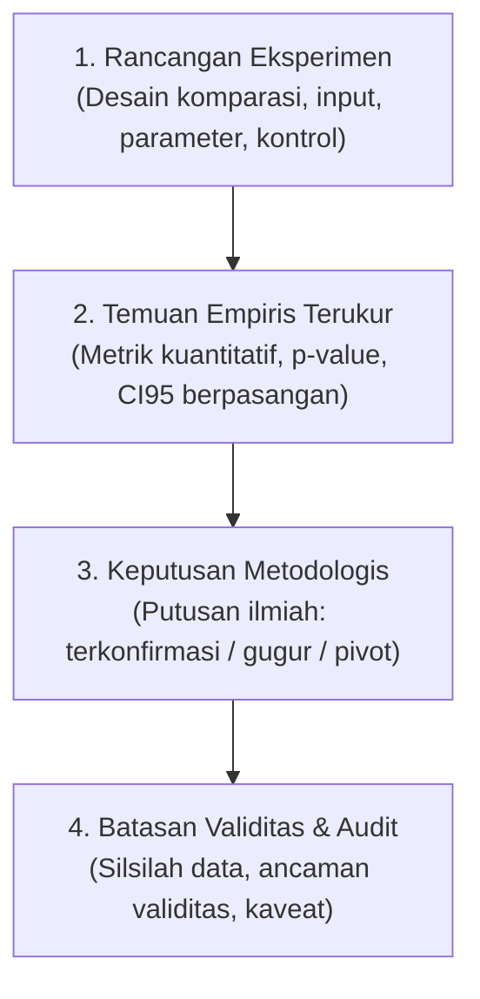

# Standar Penulisan Ilmiah Baku, Diksi Ilmiah, & Perbaikan Bahasa Penyampaian (EYD V / PUEBI)

Skill ini berfungsi sebagai pedoman baku penulisan ilmiah formal Bahasa Indonesia (EYD Edisi V / PUEBI) untuk laporan teknis, publikasi akademik, ringkasan eksekutif, dan dokumentasi riset di bidang Kecerdasan Buatan, Komputer Visi, dan Sains Data.

---

## 1. Prinsip Diksi Ilmiah & Anti-Calque (Pencegahan Terjemahan Harfiah Mesin)

### Rasional Pemilihan Kata
Terjemahan harfiah (*calque*) dari bahasa Inggris sering kali menghasilkan struktur kalimat yang janggal, ambigu, atau salah makna (misalnya kata *"loss"* diterjemahkan sebagai *"kerugian"* alih-alih *"fungsi rugi / degradasi performa"*, atau *"appearance"* diterjemahkan *"penampilan"* alih-alih *"kemunculan objek"*). 

Bahasa ilmiah baku mengutamakan **presisi makna**, **kebakuan istilah serapan**, dan **kejelasan relasi sebab-akibat**.

### Tabel Komprehensif: Padanan Dilarang vs Wajib Digunakan

#### A. Ranah Machine Learning, Optimasi, & Arsitektur Model
| Bentuk Dilarang / Terjemahan Harfiah (Hindari) | Bentuk Ilmiah Baku EYD V (Wajib Digunakan) | Alasan & Rasional Pemilihan Kata |
|---|---|---|
| *loss model besar / rugi performa* | **nilai fungsi rugi (*loss*) / degradasi performa** | *"Rugi"* bermakna finansial; dalam optimasi gunakan *fungsi rugi* atau *penurunan performa*. |
| *train on test* | **pelatihan pada data uji / kebocoran partisi (*train-on-test*)** | Istilah formal untuk kontaminasi partisi evaluasi. |
| *holdout set* | **partisi data terisolasi / himpunan uji terpisah** | Menjelaskan fungsi partisi data yang tidak tersentuh pelatihan. |
| *best observed* | **nilai terbaik yang teramati** | Diksi formal dalam observasi empiris. |
| *fine-tuning / finetune* | **penyesuaian terarah (*fine-tuning*) / adaptasi model** | Menjelaskan proses transfer pembelajaran secara spesifik. |
| *early stopping* | **penghentian dini (*early stopping*)** | Menghentikan pelatihan sebelum jadwal maksimum tercapai. |
| *freeze weight / freeze layer* | **pembekuan bobot layer (*freezing*)** | Menjaga bobot parameter agar tidak terbarui saat *backpropagation*. |
| *backbone* | **kerangka utama (*backbone*) / pengekstraksi fitur** | Jaringan ekstraktor fitur dasar sebelum kepala prediksi. |
| *head / classifier head* | **kepala klasifikasi / modul kepala (*head*)** | Lapisan proyeksi keluaran tugas spesifik. |
| *bottleneck* | **hambatan struktural (*bottleneck*) / leher botol** | Titik konvergensi atau penyempitan kapasitas representasi. |
| *gating mechanism / gate* | **mekanisme penapisan ber-gerbang (*gating*)** | Modul pembobotan fitur dinamis. |
| *weight sharing* | **pembagian bobot parameter (*weight sharing*)** | Penggunaan matriks bobot yang sama antar-cabang. |
| *data leakage / leak* | **kebocoran data (*data leakage*)** | Kontaminasi informasi masa depan/uji ke partisi latih. |
| *trade-off* | **kompromi performa (*trade-off*) / pertukaran timbal-balik** | Keseimbangan antara dua metrik yang saling bertolak belakang. |

#### B. Ranah Komputer Visi & Pengolahan Citra
| Bentuk Dilarang / Terjemahan Harfiah (Hindari) | Bentuk Ilmiah Baku EYD V (Wajib Digunakan) | Alasan & Rasional Pemilihan Kata |
|---|---|---|
| *appearance feature / penampilan objek* | **kemunculan objek (*appearance*) / fitur visual** | *"Penampilan"* merujuk pada performa panggung; gunakan *kemunculan visual*. |
| *bounding box / bbox* | **kotak pembatas (*bounding box*)** | Koordinat persegi penanda lokalisasi objek. |
| *crop / crop citra* | **citra terpotong (*crop*) / pemotongan wilayah objek** | Potongan spasial citra fokus target. |
| *ground truth (GT)* | **nilai acuan kebenaran (*ground truth*) / label acuan riil** | Label anotasi yang diverifikasi sebagai acuan faktual. |
| *pseudo-depth / depth palsu* | **estimasi kedalaman semu (*pseudo-depth*)** | Estimasi kedalaman non-sensorik fisik. |
| *screening* | **penyaringan awal (*screening*)** | Evaluasi eliminasi kandidat model secara cepat. |
| *spatial pooling* | **agregasi spasial (*spatial pooling*)** | Perataan atau reduksi dimensi matriks piksel secara spasial. |
| *temporal domain shift* | **pergeseran domain temporal (*temporal shift*)** | Perubahan distribusi statistik akibat perbedaan rentang waktu perekaman. |
| *noise / berderau* | **variasi acak (*noise*) / derau sensor** | Gangguan stokastik non-sinyal pada data masukan. |
| *letterboxing / pad* | **penambahan batas tepi (*padding / letterboxing*)** | Penyesuaian rasio aspek citra tanpa distorsi geometri. |
| *occlusion / kehalang* | **oklusi objek / objek terhalang pelepah** | Kondisi target tertutup parsial oleh objek latar depan. |

#### C. Ranah Statistika, Metrik, & Evaluasi
| Bentuk Dilarang / Terjemahan Harfiah (Hindari) | Bentuk Ilmiah Baku EYD V (Wajib Digunakan) | Alasan & Rasional Pemilihan Kata |
|---|---|---|
| *CI95 memuat nol / overlap nol* | **selang kepercayaan 95% mencakup nilai nol (tidak signifikan secara statistik)** | Rumusan baku uji signifikansi inferensial. |
| *tidak pernah menang / kalah* | **tidak menunjukkan keunggulan performa / mengalami penurunan** | Bahasa ilmiah bersifat objektif, bukan kompetitif informal. |
| *menyebut kenaikan / klaim naik* | **disimpulkan sebagai peningkatan / terbukti meningkatkan** | Diksi verifikasi berbasis pembuktian data. |
| *baseline* | **garis dasar pembanding (*baseline*) / model acuan** | Titik tolak komparasi kinerja algoritma. |
| *oracle* | **model batas atas teoretis (*oracle*)** | Estimasi performa maksimum dengan asumsi informasi sempurna. |
| *counting* | **pencacahan (*counting*)** | Penghitungan kuantitas diskret objek fisik. |
| *ablation study* | **studi ablasi / uji eliminasi komponen** | Eksperimen pelepasan modul untuk mengukur kontribusi marginal. |
| *point estimate* | **estimasi titik** | Nilai tunggal metrik tanpa interval ketidakpastian. |
| *statistically significant* | **signifikan secara statistik** | Hasil uji hipotesis dengan $p$-value $< \alpha$. |
| *inconclusive* | **belum konklusif / belum dapat diputuskan** | Bukti empiris belum cukup untuk menolak hipotesis nol. |
| *falsified / dipalsukan* | **gugur secara empiris (*falsified*) / tertolak** | *"Dipalsukan"* berarti manipulasi curang (*fake*); gunakan *gugur/tertolak*. |

---

## 2. Katalog Larangan Khusus (Negative Constraints / Hal yang Dilarang vs Wajib)

### A. Larangan Antropomorfisme Model (Larangan Menjadikan AI/Model Seperti Manusia)
Model pembelajaran mesin tidak "berpikir", "bingung", "tahu", atau "melihat". Model memetakan tensor numerik, menghitung probabilitas, atau mengalami tumpang tindih representasi.

* ❌ **Dilarang**: *"Model bingung membedakan antara B2 dan B3 karena warnanya mirip."*
* ✅ **Wajib**: *"Terjadi konfusi representasi antara kelas B2 dan B3 akibat tingginya kemiripan fotometrik pada ruang warna RGB."*
* ❌ **Dilarang**: *"Detektor tahu posisi tandan tapi tidak tahu kelasnya."*
* ✅ **Wajib**: *"Detektor berhasil melokalisasi koordinat spasial tandan dengan presisi tinggi, namun mengalami galat pada penentuan label kematangan."*
* ❌ **Dilarang**: *"Model memutuskan untuk berhenti belajar di epoch 15."*
* ✅ **Wajib**: *"Mekanisme penghentian dini (*early stopping*) menghentikan pelatihan pada epoch 15 setelah metrik validasi mengalami stagnasi."*

---

### B. Larangan Bahasa Percakapan, Slang, & Diksi Informal
Dokumen ilmiah wajib bebas dari kata-kata informal dan emotif.

| Kata Informal (DILARANG) | Padanan Ilmiah Baku (WAJIB) |
|---|---|
| *banget / sangat amat* | **sangat / secara signifikan / secara substansial** |
| *cuma / cuma dapat* | **hanya / tercatat sebesar** |
| *lumayan / lumayan bagus* | **cukup memadai / moderat / mencatat peningkatan terukur** |
| *kayak / seperti kayak* | **sebagaimana / serupa dengan** |
| *nggak / ndak / tidak pernah ada* | **tidak terdapat / ketiadaan bukti empiris** |
| *curang (pada evaluasi)* | **mengalami kebocoran informasi (*data leakage*) / evaluasi tidak terisolasi** |
| *hancur / jeblok / anjlok parah* | **mengalami penurunan drastis / mengalami degradasi performa substansial** |
| *mentok* | **mencapai batas saturasi / menyentuh batas teoretis** |

---

### C. Larangan Klaim Kausalitas Palsu & Generalisasi Berlebihan
Jangan menyatakan klaim superioritas jika selang kepercayaan masih memuat nilai nol atau ukuran sampel tidak mencukupi.

* ❌ **Dilarang**: *"Model baru kami membuktikan bahwa penambahan depth selalu meningkatkan counting tandan sawit."*
* ✅ **Wajib**: *"Uji empiris menunjukkan bahwa penambahan kanal kedalaman meningkatkan estimasi lokalisasi ($AP50 = 0,7636$ vs $0,7358$), namun peningkatan pencacahan belum mencapai signifikansi statistik formal pada split uji 352 pohon ($P = 0,921$, selang kepercayaan 95% mencakup nilai nol)."*
* ❌ **Dilarang**: *"Dataset 352 pohon jelek karena mAP-nya rendah."*
* ✅ **Wajib**: *"Rendahnya nilai $mAP50$ pada dataset 352 pohon disebabkan oleh pergeseran fenologi temporal kebun ($\sim 80\text{ hari}$) yang menyebabkan kelangkaan ekstrem sampel latih kelas B3 dan B4, bukan karena kelemahan arsitektur model."*

---

### D. Larangan Pengubahan Angka Historis Log Append-Only
* ❌ **Dilarang**: Mengubah, membulatkan secara sepihak, atau menghapus angka metrik riil pada berkas *log append-only* (`experiments/EKSPERIMEN.md`, `pipeline-pertandan/EKSPERIMEN.md`).
* ✅ **Wajib**: Memperbaiki redaksi pengantar, tata bahasa, dan keterbacaan penjelasan tanpa memutasi satu pun angka empiris yang menjadi rekaman eksperimen.

---

## 3. Standar Notasi Matematika, Statistika, & Tipografi Baku

```text
[Pedoman Cepat Notasi Angka & Simbol]
1. Desimal              : koma (,)              -> 0,6012  (BUKAN 0.6012)
2. Ribuan               : titik (.)             -> 3.992 citra (BUKAN 3,992 atau 3992)
3. Tanda Minus          : simbol asli − / $\minus$ -> −0,0476 (BUKAN tanda hubung -0.0476)
4. Selang Kepercayaan   : [min; max]            -> CI95 [−0,0671; −0,0274] (BUKAN [-0.06, -0.02])
5. Rentang Nilai/Waktu  : en dash (–)           -> B1–B4, 10–11 Agu 2026 (BUKAN B1-B4)
6. Simbol Variabel      : cetak miring (italic) -> p-value, n sampel, IoU, Δ mAP, F1, mAP50
```

### Tabel Komparasi Notasi: Dilarang vs Wajib

| Ranah Notasi | Penulisan Dilarang (Salah) | Penulisan Baku (Wajib) |
|---|---|---|
| **Nilai Desimal** | `mAP50 = 0.5435`, `acc = 74.39%` | **$mAP50 = 0,5435$**, **$\text{Akurasi} = 74,39\%$** |
| **Kuantitas Ribuan** | `18,540 boxes`, `3992 images` | **$18.540\text{ kotak pembatas}$**, **$3.992\text{ citra}$** |
| **Nilai Negatif / Selisih** | `-0.0476`, `delta = -2.3%` | **$\minus 0,0476$** atau **`−0,0476`**, **$\Delta = \minus 2,3\%$** |
| **Selang Kepercayaan** | `95% CI: (-0.02, 0.07)`, `CI95 [-0.05 - 0.05]` | **CI95 $[\minus 0,0270; +0,0739]$** |
| **Simbol Statistik** | `p-value < 0.05`, `N=410`, `mAP50-95` | ***$p$-value* $< 0,05$**, **$n = 410$**, **$mAP50\text{--}95$** |
| **Rentang Kategori** | `kelas B1-B4`, `tanggal 12-15 Agustus` | **kelas B1–B4**, **tanggal 12–15 Agustus 2026** |

---

## 4. Struktur Lembar Bukti Empiris Empat Bagian

Setiap simpul eksperimen (`V2-E-###` atau `PT-E-###`) dan bab dokumentasi evaluasi wajib disusun ke dalam 4 bagian sistematis:



### Contoh Penerapan Paragraf Baku (Sebelum vs Sesudah)

#### ❌ Contoh Buruk (Informal, Calque, Notasi Salah):
> *"Kita coba train yolo 4ch pake depth mono di 953 pohon. Hasilnya mAP50 dapet 0.4960 dibanding rgb yang 0.5436, jadi loss -0.0476. CI95 memuat nol (-0.067, -0.027) dan model kalah telak. Jadi mono depth jelek banget dan gak guna, mending di drop aja."*

#### ✅ Contoh Baku Sesuai Skill (Formal, Anti-Calque, Presisi Ilmiah):
> **Simpul V2-E-027 — Evaluasi Pengaruh Estimasi Kedalaman Monokular pada Korpus 953 Pohon**
> 1. **Rancangan Eksperimen**: Pengujian komparasi terkontrol mengevaluasi penambahan kanal kedalaman estimasi monokular (`yolo26l-depth.pt`) sebagai masukan 4-kanal pada arsitektur YOLO26l beresolusi 1.280 piksel (60 *epoch*, *cosine learning rate*) terhadap garis dasar pembanding RGB 3-kanal pada split uji SawitMVC (2.612 kotak anotasi).
> 2. **Temuan Empiris Terukur**: Penambahan depth monokular menyebabkan **penurunan performa yang signifikan** sebesar $\Delta = \mathbf{\minus 0,0476}$ ($mAP50 = \mathbf{0,4960}$ berbanding kontrol RGB $\mathbf{0,5436}$). Evaluasi bootstrap 2.000 ulangan berpasangan menghasilkan selang kepercayaan 95% **$[\minus 0,0671; \minus 0,0274]$** ($P(\Delta > 0) = 0,000$, terbukti signifikan secara statistik).
> 3. **Keputusan Metodologis**: Hipotesis keunggulan depth monokular dinyatakan **gugur secara empiris**. Jalur integrasi kedalaman monokular dihentikan dari pipeline utama.
> 4. **Batasan Validitas & Audit**: Penurunan performa terjadi konsisten di seluruh kelas kematangan (B1–B4). Berkas log eksekusi tersimpan pada [`logs_ringkas/eval_sel6_953_rgbmono.log`](file:///D:/Work/Assisten-Dosen/project-expertise/logs_ringkas/eval_sel6_953_rgbmono.log).

---

## 5. Daftar Periksa Mandiri (Checklist Audit Sebelum Menyimpan Berkas)

Sebelum menyelesaikan penulisan dokumen markdown:

- [ ] **Kepatuhan Anti-Calque**: Tidak ada kata *loss* (untuk penurunan performa), *appearance* mentah, *CI memuat nol*, *ground truth* mentah, dll.
- [ ] **Bebas Antropomorfisme**: Tidak ada kalimat *model bingung*, *model tahu*, atau *model berpikir*.
- [ ] **Format Angka**: Seluruh desimal menggunakan koma (`,`) dan ribuan menggunakan titik (`.`).
- [ ] **Simbol Minus**: Seluruh bilangan negatif menggunakan minus asli `−` atau `$\minus$`.
- [ ] **Selang Kepercayaan**: Menggunakan format $[\text{min}; \text{max}]$ dengan pemisah titik koma.
- [ ] **Keterlacakan Berkas**: Seluruh rujukan skrip (`.py`), log (`.log`), dan data (`.json`) memiliki tautan markdown aktif yang valid.
- [ ] **Integritas Log**: Angka riil historis tetap dipertahankan tanpa manipulasi.
