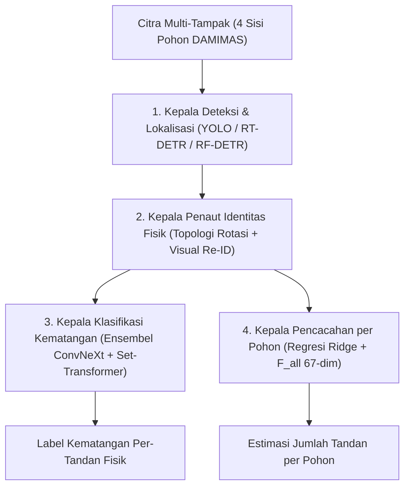

# Arsitektur Pipeline Modular DAMIMAS

Dokumen ini memuat spesifikasi teknis dan matriks performa sistem inferensi berlapis yang dioptimalkan secara modular untuk sub-populasi varietas **DAMIMAS**. Seluruh penalaan model dilakukan pada partisi latih dan validasi (*train/validation*), sementara evaluasi uji (*test*) dikunci tanpa kebocoran informasi.

---

## 1. Cakupan Data & Karakteristik Populasi

* **Dataset Acuan**: `SawitMVC-YOLO-Damimas` (mengeksklusikan seluruh 99 pohon varietas LONSUM).
* **Pembagian Partisi (*Split*) Kanonik**: **641 pohon latih / 86 pohon validasi / 127 pohon uji**.
* **Volume Citra**: **2.700 citra latih / 364 citra validasi / 532 citra uji**.
* **Total Kotak Anotasi**: **13.227 kotak latih / 1.757 kotak validasi / 2.461 kotak uji**.
* **Distribusi Kelas Latih (B1/B2/B3/B4)**: **1.569 / 2.504 / 6.764 / 2.390 kotak pembatas**.

---

## 2. Prinsip Arsitektur Empat Kepala Tugas

Satu bank representasi kandidat diproses oleh empat modul kepala inferensi khusus:

1. **Kepala Deteksi Per-Citra**: Menghasilkan proposal lokalisasi dan distribusi probabilitas kelas.
2. **Kepala Identitas Fisik (*Linker*)**: Menggabungkan prior geometri putaran searah jarum jam (*clockwise*), kemiripan visual Re-ID, dan skor kelas lunak untuk menautkan tandan fisik lintas-sudut pandang.
3. **Kepala Klasifikasi Kematangan**: Menggabungkan distribusi probabilitas multi-tampak dengan aturan agregasi ordinal kontinu ($R4$).
4. **Kepala Pencacahan (*Counting*)**: Mengekstraksi statistik multi-ambang dari seluruh sudut pandang dan detektor sebagai fitur masukan regresi *Ridge*.

---

## 3. Matriks Performa DAMIMAS Terkini

| Parameter Evaluasi | Garis Dasar Pembanding (*Baseline*) | Konfigurasi Modular Terpilih | Perubahan Relatif ($\Delta$) |
|---|---:|---:|---:|
| Deteksi Uji $mAP50$ | 0,5503 | **0,5965** | **$+4,62\text{ pp}$** |
| Deteksi Uji $mAP50\text{--}95$ | 0,2604 | **0,2743** | **$+1,39\text{ pp}$** |
| Deteksi Macro-$F1$ Operasional | 0,5557 | **0,5906** | **$+3,49\text{ pp}$** |
| Proposal Lokalisasi Fisik $AP50$ | — | **0,8381** | Kepala lokalisasi |
| Presisi / Recall Pool Fisik *End-to-End* | — | **0,8530 / 0,8116** | Pencocokan $1$-ke-$1$ |
| Akurasi Kelas pada Pool Fisik Terpasang | — | **0,7322** (Macro-$F1 = 0,7028$) | Tanpa anotasi acuan |
| Klasifikasi per-Tandan (*Strict* DAMIMAS) | 0,7242 | **0,7378** (Macro-$F1 = 0,7166$) | **$+1,36\text{ pp}$** |
| Akurasi Tandan Multi-Tampak ($\ge 2\text{ sisi}$) | — | **0,7753** | Agregasi ordinal $R4$ |
| Akurasi Tandan Satu-Tampak ($1\text{ sisi}$) | — | 0,6329 | Hambatan utama klasifikasi |
| Pencacahan Macro-$MAE$ | 1,0236 | **1,0039** | **$\minus 0,0197$** |
| Pencacahan $\text{Class }\pm 1\text{ Acc}$ | 74,61% | **75,79%** | **$+1,18\text{ pp}$** |
| Pencacahan Total $MAE$ (Regresor Langsung) | 1,5669 | **1,4882** | **$\minus 0,0787$** |
| Model Penaut $F1$ di Ruang Deteksi | 0,4704 | **0,5171** | Proposal unik |
| Cakupan Multi-Tampak atas Tandan Terdeteksi | 64,00% | **70,62%** | Target lolos |
| Cakupan Multi-Tampak atas Seluruh Tandan | 47,84% | **51,55%** | Target global |

---

## 4. Analisis Batas Teoretis dan Dekomposisi Wilayah Klasifikasi

Plafon teoretis model penggabungan (*oracle*) pada himpunan uji DAMIMAS mencapai **$87,39\%$**, namun rata-rata terbobot konvensional mentok pada plafon **$75,23\%$**.

Dekomposisi wilayah prediksi himpunan uji:
* **Wilayah Anggota Sepakat ($64,7\%$ populasi tandan)**: Akurasi mencapai **$81,92\%$**.
* **Wilayah Anggota Berselisih ($35,3\%$ populasi tandan)**: Akurasi berada di angka **$61,21\%$** (meskipun model batas atas teoretis/oracle di wilayah ini mencapai $97,41\%$).
* **Korelasi Tingkat Keyakinan vs Kebenaran**: Sangat rendah ($r = \mathbf{+0,1185}$), sehingga strategi pemilihan berbasis tingkat keyakinan (*confidence-weighted selection*) tidak efektif.

Peningkatan melampaui $75\%$ memerlukan model *gating* non-linier yang dipelajari secara *out-of-fold* dari representasi visual independen.
