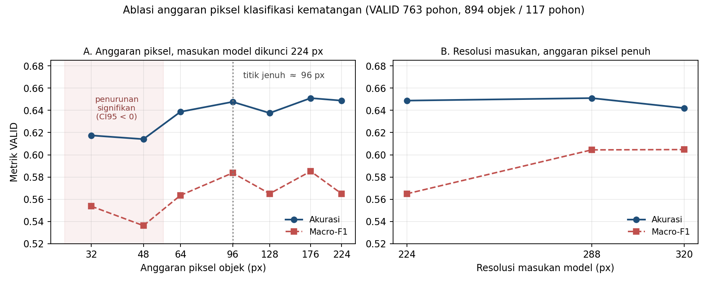

# Ablasi Anggaran Piksel pada Klasifikasi Kematangan Tingkat Objek

**Simpul eksperimen:** `V2-E-048`
**Tanggal:** 10 September 2026
**Korpus:** SawitMVC-Depth-YOLO v2.0.0 (763 pohon), split kanonik 21 Agustus 2026
**Partisi pelaporan:** VALID (894 objek / 117 pohon). Partisi TEST tidak disentuh.

---

## 1. Rancangan Eksperimen

Ablasi ini menguji satu pertanyaan: **apakah kesalahan klasifikasi tingkat
kematangan B1–B4 menurun ketika informasi piksel pada objek bertambah?**

Pemicunya adalah dua titik data historis yang arahnya berlawanan dengan
hipotesis "citra terpotong (*crop*) lebih besar lebih baik": konfigurasi `ftS`
(crop 176 piksel) mencapai akurasi $0,6837$, sedangkan `ftH` (crop 256 piksel
disajikan pada 224) justru turun ke $0,6569$. Kedua titik itu tidak dapat
memutuskan apa pun karena resolusi crop dan resolusi masukan model berubah
bersamaan, sehingga dua faktor tercampur dalam satu selisih.

Ablasi memisahkan kedua faktor tersebut ke dalam dua percobaan.

**Percobaan A — anggaran piksel, kapasitas model dikunci.**
Crop resolusi asli diturunkan ke $S \times S$ menggunakan interpolasi
`INTER_AREA`, lalu dinaikkan kembali ke $224 \times 224$ menggunakan
`INTER_CUBIC`. Nilai $S \in \{32; 48; 64; 96; 128; 176; 224\}$. Backbone,
jumlah token, dan biaya komputasi identik pada seluruh kondisi; satu-satunya
yang berubah adalah jumlah informasi piksel yang tersedia.

**Percobaan B — plafon resolusi masukan, anggaran piksel dibuka penuh.**
Crop resolusi asli langsung diubah ukurannya ke $R \times R$ dengan
$R \in \{224; 288; 320\}$. Percobaan ini menguji apakah menaikkan resolusi
masukan model di atas 224 piksel masih memberikan imbalan.

Geometri crop mengikuti `scripts/build_crop_dataset.py` secara persis, yaitu
sisi jendela $= 1{,}6 \times \max(w, h)$ dengan pengisian tepi (*padding*),
sehingga cincin di sekeliling objek tetap masuk.

**Pengklasifikasi.** Probe linear (regresi logistik multinomial) di atas fitur
ConvNeXt-Tiny ImageNet yang dibekukan (768 dimensi, *global average pooling*).
Pemilihan tetapan regularisasi $C$ dilakukan murni di dalam TRAIN melalui
`GroupKFold` 5 lipatan yang dikelompokkan menurut identitas pohon, tanpa
menyentuh VALID.

Alasan memakai probe linear bukan semata kepraktisan komputasi. Probe linear
mengukur keterpisahan linear informasi yang tersedia pada representasi, tanpa
mencampurkan efek resep penyesuaian terarah (*fine-tuning*), penjadwalan laju
belajar, atau variasi antar-*seed*. Konsekuensinya, ketinggian absolut kurva
berada di bawah pengklasifikasi yang disesuaikan terarah dan **tidak
dimaksudkan sebagai pembanding langsung terhadap $0,6837$**. Yang dibaca
adalah bentuk kurva terhadap $S$, bukan ketinggiannya.

---

## 2. Geometri Objek: Anggaran yang Tersedia

| Besaran | TRAIN (4.087 objek) | VALID (894 objek) |
|---|---|---|
| Sisi crop resolusi asli, median | 277 px | 277 px |
| Sisi crop resolusi asli, rerata | 280,1 px | 280,8 px |
| Persentil ke-5 | 157 px | 163 px |
| Persentil ke-95 | 411 px | 404 px |
| Fraksi objek di atas 176 px | 91,3% | 92,4% |
| Fraksi objek di atas 224 px | 74,8% | 76,3% |
| Fraksi objek di atas 288 px | 45,2% | 44,4% |

Median sisi crop per kelas pada VALID: B1 = 300 px, B2 = 278 px, B3 = 276,5 px,
B4 = 205 px. Seluruh citra sumber berukuran $1.280 \times 800$ piksel.

Angka ini menetapkan bahwa konfigurasi `ftS` historis, yang menyimpan crop pada
176 piksel, membuang informasi piksel pada lebih dari sembilan dari sepuluh
objek. Ablasi sampai 320 piksel karena itu mengukur informasi nyata, bukan
sekadar interpolasi.

---

## 3. Temuan Empiris Terukur



Seluruh selisih dihitung berpasangan terhadap kondisi acuan `A176`, yang meniru
konfigurasi `ftS`. Selang kepercayaan berasal dari 2.000 ulangan bootstrap yang
diambil ulang pada **tingkat pohon**, bukan tingkat objek, karena empat sisi
pandang dari satu pohon tidak saling bebas.

### 3.1 Percobaan A — anggaran piksel

| Anggaran | $C$ | Akurasi | Macro-$F1$ | MAE ordinal | $\Delta$ akurasi vs `A176` | $P(\text{lebih baik})$ |
|---|---|---|---|---|---|---|
| 32 px | 0,003 | 0,6174 | 0,5537 | 0,4430 | $−0,0336$ $[−0,0676; −0,0011]$ | 0,02 |
| 48 px | 0,001 | 0,6141 | 0,5363 | 0,4530 | $−0,0369$ $[−0,0674; −0,0070]$ | 0,00 |
| 64 px | 0,001 | 0,6387 | 0,5635 | 0,4195 | $−0,0123$ $[−0,0397; +0,0151]$ | 0,18 |
| 96 px | 0,001 | 0,6477 | 0,5837 | 0,4206 | $−0,0034$ $[−0,0240; +0,0184]$ | 0,36 |
| 128 px | 0,001 | 0,6376 | 0,5650 | 0,4295 | $−0,0134$ $[−0,0323; +0,0076]$ | 0,08 |
| **176 px** | 0,003 | **0,6510** | 0,5852 | **0,4072** | (acuan) | — |
| 224 px | 0,001 | 0,6488 | 0,5650 | 0,4150 | $−0,0022$ $[−0,0248; +0,0191]$ | 0,41 |

### 3.2 Percobaan B — resolusi masukan model

| Resolusi | $C$ | Akurasi | Macro-$F1$ | MAE ordinal | $\Delta$ macro-$F1$ vs `A176` | $P(\text{lebih baik})$ |
|---|---|---|---|---|---|---|
| 224 px | 0,001 | 0,6488 | 0,5650 | 0,4150 | $−0,0202$ $[−0,0541; +0,0161]$ | 0,14 |
| 288 px | 0,003 | **0,6510** | **0,6044** | 0,4105 | $+0,0193$ $[−0,0197; +0,0642]$ | 0,83 |
| 320 px | 0,003 | 0,6421 | **0,6047** | 0,4116 | $+0,0195$ $[−0,0238; +0,0725]$ | 0,79 |

Kondisi `A224` dan `B224` menghasilkan angka yang identik hingga digit terakhir.
Ini merupakan pemeriksaan konsistensi internal yang berhasil, karena pengubahan
ukuran dari 224 ke 224 memang bersifat identitas.

### 3.3 Pembacaan

1. **Kurva jenuh pada sekitar 96 piksel.** Anggaran 96 piksel sudah tidak
   terbedakan dari anggaran 176 piksel: selisih $−0,0034$ dengan selang
   kepercayaan 95% $[−0,0240; +0,0184]$ yang mencakup nilai nol. Median crop
   yang tersedia (277 px) berada $2{,}9\times$ di atas titik jenuh ini.

2. **Penurunan yang signifikan baru muncul di bawah 64 piksel.** Anggaran 32 px
   dan 48 px keduanya memiliki selang kepercayaan yang seluruhnya negatif
   ($[−0,0676; −0,0011]$ dan $[−0,0674; −0,0070]$), sedangkan 64 px sudah tidak
   signifikan ($P = 0,18$). Objek harus dipangkas hingga di bawah seperempat
   ukuran aslinya sebelum kerugiannya terukur.

3. **Menambah anggaran di atas 176 piksel tidak menaikkan akurasi.** Kondisi
   224 px, 288 px, dan 320 px seluruhnya menghasilkan selisih akurasi yang
   mencakup nilai nol, dengan estimasi titik nol atau sedikit negatif.

4. **Satu-satunya sinyal positif berasal dari resolusi masukan, bukan anggaran
   piksel.** Macro-$F1$ naik $+0,0193$ pada 288 px dan $+0,0195$ pada 320 px,
   konsisten pada dua kondisi yang terpisah, dengan $P(\text{lebih baik})$
   sebesar 0,83 dan 0,79. Selang kepercayaannya tetap mencakup nilai nol,
   sehingga peningkatan ini **belum mencapai signifikansi statistik**. Karena
   percobaan A menunjukkan anggaran piksel sudah jenuh jauh sebelum titik ini,
   sumber keuntungan tersebut lebih mungkin berupa granularitas spasial
   backbone — jumlah token yang lebih banyak sebelum agregasi spasial
   (*spatial pooling*) — dan bukan informasi piksel tambahan.

---

## 4. Keputusan Metodologis

Hipotesis anggaran piksel **tidak didukung** pada korpus dan protokol ini.
Informasi piksel yang tersedia (median 277 px per objek) sudah hampir tiga kali
lipat melampaui titik jenuh yang terukur (96 px). Menambah resolusi crop bukan
jalur perbaikan yang menjanjikan untuk klasifikasi kematangan.

Konsekuensi langsung bagi usulan pengklasifikasi tingkat butir buah pada
resolusi asli: **justifikasi fisiknya melemah secara substansial**. Apabila
detail permukaan tingkat butir memang membawa sinyal kematangan yang belum
tereksploitasi, kurva pada percobaan A seharusnya masih menanjak antara 128 px
dan 224 px, dan percobaan B seharusnya menunjukkan kenaikan akurasi yang jelas
pada 288 px dan 320 px. Keduanya tidak terjadi.

Satu arah yang layak diuji lebih lanjut adalah menaikkan resolusi masukan model
ke 288 piksel sambil mempertahankan anggaran piksel penuh, khusus untuk
memperbaiki macro-$F1$ pada kelas minoritas. Arah ini murah karena tidak
memerlukan pelatihan ulang detektor, tetapi statusnya masih kandidat terpilih
pada validasi (*validation-selected*), bukan temuan yang terkonfirmasi.

---

## 5. Batasan Validitas dan Audit

1. **Probe linear, bukan penyesuaian terarah penuh.** Ini adalah batasan yang
   paling menentukan. Penyesuaian terarah dapat mengekstraksi sinyal resolusi
   tinggi yang tidak terpisahkan secara linear pada representasi ImageNet.
   Kesimpulan ini berlaku untuk informasi yang terpisah secara linear pada
   representasi ConvNeXt-Tiny yang dibekukan, dan bukan batas untuk seluruh
   metode pembelajaran.

2. **Struktur *stem* backbone.** ConvNeXt-Tiny memakai *patch stem* $4 \times 4$,
   sehingga pada masukan 224 piksel satu token mewakili 4 piksel. Detail yang
   lebih halus dari 4 piksel hilang terlepas dari besarnya anggaran. Percobaan B
   menguji sebagian keterbatasan ini, tetapi tidak menghapusnya.

3. **Daya statistik.** VALID memuat 894 objek pada 117 pohon. Lebar selang
   kepercayaan untuk selisih akurasi berpasangan berkisar $\pm 0,025$, sehingga
   efek yang lebih kecil dari sekitar $0,025$ tidak dapat dipisahkan dari
   variasi acak.

4. **Kelas B4 langka.** VALID hanya memuat 66 objek B4 dari 894. Macro-$F1$
   karena itu memiliki variasi yang lebar, dan sinyal positif pada percobaan B
   sebagian besar bergantung pada kelas ini.

5. **Crop RGB tanpa kanal penanda kotak.** Berbeda dari
   `build_crop_dataset.py`, ablasi ini tidak menyertakan kanal *mask* footprint
   kotak acuan. Pada kanopi padat, satu crop dapat memuat lebih dari satu
   tandan, sehingga terdapat ambiguitas target. Ambiguitas ini seragam pada
   seluruh kondisi dan tidak mengubah perbandingan relatif, tetapi menurunkan
   ketinggian absolut seluruh kurva.

6. **Bukan pembanding untuk $0,6837$.** Angka historis tersebut berasal dari
   korpus 352 pohon dengan pengklasifikasi yang disesuaikan terarah. Ablasi ini
   memakai korpus 763 pohon dengan probe linear. Kedua angka tidak sebanding.

---

## 6. Reproduksi

```bash
python scripts/ablasi_anggaran_piksel.py crop     # ekstraksi 4.981 crop resolusi asli
python scripts/ablasi_anggaran_piksel.py fitur    # 10 kondisi, ConvNeXt-Tiny beku, CPU
python scripts/ablasi_anggaran_piksel.py probe    # probe linear + bootstrap
```

| Artefak | Kandungan |
|---|---|
| [`scripts/ablasi_anggaran_piksel.py`](../scripts/ablasi_anggaran_piksel.py) | Skrip tiga tahap, seluruhnya CPU |
| [`results/ablasi_piksel_2026-09-10/ablasi_anggaran_piksel.json`](../results/ablasi_piksel_2026-09-10/ablasi_anggaran_piksel.json) | Metrik seluruh kondisi, $C$ terpilih, skor lipatan silang, selang kepercayaan |
| [`results/ablasi_piksel_2026-09-10/sisi_crop_native.json`](../results/ablasi_piksel_2026-09-10/sisi_crop_native.json) | Distribusi sisi crop resolusi asli |
| [`results/ablasi_piksel_2026-09-10/distribusi_ukuran_kotak.json`](../results/ablasi_piksel_2026-09-10/distribusi_ukuran_kotak.json) | Distribusi sisi kotak pembatas per partisi dan per kelas |
| [`results/ablasi_piksel_2026-09-10/kurva_ablasi_anggaran_piksel.png`](../results/ablasi_piksel_2026-09-10/kurva_ablasi_anggaran_piksel.png) | Kurva kedua percobaan |
