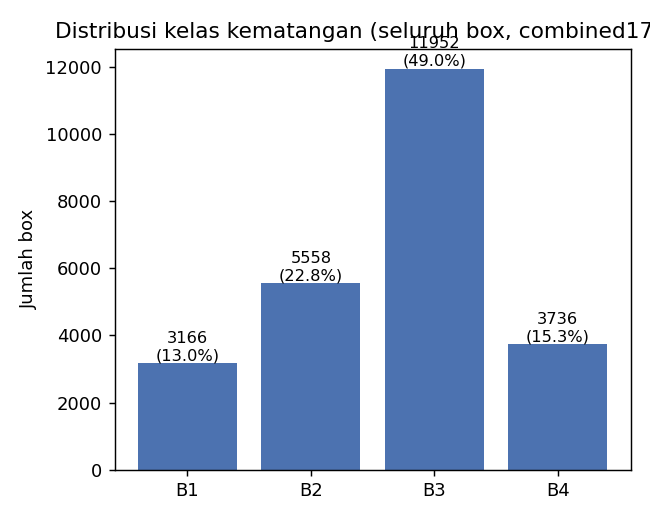
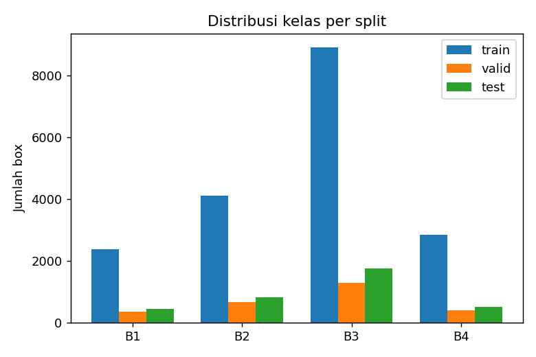
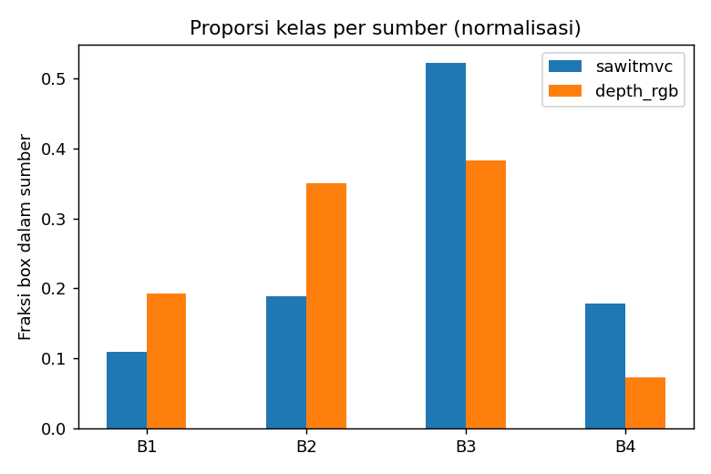
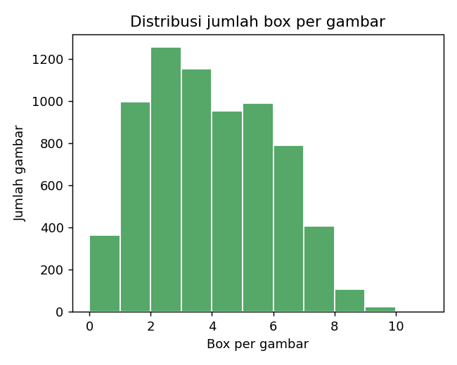
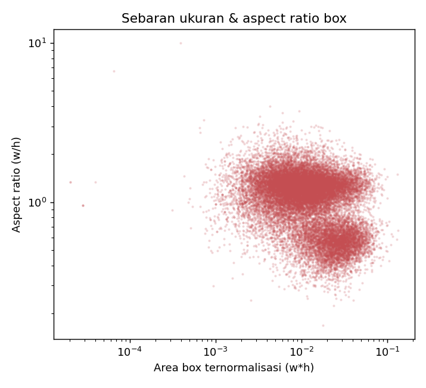

# Analisis Eksplorasi Data: Korpus Gabungan SawitMVC-Combined-1716-RGB

Dokumen ini memuat analisis data eksploratif (*Exploratory Data Analysis* / EDA) dari korpus gabungan skala penuh **`SawitMVC-Combined-1716-RGB`** yang dibangun dari penyatuan dua sumber data utama: `SawitMVC-YOLO` (953 pohon) dan `SawitMVC-Depth-YOLO` v2.0.0 (763 pohon).

Dataset ini dapat dibangun ulang secara deterministik melalui skrip:
```bash
python scripts/build_combined_rgb_dataset.py \
  --sawit <path_ke_SawitMVC-YOLO> \
  --depth-rgb <path_ke_SawitMVC-Depth-YOLO> \
  --output <path_tujuan_combined1716>
```

---

## 1. Komposisi Korpus dan Kebijakan Pembagian Partisi

* **Total Citra**: **7.044 citra** ($24.412\text{ kotak pembatas}$).
* **Sumber 1 (`sawitmvc`)**: 953 pohon ($3.992\text{ citra}$).
* **Sumber 2 (`depth_rgb`)**: 763 pohon ($3.052\text{ citra}$).
* **Irisan Pohon (*Re-photographed Trees*)**: 352 pohon difoto ulang pada kedua sesi akuisisi (dengan jeda waktu $\sim 80\text{ hari}$ / $\approx 5\text{ bulan}$).
* **Jumlah Pohon Fisik Unik**: **1.364 pohon** ($953 + 763 − 352 = 1.364$; angka 1.716 merepresentasikan total entri pohon terindeks).

| Partisi Data | Jumlah Citra | Pohon Fisik Unik | Asal SawitMVC | Asal Depth-RGB |
|---|---|---|---|---|
| Latih (*Train*) | 5.184 | 1.005 | 716 | 546 |
| Validasi (*Valid*) | 808 | 160 | 96 | 101 |
| Uji (*Test*) | 1.052 | 199 | 141 | 116 |

> [!NOTE]
> **Kebijakan Partisi Bebas Bocor (*Group-Safe*)**: Sebanyak 352 pohon yang terfoto ulang diwajibkan mengikuti partisi asal `SawitMVC` untuk mencegah citra dari pohon yang sama terpecah ke partisi latih dan uji secara bersamaan.

---

## 2. Distribusi Frekuensi Kelas Tingkat Kematangan (B1–B4)

| Kategori Kematangan | Jumlah Kotak | Proporsi Relatif |
|---|---|---|
| Lewat Matang / Siap Panen (B1) | 3.166 | 13,0% |
| Matang Optimal (B2) | 5.558 | 22,8% |
| Matang Awal / Mengkal (B3) | 11.952 | 49,0% |
| Mentah / Muda (B4) | 3.736 | 15,3% |

Rasio kelas mayoritas terhadap minoritas mencapai **$3,8\times$** (B3 terhadap B1). Kelas B1 merupakan kelas paling langka pada ketiga partisi, selaras dengan fenomena agronomi di mana tandan yang sudah siap panen segera dipanen sehingga jarang terekam.


*Gambar 1: Distribusi frekuensi total kotak pembatas per kelas kematangan.*


*Gambar 2: Distribusi proporsi kelas kematangan terstratifikasi pada partisi latih, validasi, dan uji.*

---

## 3. Komparasi Distribusi Lintas Sumber Data

| Kategori Kematangan | Proporsi SawitMVC ($n = 18.540$) | Proporsi Depth-RGB ($n = 5.872$) |
|---|---|---|
| Lewat Matang / Siap Panen (B1) | 2.032 ($11,0\%$) | 1.134 ($19,3\%$) |
| Matang Optimal (B2) | 3.500 ($18,9\%$) | 2.058 ($35,0\%$) |
| Matang Awal / Mengkal (B3) | 9.701 ($52,3\%$) | 2.251 ($38,3\%$) |
| Mentah / Muda (B4) | 3.307 ($17,8\%$) | 429 ($7,3\%$) |


*Gambar 3: Perbandingan proporsi kelas kematangan antara sumber SawitMVC dan Depth-RGB.*

Perbedaan proporsi ini mencerminkan dinamika fenologi kebun riil akibat jeda waktu pengambilan data.

---

## 4. Kepadatan dan Geometri Kotak Pembatas

* **Kepadatan Objek per Citra**: Rerata **$3,47\text{ kotak/citra}$** (median $3$, maksimum $10$).
* **Citra Latar Belakang (*Background*, 0 Kotak)**: **364 citra** ($5,2\%$).
  * Sumber `sawitmvc`: 66 citra.
  * Sumber `depth_rgb`: 298 citra.
* **Luas Kotak Ternormalisasi ($w \times h$)**: Median **$0,0121$** (rentang $[0,00002; 0,1338]$).
* **Rasio Aspek Kotak ($w / h$)**: Median **$1,16$** (rentang $[0,17; 10,00]$).


*Gambar 4: Histogram frekuensi jumlah kotak pembatas per citra.*


*Gambar 5: Sebaran luas ternormalisasi dan rasio aspek kotak pembatas objek.*

---

## 5. Resolusi Asli Citra dan Penanganan Subset LONSUM

### Resolusi Asli Kamera
* **Sumber `sawitmvc`**: $960 \times 1.280\text{ piksel}$ (orientasi potret kamera ponsel).
* **Sumber `depth_rgb`**: $1.280 \times 800\text{ piksel}$ (orientasi lanskap sensor Orbbec).
* Pada pelatihan detektor beresolusi tetap ($1.280\text{ piksel}$), *letterboxing* diterapkan otomatis oleh *dataloader*.

### Karakteristik Khusus Subset LONSUM (99 Pohon)
Dari 953 pohon `sawitmvc`, 99 pohon berasal dari perkebunan LONSUM dengan karakteristik ekologis khusus:
* Total 396 citra ($1.095\text{ kotak pembatas}$, rerata $2,77\text{ kotak/citra}$).
* **Dominasi Ekstrem Kelas B3**: B3 mencapai **$69,5\%$** ($761\text{ kotak}$), B2 $14,5\%$, B4 $14,4\%$, dan B1 hanya $1,6\%$ ($17\text{ kotak}$).
* Evaluasi pada [`results/local_eval_combined1716_no_lonsum/`](file:///D:/Work/Assisten-Dosen/project-expertise/results/local_eval_combined1716_no_lonsum/) secara terpisah menguji performa tanpa subset LONSUM untuk mengisolasi variasi agronomi regional.
