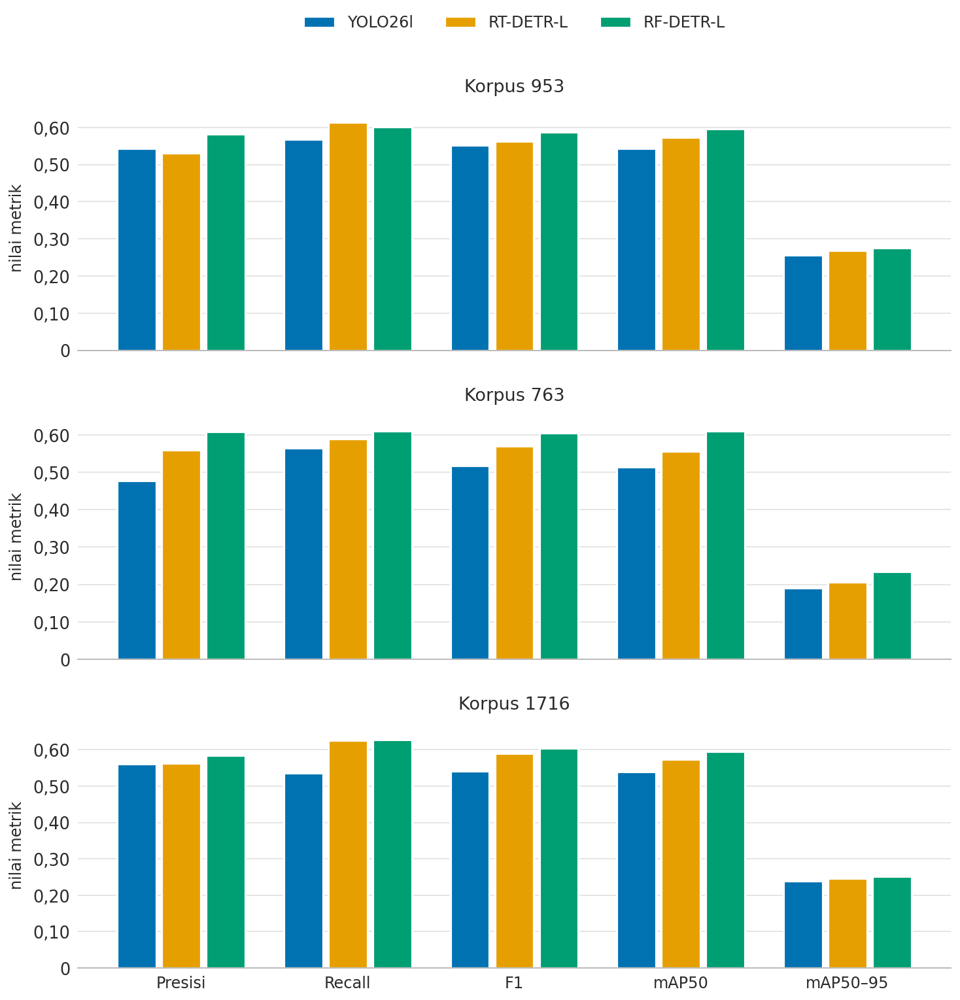
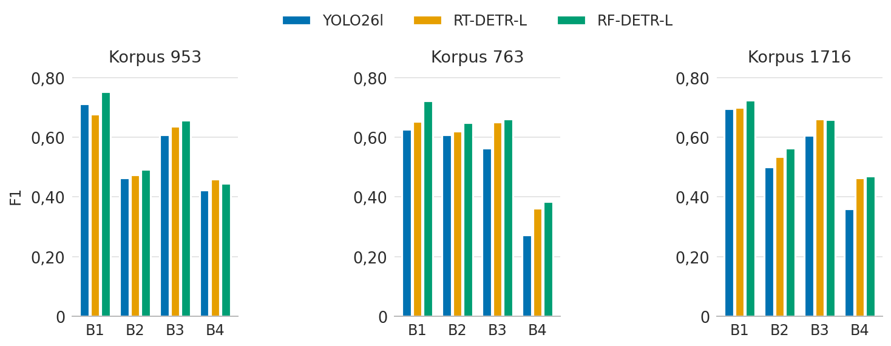
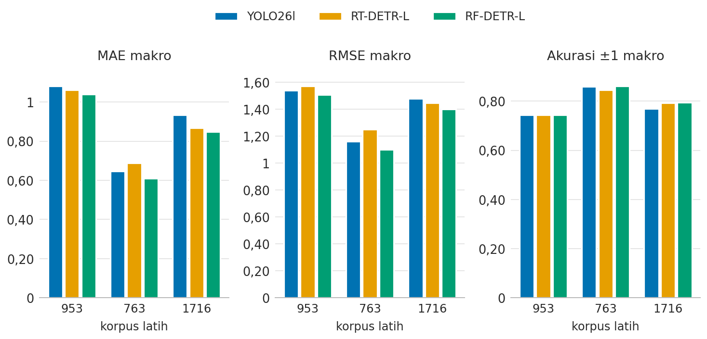
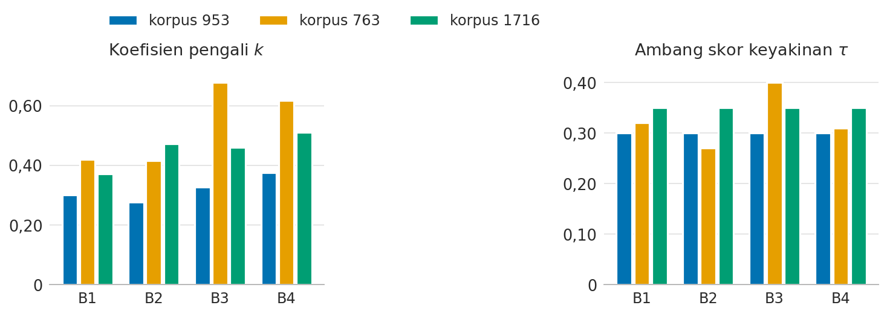
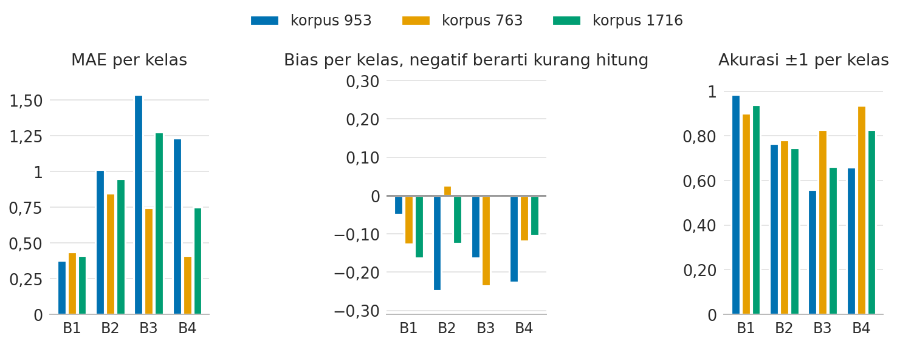
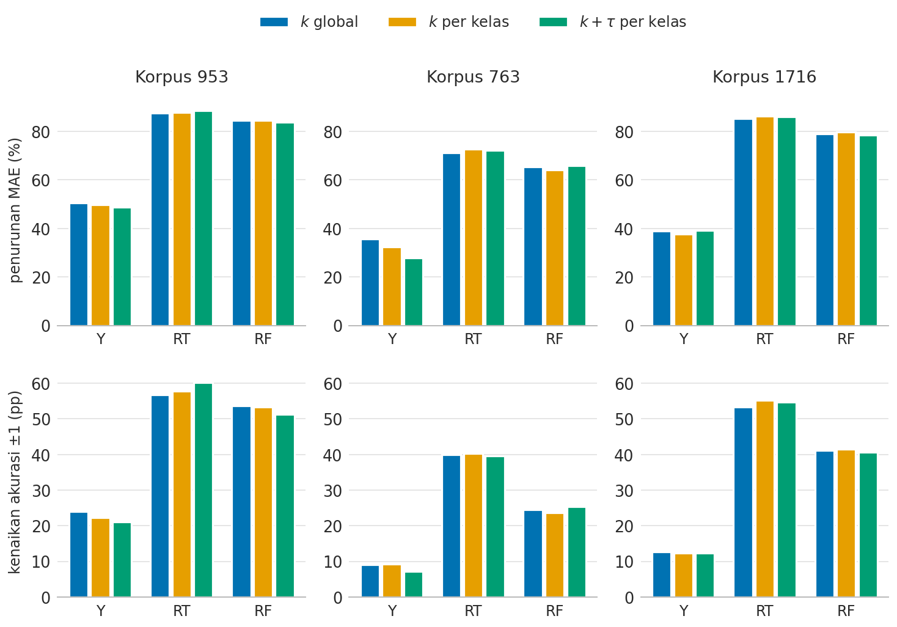
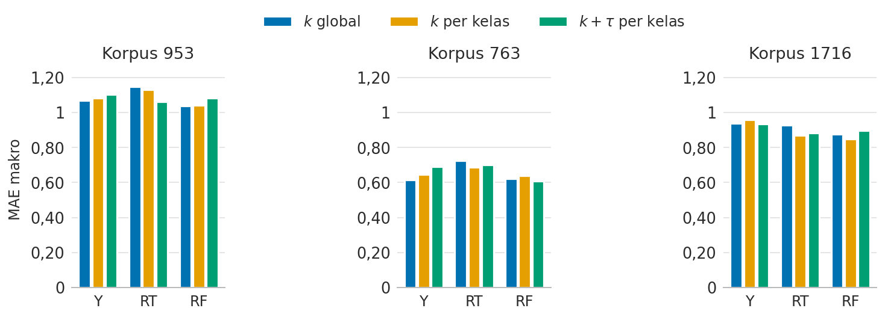
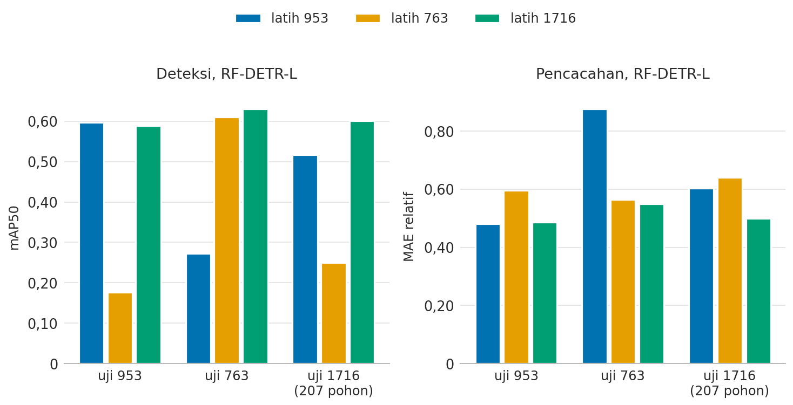
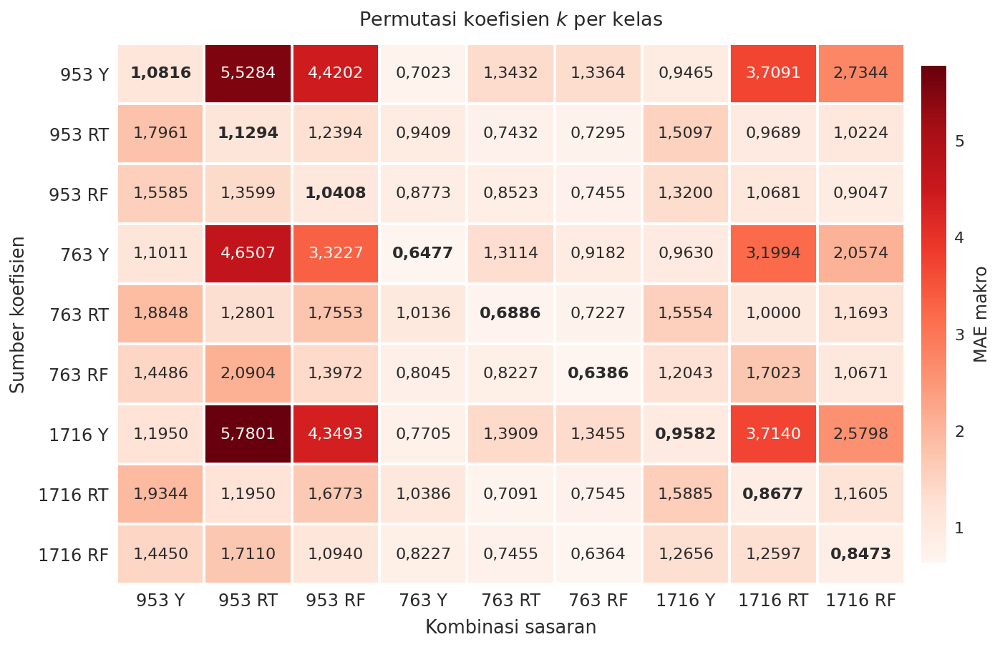

# Laporan Kinerja per Korpus Latih: Deteksi dan Pencacahan

## 1. Ringkasan Eksekutif

| Korpus | Detektor terbaik | $mAP50$ | F1 | Metode kalibrasi | $MAE$ | $MAE$ relatif | Akurasi ±1 | Penurunan $MAE$ |
|---|---|---|---|---|---|---|---|---|
| 953 | RF-DETR-L | 0,5964 | 0,5874 | $k$ per kelas | 1,0408 | 0,4803 | 0,7429 | 84,5% |
| 763 | RF-DETR-L | 0,6101 | 0,6046 | $k + \tau$ per kelas | 0,6091 | 0,5648 | 0,8614 | 65,9% |
| 1716 | RF-DETR-L | 0,5961 | 0,6039 | $k$ per kelas | 0,8473 | 0,4847 | 0,7938 | 79,8% |

| Temuan utama | Angka pendukung |
|---|---|
| RF-DETR-L terbaik di ketiga korpus | $mAP50$ 0,5961–0,6101 |
| Kalibrasi menurunkan galat di semua kombinasi | $MAE$ turun 25,0–88,6% |
| Peringkat korpus berbalik pada basis relatif | $MAE$ 0,6091 (763) berbanding 1,0408 (953); relatif 0,5648 berbanding 0,4803 |
| Detektor gugur lintas korpus, dua arah | $mAP50$ serendah 0,1109 |

## 2. Identitas Eksperimen

| Parameter | Nilai |
|---|---|
| Identitas simpul | `V2-E-050` sampai `V2-E-050f` |
| Tanggal | 16 September 2026 |
| Korpus latih | `953` (SawitMVC-YOLO), `763` (SawitMVC-Depth-YOLO v2.0.0), `1716` (gabungan) |
| Partisi uji | `953`: 141 pohon; `763`: 110 pohon; `1716`: 257 pohon |
| Detektor | YOLO26l, RT-DETR-L, RF-DETR-L |
| Metrik deteksi | Presisi, Recall, F1, $AP50$, dan $AP50\text{--}95$ per kelas serta makro |
| Model pencacahan | $\hat{y}_c(t) = \operatorname{round}(k_c \cdot n_c(t))$, dengan $n_c(t)$ sebagai jumlah deteksi kelas $c$ lintas sisi pohon yang memenuhi skor keyakinan $\ge \tau_c$ |
| Kalibrasi | Lipat-silang 5 lipatan tingkat pohon, tanpa pelatihan ulang |
| Metrik pencacahan | $MAE$ makro, $MAE$ relatif, $RMSE$ makro, bias mutlak makro, akurasi ±1 makro |
| Skrip | [`susun_laporan_pencacahan.py`](../scripts/susun_laporan_pencacahan.py), [`metrik_deteksi_perkorpus.py`](../scripts/metrik_deteksi_perkorpus.py), [`kalibrasi_pencacahan_perkorpus.py`](../scripts/kalibrasi_pencacahan_perkorpus.py), [`permutasi_koefisien_pencacahan.py`](../scripts/permutasi_koefisien_pencacahan.py) |
| Artefak angka | [`metrik_deteksi_perkorpus.json`](../results/counting_koefisien_2026-09-16/metrik_deteksi_perkorpus.json), [`pencacahan_perkorpus.json`](../results/counting_koefisien_2026-09-16/pencacahan_perkorpus.json), [`permutasi_koefisien.json`](../results/counting_koefisien_2026-09-16/permutasi_koefisien.json) |

## 3. Karakteristik Partisi Uji

| Korpus | Pohon | Tandan | Tandan per pohon | B1 | B2 | B3 | B4 |
|---|---|---|---|---|---|---|---|
| 953 | 141 | 1.397 | 9,91 | 0,83 | 1,82 | 5,26 | 1,99 |
| 763 | 110 | 558 | 5,07 | 0,85 | 1,81 | 1,95 | 0,45 |
| 1716 | 257 | 1.972 | 7,67 | 0,88 | 1,77 | 3,76 | 1,26 |

| Pasangan partisi | Pohon beririsan | Konsekuensi |
|---|---|---|
| `1716` dan `953` | 141 dari 141 pohon SAWIT | Tidak independen |
| `1716` dan `763` | 66 dari 110 pohon | Basis pohon lebih kecil |
| `953` dan `763` | 0 pohon | Terpisah penuh |

## 4. Deteksi per Korpus Latih

Presisi, Recall, dan F1 pada ambang $\text{conf}^{*}$ yang memaksimalkan F1 makro.

| Korpus | Detektor | Citra | Objek | $\text{conf}^{*}$ | Presisi | Recall | F1 | $mAP50$ | $mAP50\text{--}95$ | $mAP50$ `pycocotools` |
|---|---|---|---|---|---|---|---|---|---|---|
| 953 | YOLO26l | 588 | 2.612 | 0,20 | 0,5426 | 0,5681 | 0,5515 | 0,5434 | 0,2565 | 0,5435 |
| 953 | RT-DETR-L | 588 | 2.612 | 0,45 | 0,5316 | 0,6136 | 0,5618 | 0,5725 | 0,2687 | 0,5718 |
| **953** | **RF-DETR-L** | 588 | 2.612 | 0,37 | **0,5824** | **0,6017** | **0,5874** | **0,5964** | **0,2756** | 0,5965 |
| 763 | YOLO26l | 440 | 891 | 0,17 | 0,4778 | 0,5650 | 0,5173 | 0,5143 | 0,1902 | 0,5163 |
| 763 | RT-DETR-L | 440 | 891 | 0,48 | 0,5604 | 0,5893 | 0,5712 | 0,5563 | 0,2056 | 0,5580 |
| **763** | **RF-DETR-L** | 440 | 891 | 0,34 | **0,6089** | **0,6103** | **0,6046** | **0,6101** | **0,2335** | 0,6129 |
| 1716 | YOLO26l | 1.052 | 3.513 | 0,20 | 0,5604 | 0,5354 | 0,5406 | 0,5386 | 0,2393 | 0,5389 |
| 1716 | RT-DETR-L | 1.052 | 3.513 | 0,46 | 0,5630 | 0,6256 | 0,5898 | 0,5742 | 0,2456 | 0,5745 |
| **1716** | **RF-DETR-L** | 1.052 | 3.513 | 0,36 | **0,5846** | **0,6269** | **0,6039** | **0,5961** | **0,2522** | 0,5960 |

### 4.1 Rincian per Kelas, Korpus `953`

| Detektor | Kelas | Objek | Presisi | Recall | F1 | $AP50$ | $AP50\text{--}95$ |
|---|---|---|---|---|---|---|---|
| YOLO26l | B1 | 252 | 0,6555 | 0,7778 | 0,7114 | 0,7704 | 0,4022 |
| YOLO26l | B2 | 496 | 0,5312 | 0,4113 | 0,4636 | 0,4475 | 0,2110 |
| YOLO26l | B3 | 1.409 | 0,5741 | 0,6458 | 0,6079 | 0,6050 | 0,2748 |
| YOLO26l | B4 | 455 | 0,4095 | 0,4374 | 0,4230 | 0,3505 | 0,1379 |
| YOLO26l | **Semua** | 2.612 | **0,5426** | **0,5681** | **0,5515** | **0,5434** | **0,2565** |
| RT-DETR-L | B1 | 252 | 0,5730 | 0,8254 | 0,6764 | 0,7739 | 0,4183 |
| RT-DETR-L | B2 | 496 | 0,5538 | 0,4153 | 0,4747 | 0,4810 | 0,2270 |
| RT-DETR-L | B3 | 1.409 | 0,5782 | 0,7083 | 0,6367 | 0,6323 | 0,2776 |
| RT-DETR-L | B4 | 455 | 0,4212 | 0,5055 | 0,4595 | 0,4028 | 0,1517 |
| RT-DETR-L | **Semua** | 2.612 | **0,5316** | **0,6136** | **0,5618** | **0,5725** | **0,2687** |
| RF-DETR-L | B1 | 252 | 0,6933 | 0,8254 | 0,7536 | 0,8196 | 0,4383 |
| RF-DETR-L | B2 | 496 | 0,5251 | 0,4637 | 0,4925 | 0,5010 | 0,2364 |
| RF-DETR-L | B3 | 1.409 | 0,6068 | 0,7175 | 0,6576 | 0,6632 | 0,2869 |
| RF-DETR-L | B4 | 455 | 0,5042 | 0,4000 | 0,4461 | 0,4018 | 0,1408 |
| RF-DETR-L | **Semua** | 2.612 | **0,5824** | **0,6017** | **0,5874** | **0,5964** | **0,2756** |

### 4.2 Rincian per Kelas, Korpus `763`

| Detektor | Kelas | Objek | Presisi | Recall | F1 | $AP50$ | $AP50\text{--}95$ |
|---|---|---|---|---|---|---|---|
| YOLO26l | B1 | 173 | 0,5821 | 0,6763 | 0,6257 | 0,6847 | 0,2708 |
| YOLO26l | B2 | 321 | 0,5695 | 0,6511 | 0,6076 | 0,5877 | 0,2074 |
| YOLO26l | B3 | 334 | 0,4988 | 0,6467 | 0,5632 | 0,5916 | 0,2146 |
| YOLO26l | B4 | 63 | 0,2609 | 0,2857 | 0,2727 | 0,1929 | 0,0680 |
| YOLO26l | **Semua** | 891 | **0,4778** | **0,5650** | **0,5173** | **0,5143** | **0,1902** |
| RT-DETR-L | B1 | 173 | 0,6029 | 0,7110 | 0,6525 | 0,7377 | 0,2947 |
| RT-DETR-L | B2 | 321 | 0,5674 | 0,6822 | 0,6195 | 0,5889 | 0,2124 |
| RT-DETR-L | B3 | 334 | 0,7117 | 0,5988 | 0,6504 | 0,6542 | 0,2362 |
| RT-DETR-L | B4 | 63 | 0,3594 | 0,3651 | 0,3622 | 0,2445 | 0,0791 |
| RT-DETR-L | **Semua** | 891 | **0,5604** | **0,5893** | **0,5712** | **0,5563** | **0,2056** |
| RF-DETR-L | B1 | 173 | 0,7294 | 0,7168 | 0,7230 | 0,7758 | 0,3249 |
| RF-DETR-L | B2 | 321 | 0,5777 | 0,7414 | 0,6494 | 0,6353 | 0,2376 |
| RF-DETR-L | B3 | 334 | 0,6718 | 0,6497 | 0,6606 | 0,6893 | 0,2537 |
| RF-DETR-L | B4 | 63 | 0,4565 | 0,3333 | 0,3853 | 0,3401 | 0,1179 |
| RF-DETR-L | **Semua** | 891 | **0,6089** | **0,6103** | **0,6046** | **0,6101** | **0,2335** |

### 4.3 Rincian per Kelas, Korpus `1716`

| Detektor | Kelas | Objek | Presisi | Recall | F1 | $AP50$ | $AP50\text{--}95$ |
|---|---|---|---|---|---|---|---|
| YOLO26l | B1 | 443 | 0,6803 | 0,7111 | 0,6954 | 0,7298 | 0,3455 |
| YOLO26l | B2 | 808 | 0,4952 | 0,5062 | 0,5006 | 0,4764 | 0,2095 |
| YOLO26l | B3 | 1.749 | 0,5762 | 0,6398 | 0,6063 | 0,6065 | 0,2657 |
| YOLO26l | B4 | 513 | 0,4899 | 0,2846 | 0,3600 | 0,3419 | 0,1364 |
| YOLO26l | **Semua** | 3.513 | **0,5604** | **0,5354** | **0,5406** | **0,5386** | **0,2393** |
| RT-DETR-L | B1 | 443 | 0,7110 | 0,6885 | 0,6995 | 0,7308 | 0,3533 |
| RT-DETR-L | B2 | 808 | 0,4734 | 0,6176 | 0,5360 | 0,5120 | 0,2169 |
| RT-DETR-L | B3 | 1.749 | 0,5949 | 0,7421 | 0,6604 | 0,6466 | 0,2683 |
| RT-DETR-L | B4 | 513 | 0,4726 | 0,4542 | 0,4632 | 0,4074 | 0,1438 |
| RT-DETR-L | **Semua** | 3.513 | **0,5630** | **0,6256** | **0,5898** | **0,5742** | **0,2456** |
| RF-DETR-L | B1 | 443 | 0,6892 | 0,7607 | 0,7232 | 0,7688 | 0,3729 |
| RF-DETR-L | B2 | 808 | 0,5443 | 0,5854 | 0,5641 | 0,5369 | 0,2266 |
| RF-DETR-L | B3 | 1.749 | 0,6125 | 0,7130 | 0,6589 | 0,6645 | 0,2687 |
| RF-DETR-L | B4 | 513 | 0,4925 | 0,4483 | 0,4694 | 0,4141 | 0,1407 |
| RF-DETR-L | **Semua** | 3.513 | **0,5846** | **0,6269** | **0,6039** | **0,5961** | **0,2522** |

## 5. Pencacahan per Korpus Latih

Varian koefisien per kelas terbaik tiap detektor. $MAE$ relatif adalah $MAE$ dibagi rerata cacah acuan kelas.

| Korpus | Detektor | Metode | $MAE$ makro | $MAE$ relatif | $RMSE$ makro | Bias mutlak makro | Akurasi ±1 makro |
|---|---|---|---|---|---|---|---|
| 953 | YOLO26l | $k$ per kelas | 1,0816 | 0,5031 | 1,5408 | 0,1206 | 0,7447 |
| 953 | RT-DETR-L | $k + \tau$ per kelas | 1,0621 | 0,5102 | 1,5733 | 0,2784 | 0,7429 |
| **953** | **RF-DETR-L** | **$k$ per kelas** | **1,0408** | 0,4803 | 1,5087 | 0,1720 | 0,7429 |
| 763 | YOLO26l | $k$ per kelas | 0,6477 | 0,5817 | 1,1638 | 0,2205 | 0,8591 |
| 763 | RT-DETR-L | $k$ per kelas | 0,6886 | 0,6141 | 1,2506 | 0,2614 | 0,8455 |
| **763** | **RF-DETR-L** | **$k + \tau$ per kelas** | **0,6091** | 0,5648 | 1,1023 | 0,1273 | 0,8614 |
| 1716 | YOLO26l | $k + \tau$ per kelas | 0,9348 | 0,5324 | 1,4794 | 0,2519 | 0,7685 |
| 1716 | RT-DETR-L | $k$ per kelas | 0,8677 | 0,5015 | 1,4495 | 0,2490 | 0,7928 |
| **1716** | **RF-DETR-L** | **$k$ per kelas** | **0,8473** | 0,4847 | 1,4006 | 0,0982 | 0,7938 |

## 6. Koefisien Terbaik

Rerata lima lipatan, RF-DETR-L.

| Korpus | Metode | $k_{B1}$ | $k_{B2}$ | $k_{B3}$ | $k_{B4}$ | $\tau_{B1}$ | $\tau_{B2}$ | $\tau_{B3}$ | $\tau_{B4}$ |
|---|---|---|---|---|---|---|---|---|---|
| 953 | $k$ per kelas | 0,30 | 0,28 | 0,33 | 0,38 | 0,30 | 0,30 | 0,30 | 0,30 |
| 763 | $k + \tau$ per kelas | 0,42 | 0,42 | 0,68 | 0,62 | 0,32 | 0,27 | 0,40 | 0,31 |
| 1716 | $k$ per kelas | 0,37 | 0,47 | 0,46 | 0,51 | 0,35 | 0,35 | 0,35 | 0,35 |

### 6.1 Rincian per Kelas

| Korpus | Metrik | B1 | B2 | B3 | B4 |
|---|---|---|---|---|---|
| 953 | $MAE$ | 0,376 | 1,014 | 1,539 | 1,234 |
| 953 | Bias | −0,050 | −0,248 | −0,163 | −0,227 |
| 953 | Akurasi ±1 | 0,986 | 0,766 | 0,560 | 0,660 |
| 763 | $MAE$ | 0,436 | 0,845 | 0,745 | 0,409 |
| 763 | Bias | −0,127 | +0,027 | −0,236 | −0,118 |
| 763 | Akurasi ±1 | 0,900 | 0,782 | 0,827 | 0,936 |
| 1716 | $MAE$ | 0,412 | 0,949 | 1,276 | 0,751 |
| 1716 | Bias | −0,163 | −0,125 | 0,000 | −0,105 |
| 1716 | Akurasi ±1 | 0,938 | 0,747 | 0,661 | 0,829 |

## 7. Efek Kalibrasi

Garis dasar naif: $k = 1$, $\tau = 0,25$.

| Korpus | Detektor | $MAE$ naif | $RMSE$ naif | Akurasi ±1 naif |
|---|---|---|---|---|
| 953 | YOLO26l | 2,1560 | 2,9507 | 0,5213 |
| 953 | RT-DETR-L | 9,2837 | 10,5769 | 0,1401 |
| 953 | RF-DETR-L | 6,7039 | 7,8535 | 0,2092 |
| 763 | YOLO26l | 0,9591 | 1,5413 | 0,7659 |
| 763 | RT-DETR-L | 2,5227 | 3,4071 | 0,4432 |
| 763 | RF-DETR-L | 1,7864 | 2,5912 | 0,6068 |
| 1716 | YOLO26l | 1,5370 | 2,3869 | 0,6449 |
| 1716 | RT-DETR-L | 6,3103 | 8,0470 | 0,2412 |
| 1716 | RF-DETR-L | 4,1858 | 5,7300 | 0,3784 |

### 7.1 Perbandingan Metode

Sembilan kombinasi, tiga metode, perbaikan terhadap garis dasar di atas.

| Korpus | Detektor | Metode | $MAE$ | Penurunan $MAE$ | $RMSE$ | Penurunan $RMSE$ | Akurasi ±1 | Kenaikan akurasi |
|---|---|---|---|---|---|---|---|---|
| 953 | YOLO26l | **$k$ global** | **1,0691** | **50,4**% | 1,5512 | 47,4% | 0,7606 | +23,9 pp |
| 953 | YOLO26l | $k$ per kelas | 1,0816 | 49,8% | 1,5408 | 47,8% | 0,7447 | +22,3 pp |
| 953 | YOLO26l | $k + \tau$ per kelas | 1,1046 | 48,8% | 1,5605 | 47,1% | 0,7323 | +21,1 pp |
| 953 | RT-DETR-L | $k$ global | 1,1489 | 87,6% | 1,6590 | 84,3% | 0,7074 | +56,7 pp |
| 953 | RT-DETR-L | $k$ per kelas | 1,1294 | 87,8% | 1,6305 | 84,6% | 0,7181 | +57,8 pp |
| 953 | RT-DETR-L | **$k + \tau$ per kelas** | **1,0621** | **88,6**% | 1,5733 | 85,1% | 0,7429 | +60,3 pp |
| 953 | RF-DETR-L | **$k$ global** | **1,0372** | **84,5**% | 1,5037 | 80,9% | 0,7465 | +53,7 pp |
| 953 | RF-DETR-L | $k$ per kelas | 1,0408 | 84,5% | 1,5087 | 80,8% | 0,7429 | +53,4 pp |
| 953 | RF-DETR-L | $k + \tau$ per kelas | 1,0833 | 83,8% | 1,5616 | 80,1% | 0,7216 | +51,2 pp |
| 763 | YOLO26l | **$k$ global** | **0,6159** | **35,8**% | 1,1467 | 25,6% | 0,8568 | +9,1 pp |
| 763 | YOLO26l | $k$ per kelas | 0,6477 | 32,5% | 1,1638 | 24,5% | 0,8591 | +9,3 pp |
| 763 | YOLO26l | $k + \tau$ per kelas | 0,6909 | 28,0% | 1,1992 | 22,2% | 0,8386 | +7,3 pp |
| 763 | RT-DETR-L | $k$ global | 0,7250 | 71,3% | 1,2871 | 62,2% | 0,8432 | +40,0 pp |
| 763 | RT-DETR-L | **$k$ per kelas** | **0,6886** | **72,7**% | 1,2506 | 63,3% | 0,8455 | +40,2 pp |
| 763 | RT-DETR-L | $k + \tau$ per kelas | 0,7023 | 72,2% | 1,2610 | 63,0% | 0,8386 | +39,5 pp |
| 763 | RF-DETR-L | $k$ global | 0,6205 | 65,3% | 1,1234 | 56,6% | 0,8523 | +24,5 pp |
| 763 | RF-DETR-L | $k$ per kelas | 0,6386 | 64,2% | 1,1698 | 54,9% | 0,8432 | +23,6 pp |
| 763 | RF-DETR-L | **$k + \tau$ per kelas** | **0,6091** | **65,9**% | 1,1023 | 57,5% | 0,8614 | +25,5 pp |
| 1716 | YOLO26l | $k$ global | 0,9387 | 38,9% | 1,4665 | 38,6% | 0,7714 | +12,6 pp |
| 1716 | YOLO26l | $k$ per kelas | 0,9582 | 37,7% | 1,5115 | 36,7% | 0,7685 | +12,4 pp |
| 1716 | YOLO26l | **$k + \tau$ per kelas** | **0,9348** | **39,2**% | 1,4794 | 38,0% | 0,7685 | +12,4 pp |
| 1716 | RT-DETR-L | $k$ global | 0,9270 | 85,3% | 1,5134 | 81,2% | 0,7753 | +53,4 pp |
| 1716 | RT-DETR-L | **$k$ per kelas** | **0,8677** | **86,2**% | 1,4495 | 82,0% | 0,7928 | +55,2 pp |
| 1716 | RT-DETR-L | $k + \tau$ per kelas | 0,8842 | 86,0% | 1,4608 | 81,8% | 0,7879 | +54,7 pp |
| 1716 | RF-DETR-L | $k$ global | 0,8765 | 79,1% | 1,4178 | 75,3% | 0,7899 | +41,1 pp |
| 1716 | RF-DETR-L | **$k$ per kelas** | **0,8473** | **79,8**% | 1,4006 | 75,6% | 0,7938 | +41,5 pp |
| 1716 | RF-DETR-L | $k + \tau$ per kelas | 0,8959 | 78,6% | 1,4513 | 74,7% | 0,7840 | +40,6 pp |

Tebal: $MAE$ terendah tiap detektor.

## 8. Uji Silang Detektor

Detektor dipindah ke partisi uji korpus lain, koefisien dipasang ulang pada sasaran.

| Korpus latih | Korpus uji | Detektor | $mAP50$ | F1 | $MAE$ makro | $MAE$ relatif | Akurasi ±1 |
|---|---|---|---|---|---|---|---|
| 953 | 953 (dalam domain) | YOLO26l | 0,5434 | 0,5515 | 1,0816 | 0,5031 | 0,7447 |
| 953 | 953 (dalam domain) | RT-DETR-L | 0,5725 | 0,5618 | 1,0621 | 0,5102 | 0,7429 |
| 953 | 953 (dalam domain) | RF-DETR-L | 0,5964 | 0,5874 | 1,0408 | 0,4803 | 0,7429 |
| 763 | 763 (dalam domain) | YOLO26l | 0,5143 | 0,5173 | 0,6477 | 0,5817 | 0,8591 |
| 763 | 763 (dalam domain) | RT-DETR-L | 0,5563 | 0,5712 | 0,6886 | 0,6141 | 0,8455 |
| 763 | 763 (dalam domain) | RF-DETR-L | 0,6101 | 0,6046 | 0,6091 | 0,5648 | 0,8614 |
| 1716 | 1716 (dalam domain) | YOLO26l | 0,5386 | 0,5406 | 0,9348 | 0,5324 | 0,7685 |
| 1716 | 1716 (dalam domain) | RT-DETR-L | 0,5742 | 0,5898 | 0,8677 | 0,5015 | 0,7928 |
| 1716 | 1716 (dalam domain) | RF-DETR-L | 0,5961 | 0,6039 | 0,8473 | 0,4847 | 0,7938 |
| 763 | 953 | YOLO26l | 0,2332 | 0,2706 | 1,2961 | 0,5876 | 0,6702 |
| 763 | 953 | RT-DETR-L | 0,1109 | 0,1408 | 1,5142 | 0,6846 | 0,6277 |
| 763 | 953 | RF-DETR-L | 0,1767 | 0,2062 | 1,2518 | 0,5959 | 0,6702 |
| 1716 | 953 | YOLO26l | 0,5399 | 0,5342 | 1,0851 | 0,4945 | 0,7287 |
| 1716 | 953 | RT-DETR-L | 0,5723 | 0,5855 | 1,0567 | 0,4793 | 0,7411 |
| 1716 | 953 | RF-DETR-L | 0,5894 | 0,5935 | 1,0426 | 0,4866 | 0,7642 |
| 1716 | 763 | YOLO26l | 0,5435 | 0,5466 | 0,7538 | 0,6138 | 0,8371 |
| 1716 | 763 | RT-DETR-L | 0,5727 | 0,5689 | 0,7008 | 0,6279 | 0,8598 |
| 1716 | 763 | RF-DETR-L | 0,6302 | 0,6348 | 0,6098 | 0,5489 | 0,8674 |
| 953 | 763 | YOLO26l | 0,2373 | 0,3018 | 1,1136 | 0,8766 | 0,7477 |
| 953 | 763 | RT-DETR-L | 0,1200 | 0,1596 | 1,2273 | 0,9485 | 0,7273 |
| 953 | 763 | RF-DETR-L | 0,2724 | 0,3023 | 1,1250 | 0,8759 | 0,7705 |

Baris `1716` ke `763` memakai 66 pohon irisan.

## 9. Uji Silang Koefisien

Y, RT, RF: YOLO26l, RT-DETR-L, RF-DETR-L. Diagonal tebal: koefisien sendiri.

| Bagian | Yang dipindahkan | Pertanyaan yang dijawab |
|---|---|---|
| 8 | Detektor, pada citra korpus lain | Daya tahan detektor lintas populasi |
| 9 | Koefisien, detektor dan citra tetap milik sasaran | Kekhususan koefisien terhadap arsitektur |

| Jenis permutasi | Jumlah sel | $MAE$ rerata | Terendah | Tertinggi |
|---|---|---|---|---|
| Koefisien sendiri | 9 | 0,8778 | 0,6386 | 1,1294 |
| Korpus sama, detektor berbeda | 18 | 1,8369 | 0,7227 | 5,5284 |
| Detektor sama, korpus berbeda | 18 | 0,9572 | 0,6295 | 1,3972 |
| Korpus dan detektor berbeda | 36 | 1,8381 | 0,7295 | 5,8564 |

## 10. Glosarium

| Simbol atau istilah | Arti |
|---|---|
| B1 sampai B4 | Kelas kematangan. B1 lewat matang, B4 mentah |
| $n_c(t)$ | Jumlah deteksi kelas $c$ lintas sisi pohon $t$ yang lolos ambang |
| $k_c$ | Pengali kelas $c$. Di bawah $1,00$ menurunkan hitungan, di atas menaikkan |
| $\tau_c$ | Ambang skor keyakinan kelas $c$ |
| $\hat{y}_c(t)$ | Hitungan akhir kelas $c$ pada pohon $t$ |
| $\text{conf}^{*}$ | Ambang yang memaksimalkan F1 makro |
| Presisi dan Recall | Deteksi yang cocok dengan acuan, dan acuan yang terdeteksi |
| P dan R | Singkatan Presisi dan Recall |
| F1 | Rerata harmonik presisi dan recall |
| IoU | Rasio irisan terhadap gabungan dua kotak pembatas (*bounding box*) |
| $AP50$ dan $AP50\text{--}95$ | Luas kurva presisi-recall pada IoU $0,50$, dan rerata sepuluh ambang |
| $mAP50$ dan $mAP50\text{--}95$ | Rerata $AP50$ dan $AP50\text{--}95$ atas empat kelas |
| $MAE$ | Rerata galat absolut per pohon, satuan tandan |
| $MAE$ relatif | $MAE$ dibagi rerata cacah acuan kelas yang sama |
| $RMSE$ | Akar rerata kuadrat galat, menekankan galat besar |
| Bias | Rerata selisih bertanda. Negatif berarti kurang hitung |
| Akurasi ±1 | Proporsi pohon dengan selisih paling banyak satu tandan |
| pp | Persentase poin |
| Makro | Rerata tanpa bobot atas B1–B4 |
| Naif | Tanpa kalibrasi: $k = 1$, $\tau = 0,25$ |
| $k$ global, $k$ per kelas, $k + \tau$ per kelas | Satu nilai; $k$ per kelas; $k$ dan $\tau$ per kelas |
| Lipat-silang 5 lipatan | Koefisien dipasang pada empat kelompok, diuji pada kelompok yang ditahan |
| Korpus 953, 763, 1716 | SawitMVC-YOLO, SawitMVC-Depth-YOLO, dan gabungannya |
| Y, RT, RF | YOLO26l, RT-DETR-L, RF-DETR-L |
| $n$ | Jumlah pohon pada partisi uji |
