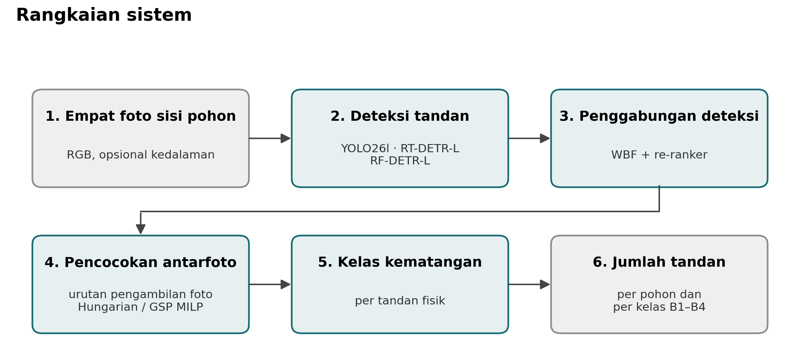
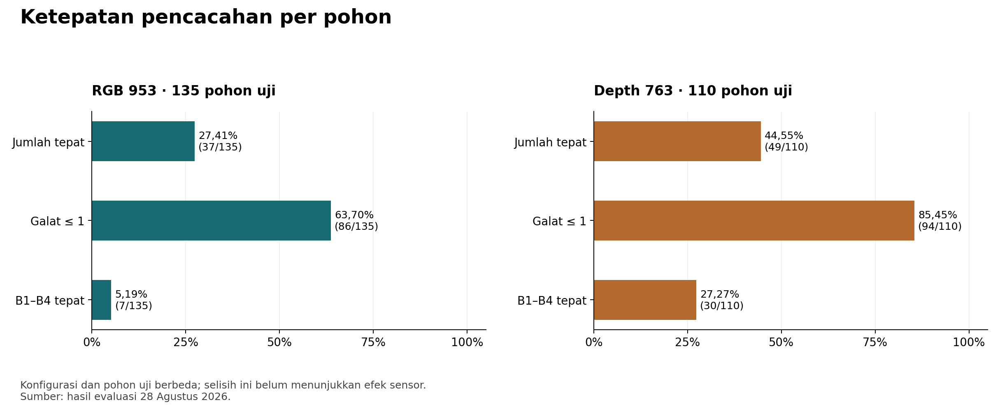
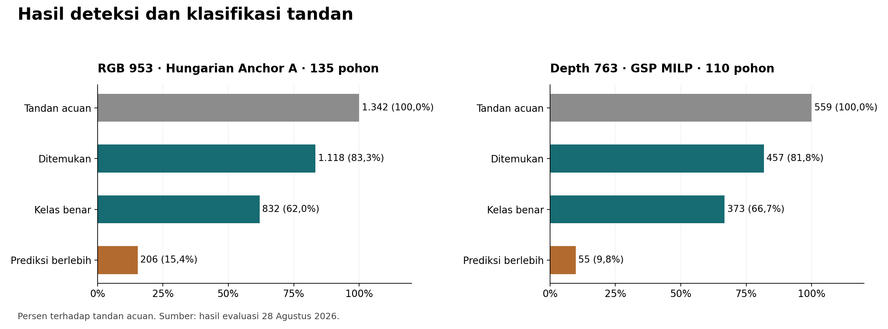
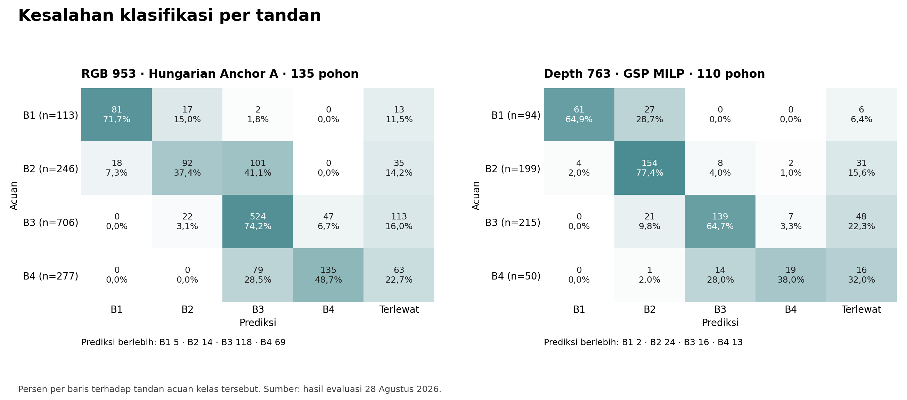
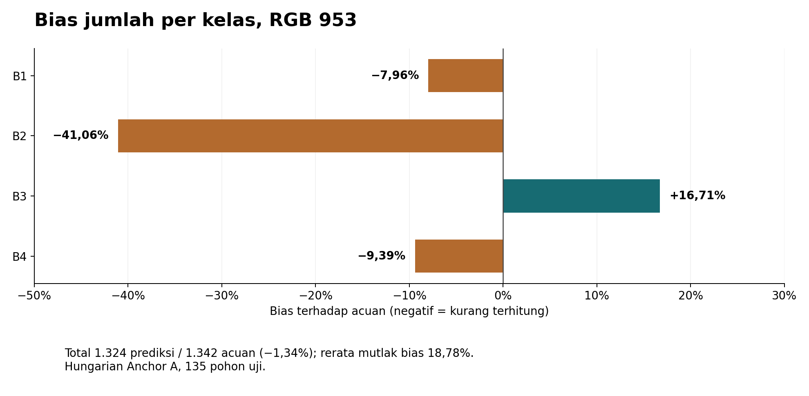
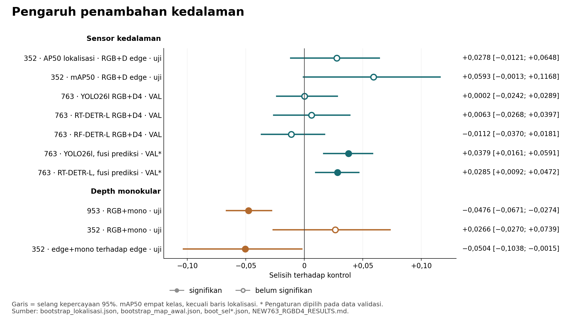
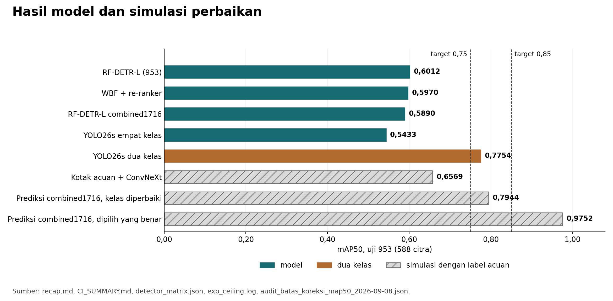

# Laporan Kesiapan Monev: Kinerja Model Pencacahan dan Klasifikasi Tandan Kelapa Sawit

| Butir | Isi |
|---|---|
| Penelitian | Pengembangan Perangkat Mobile dengan Teknologi Depth Sensor untuk Penghitungan dan Klasifikasi Tandan Kelapa Sawit Berbasis Deep Learning |
| Monev | Rabu, 23 September 2026, pukul 10.00–11.00 WITA |
| Penyaji | Bu Fatma |
| Penyusun | Muhammad Zainal Muttaqin |
| Tanggal | 15 September 2026 |
| Cakupan | Artefak repositori `project-expertise` sampai 10 September 2026: `V2-E-001`–`V2-E-048`, `PT-E-000`–`PT-E-036`, `AF-E-001`–`AF-E-016` |

Semua angka berasal dari artefak tanpa pelatihan atau inferensi ulang; aritmetika gambar diverifikasi oleh skrip di [`assets/monev-2026-09-15/`](assets/monev-2026-09-15/).

---

## Ringkasan

| Pertanyaan | Jawaban | Bagian |
|---|---|---|
| Apakah sistem sudah berjalan? | Sudah; diuji pada 135 pohon (RGB 953) dan 110 pohon (Depth 763). | §3–4 |
| Berapa kinerja terbaik? | F1 fisik 0,8387–0,8534; akurasi kelas tertaut 74,42–81,62%; galat jumlah ≤ 1 pada 63,70–85,45% pohon; B1–B4 tepat sekaligus pada 5,19–27,27% pohon. | §4 |
| Apa kelemahan utama? | Kesalahan terbesar terjadi pada kelas bertetangga dan tandan terlewat. Pada 953, 41,06% tandan B2 diprediksi B3, sehingga jumlah B2 kurang 41,06% walaupun jumlah total hanya kurang 1,34%. | §5 |
| Apakah sensor kedalaman bermanfaat? | Belum terbukti. Uji pada data uji dan *early fusion* pada validasi tidak signifikan; hanya fusi prediksi yang signifikan, dengan resep yang dipilih pada validasi. | §6 |
| Apakah sudah mencapai batas? | Belum terbukti. Dari prediksi yang sama, diagnostik berbantuan anotasi mencapai mAP50 0,9752; pemilih otomatisnya belum ada. | §7–8 |
| Apa yang sudah tercapai? | Cacah B1 ±1 95,7–97,0% dan mAP50 dua kelas 0,7754 (uji 953). Target empat kelas dan konsistensi pencacahan total > 95% belum tercapai. | §8–9 |
| Apa langkah berikutnya? | Menetapkan kriteria penerimaan, mengaudit label B2/B3, dan menguji pada data baru dengan RGB+D serentak serta satu protokol anotasi. | §11 |

---

## 1. Apa yang Diukur?

Kedalaman diuji di tiga titik: kanal keempat detektor, fitur *re-ranker* dan pengklasifikasi, serta *prior* posisi pada penautan.

| Metrik | Mengukur | Tingkat |
|---|---|---|
| AP50 lokalisasi | Posisi tandan, tanpa kelas | Citra |
| mAP50 empat kelas | Posisi dan kelas B1–B4 sekaligus | Citra |
| F1 tandan fisik | Tandan fisik ditemukan satu kali setelah empat sisi ditautkan | Pohon |
| Akurasi kelas tertaut | Kelas benar pada tandan yang cocok dengan acuan | Tandan |
| Makro-F1 ujung ke ujung | Rerata F1 B1–B4, termasuk tandan terlewat dan prediksi berlebih | Tandan |
| MAE jumlah | Selisih mutlak rata-rata jumlah total per pohon | Pohon |
| Galat ≤ 1 / tepat / B1–B4 tepat | Proporsi pohon dengan jumlah total meleset paling banyak satu, tepat, atau tepat pada keempat kelas | Pohon |
| Bias per kelas | Selisih jumlah prediksi terhadap acuan per kelas | Kohort |

AP50 dan mAP50 bukan persentase tandan benar. Akurasi kelas tertaut tidak memuat tandan terlewat, sehingga dibaca bersama F1 fisik dan makro-F1.

---

## 2. Data Apa yang Dipakai?

| Korpus | Kamera | Akuisisi | Pohon | Citra | Kotak | Latih/val/uji (pohon) |
|---|---|---|---:|---:|---:|---|
| SawitMVC-YOLO (953) | Ponsel, RGB 960 × 1.280 | 30 April–16 Mei 2026 | 953 | 3.992 | 18.540 | 716/96/141 |
| SawitMVC-Depth (352) | Orbbec, RGB 1.280 × 800 + kedalaman 848 × 480 | 28–29 Juli 2026 | 352 | 1.408 | 2.299 | 245/52/55 |
| SawitMVC-Depth-YOLO v2.0.0 (763) | Orbbec, kampanye Juli (352) dan Agustus (411) | Juli–Agustus 2026 | 763 | 3.052 | 5.872 | 536/117/110 |
| Combined-1716 | Gabungan 953 dan 763 | Mei–Agustus 2026 | 1.364 unik | 7.044 | 24.412 | 1.005/160/199 |

Tiga hal memengaruhi pembacaan hasil:

1. **Komposisi kelas berbeda.** B3 mencakup 52,3% kotak pada 953, sedangkan Depth didominasi B2 (35,0%) dan B3 (38,3%) dengan B4 hanya 7,3%.
2. **Kepadatan berbeda.** Rerata tandan per pohon uji adalah 9,94 (953) dan 5,08 (763). Penautan pada 953 lebih sulit: sekitar 235 pasangan kandidat per pohon (4% benar) dibanding 28 pasangan (21% benar) pada 352 (`PT-E-011`).
3. **Protokol anotasi berbeda.** Pada 352 pohon yang difoto Mei dan Juli, tandan per pohon berubah 9,89 → 3,99, sisi tanpa kotak 1,1% → 14,2%, rasio ukuran kotak 1,003 → 0,869, B1 +66%, dan B4 −85% (`AF-E-001`, `AF-E-007`). Karena itu, perbandingan lintas korpus tidak mengukur efek sensor.

---

## 3. Komponen Apa yang Sudah Ada?

| Komponen | Status | Bukti |
|---|---|---|
| Data RGB dan kedalaman Orbbec + kalibrasi | Sudah | Validitas piksel kedalaman di dalam kotak tandan 95,1% ([DIAGNOSIS-DEPTH.md](DIAGNOSIS-DEPTH.md)) |
| Reproyeksi kedalaman ke citra RGB | Sudah | Pergeseran median 29 piksel dikoreksi ([NEW763_RGBD4_RESULTS.md](NEW763_RGBD4_RESULTS.md)) |
| Tiga detektor | Sudah | RF-DETR-L > RT-DETR-L > YOLO26l, signifikan (`V2-E-038`) |
| Detektor RGB+D dan fusi prediksi | Sudah | Manfaat belum konsisten (§6) |
| WBF + *re-ranker* | Sudah | +0,0108 mAP50 signifikan (953); −0,0139 tidak signifikan (763) ([CI_SUMMARY.md](../results/remote_eval_2026-08-28/ci_artifacts/CI_SUMMARY.md)) |
| Penautan lintas sisi | Sudah | *Prior* arah putar: F1 0,398 → 0,649 (`PT-E-008`) |
| Kelas per tandan | Sudah, belum memadai | Akurasi tertaut 74,42–81,62% |
| Pencacahan per kelas | Sudah, bias besar | Rerata mutlak bias 18,78–19,62% |
| Evaluasi uji + selang kepercayaan | Sudah | Bootstrap 2.000 ulangan ([recap.md §5](../metrics/recap.md)) |
| Pemeriksaan kualitas foto | Belum | [HANDOFF.md](../HANDOFF.md) |
| Laporan keyakinan hasil | Belum final | [HANDOFF.md](../HANDOFF.md) |
| Uji pada pohon baru | Belum | Partisi uji sudah dibaca berulang (§10) |
| Reproduksi penuh profil terbaik | Sebagian | Solver GSP MILP tidak ditemukan; `V2-E-046` tidak tereproduksi |
| Aplikasi mobile dan latensi perangkat | Di luar repositori | — |

---

## 4. Berapa Kinerja Terbaik?

### 4.1 Detektor per citra

| Kemampuan | RGB 953 (588 citra uji) | Depth 763 (440 citra uji) | Combined-1716 (1.052 citra uji) |
|---|---|---|---|
| AP50 lokalisasi | 0,8419 [0,8270; 0,8595], WBF + *re-ranker* | 0,8783 [0,8541; 0,9009], WBF + *re-ranker* | 0,8104, WBF |
| mAP50, model tunggal | 0,6012, RF-DETR-L | 0,6711, RF-DETR-L `combined1716` | 0,5960, RF-DETR-L |
| mAP50, ansambel | 0,5970 [0,5751; 0,6239], WBF + *re-ranker* | 0,6691 [0,6334; 0,7108], WBF | 0,5538, WBF |

| AP50 per kelas | B1 | B2 | B3 | B4 | mAP50 |
|---|---:|---:|---:|---:|---:|
| YOLO26l, uji 953 ([boot_sel6_vs_sel5.json](../results/boot_sel6_vs_sel5.json)) | 0,7708 | 0,4479 | 0,6051 | 0,3506 | 0,5436 |
| YOLO26s, uji 763 ([detector_matrix.json](../results/audit_forensik_2026-09-06/detector_matrix.json)) | 0,7268 | 0,6057 | 0,6480 | 0,2476 | 0,5570 |

Lokalisasi berada di atas 0,84, sedangkan mAP50 empat kelas 0,60–0,67. Penurunan terbesar ada pada penentuan kelas; B2 dan B4 paling lemah.

### 4.2 Pipeline per pohon

Profil *test-locked* 28 Agustus 2026 memakai tiga detektor `combined1716` → WBF → Hungarian Anchor A (953) atau GSP MILP (763) → kelas dan pencacahan Ridge.

| Metrik | RGB 953 (135 pohon) | Depth 763 (110 pohon) |
|---|---|---|
| F1 tandan fisik | 0,8387 [0,8174; 0,8587] | 0,8534 [0,8301; 0,8761] |
| Presisi / daya tangkap | 84,44% / 83,31% | 89,26% / 81,75% |
| Akurasi kelas tertaut | 74,42% [71,12%; 77,35%], *n* = 1.118 | 81,62% [77,65%; 85,56%], *n* = 457 |
| Makro-F1 ujung ke ujung | 0,6034 [0,5655; 0,6382] | 0,6519 [0,6046; 0,6918] |
| F1 B1 / B2 / B3 / B4 | 0,7465 / 0,4706 / 0,6850 / 0,5114 | 0,7578 / 0,7230 / 0,7092 / 0,4176 |
| MAE jumlah | 1,363 [1,163; 1,585] | 0,773 [0,609; 0,945] |
| Jumlah tepat | 27,41% (37 pohon) | 44,55% (49 pohon) |
| Galat ≤ 1 | 63,70% [55,56%; 71,85%] (86 pohon) | 85,45% [78,18%; 91,82%] (94 pohon) |
| B1–B4 tepat sekaligus | 5,19% (7 pohon) | 27,27% (30 pohon) |
| Rerata mutlak bias per kelas | 18,78% | 19,62% |
| Tandan acuan per pohon | 9,94 | 5,08 |

Selang kepercayaan 95% dihitung dengan bootstrap 2.000 ulangan ([953](../results/remote_eval_2026-08-28/gsp_artifacts/953/results_test_locked.json), [Depth](../results/remote_eval_2026-08-28/gsp_artifacts/depth/results_test_locked.json), [recap.md §5](../metrics/recap.md)).

*Gambar 1. Ketepatan pencacahan per pohon.*

Kedua kolom tidak menilai sensor: detektornya RGB, dan pohon 763 rata-rata memuat separuh tandan pohon 953.

### 4.3 Profil alternatif

| Profil | Korpus | F1 fisik | Akurasi | MAE | ≤ 1 | Bias kelas |
|---|---|---:|---:|---:|---:|---:|
| Hungarian Anchor A (acuan) | 953 | **0,8387** | **74,4%** | **1,363** | **63,70%** | 18,78% |
| *Prior* rotasi + Ridge (`V2-E-045`) | 953 | 0,8043 | 71,1% | 1,393 | 61,48% | **16,82%** |
| Pipeline Panen, 132 pohon (`AF-E-012`) | 953 | 0,7619 | 71,6% | 1,402 | 56,82% | 23,22% |
| GSP MILP (acuan) | 763 | **0,8534** | **81,6%** | **0,773** | **85,45%** | 19,62% |
| *Prior* rotasi + Ridge (`V2-E-045`) | 763 | 0,8069 | 80,3% | 0,891 | 80,91% | **13,93%** |

Tidak ada profil yang unggul di semua metrik: profil acuan unggul pada F1 dan galat jumlah, `V2-E-045` pada bias per kelas.

### 4.4 Angka lebih tinggi yang belum dapat dipakai

| Kandidat | Angka | Alasan |
|---|---|---|
| *Stacking* DINOv2-Large, 953 (`V2-E-046`) | Akurasi 76,8% (validasi) | Rekonstruksi hanya 71,64% |
| Komposisi lintas lapis, 763 (`V2-E-047`) | Akurasi 85,0% (validasi) | Selisih tidak signifikan; kode solver hilang |
| *Greedy linker* (`V2-E-043`) | ≤ 1: 83,64% (763), 54,07% (953) | Parameter dipilih pada data uji |
| Pipeline Panen (`AF-E-012`) | Makro-F1 0,6692 | Hanya tandan tertaut; ujung ke ujung 0,5201 |

---

## 5. Di Mana Kinerja Hilang?

### 5.1 Alur tandan

*Gambar 2. Jumlah tandan per tahap terhadap tandan acuan.*

- **953:** 1.342 acuan → 1.118 tertaut (83,3%) → 832 kelas benar (62,0%), dengan 206 prediksi berlebih. Salah kelas (286) lebih banyak daripada terlewat (224).
- **763:** 559 acuan → 457 tertaut (81,8%) → 373 kelas benar (66,7%), dengan 55 prediksi berlebih. Terlewat (102) sedikit lebih banyak daripada salah kelas (84).

### 5.2 Pola salah kelas

*Gambar 3. Matriks konfusi per tandan acuan.*

1. **953: B2 dan B4 terlemah.** B2 benar 37,40% dan 41,06% menjadi B3; B4 benar 48,74% dan 28,52% menjadi B3.
2. **763: B4 terlemah.** B4 benar 38,00%, 28,00% menjadi B3, dan 32,00% terlewat; B1 benar 64,89% dan 28,72% menjadi B2.
3. **Kesalahan bersifat ordinal.** Sebanyak 99,3% (953) dan 96,4% (763) salah kelas terjadi antarkelas bertetangga.
4. **B2|B3 adalah batas tersulit.** Konfusi B2↔B3 menyumbang 195 galat, B1↔B2 57 galat (`AF-E-009`).
5. **Kesepakatan antaranotator belum diukur.** Kelas dicatat sekali per tandan fisik lalu disalin ke semua tampak (`AF-E-002`).

### 5.3 Jumlah total menutupi salah komposisi

*Gambar 4. Bias jumlah per kelas, RGB 953.*

| Kelas | 953: prediksi / acuan | 953: bias | 763: prediksi / acuan | 763: bias |
|---|---:|---:|---:|---:|
| B1 | 104 / 113 | −7,96% | 67 / 94 | −28,72% |
| B2 | 145 / 246 | −41,06% | 227 / 199 | +14,07% |
| B3 | 824 / 706 | +16,71% | 177 / 215 | −17,67% |
| B4 | 251 / 277 | −9,39% | 41 / 50 | −18,00% |
| **Total** | **1.324 / 1.342** | **−1,34%** | **512 / 558** | **−8,24%** |

Acuan per kelas 763 dari matriks konfusi berjumlah 558, satu kurang dari 559 pada metrik fisik; selisih ini belum dijelaskan.

Jumlah tepat belum berarti tandan yang dihitung benar: 24 dari 37 pohon tepat (953) dan 17 dari 49 (763) memuat tandan terlewat dan prediksi berlebih yang saling meniadakan. Galat ≥ 2 terjadi pada 49 dari 135 pohon (953) dan 16 dari 110 pohon (763). Pada 763, pohon kurang terhitung (46) jauh lebih banyak daripada pohon berlebih (15) ([`count_error_cancellation.json`](../results/audit_2026-09-06/count_error_cancellation.json)).

---

## 6. Apakah Sensor Kedalaman Bermanfaat?

*Gambar 5. Selisih berpasangan terhadap kontrol. Titik terisi menandakan selang kepercayaan 95% tidak mencakup nol.*

### 6.1 Hasil uji

| Uji | Rancangan | Hasil | Kesimpulan |
|---|---|---|---|
| Lokalisasi, 352 (`V2-E-024`) | Detektor satu kelas, RGB+D `edge` terhadap RGB | AP50 0,7636 terhadap 0,7358; Δ = +0,0278 [−0,0121; +0,0648] | Belum signifikan |
| mAP50, 352 (`V2-E-011`) | YOLO26l RGB+D `edge` terhadap RGB | 0,4270 terhadap 0,3677; Δ = +0,0593 [−0,0013; +0,1168] | Belum signifikan |
| *Early fusion* RGB+D4, 763 (validasi) | Tiga arsitektur, 468 citra | Δ: YOLO26l +0,0002; RT-DETR-L +0,0063; RF-DETR-L −0,0112 | Tidak signifikan |
| Fusi prediksi RGB dan RGB+D4, 763 (validasi) | Union-WBF (YOLO26l), union-NMS (RT-DETR-L) | Δ = +0,0379 [+0,0161; +0,0591]; +0,0285 [+0,0092; +0,0472] | Signifikan; resep dipilih pada validasi |
| Fitur kematangan, 352 (`V2-E-016`) | RGB terhadap RGB + statistik kedalaman | *Probe* 0,6415 dan 0,6415; tiga *seed* 0,6309 dan 0,6106; kedalaman saja 0,3756 | Redundan dengan RGB |
| Penautan 3D, 352 (`PT-E-013`) | Kedalaman + arah putar | AUC 0,45–0,51 | Setara tebakan acak |
| Depth monokular, 953 (`V2-E-029`) | RGB + estimasi kedalaman | Δ = −0,0476 [−0,0671; −0,0274] | Turun signifikan |
| Monokular di atas sensor, 352 (`V2-E-031`) | Lima kanal terhadap RGB+D `edge` | Δ = −0,0504 [−0,1038; −0,0015] | Turun signifikan |

### 6.2 Penyebab

1. **Sinyal fisik ada.** Relief lokal berubah monoton terhadap kelas: +2,8 cm (B1) sampai −5,1 cm (B4); Kruskal–Wallis *H* = 99,8; *p* = 1,7 × 10⁻²¹.
2. **Sinyal per piksel lemah.** Pada jarak 2,49 m, satu tingkat uint8 setara 2,9 cm, sedangkan derau sensor sekitar 2,5 cm; rasio sinyal terhadap derau per piksel sekitar 0,3.
3. **Cakupan sensor terbatas.** Piksel valid hanya 28,6–28,8% grid warna, walaupun 95,1% di dalam kotak tandan.
4. **Informasinya sudah ada di RGB.** Tandan muda yang tertanam di sela pelepah juga berbeda warna dan teksturnya.

### 6.3 Keputusan

Klaim "kedalaman meningkatkan kinerja" belum dapat diajukan. Bukti mendukung empat hal:

- Kanal kedalaman terselaraskan dan terbaca oleh tiga detektor.
- Relief kedalaman berkaitan signifikan dengan kelas kematangan.
- Fusi prediksi RGB dan RGB+D menjanjikan pada validasi dan perlu diuji pada data baru.
- Depth monokular tidak dapat menggantikan sensor.

Uji 352 hanya memuat 410 kotak, sehingga lebar selang mAP50 sekitar 0,12. Efek 0,03 dengan daya 80% membutuhkan sekitar 4.000 kotak uji ([LAPORAN-AKHIR.md §8](LAPORAN-AKHIR.md)).

---

## 7. Apa yang Sudah Dicoba?

Repositori mencatat 48 simpul `V2-E`, 36 simpul `PT-E`, 16 simpul `AF-E`, dan 2.893 baris evaluasi gelombang validasi ([`07_buku_besar_eksperimen.md`](../metrics/07_buku_besar_eksperimen.md)).

| Pendekatan | Varian | Hasil | Simpul |
|---|---|---|---|
| Detektor | YOLO26l/s/m, RT-DETR-L, RF-DETR-L; 960–1.280 px | RF-DETR-L terbaik signifikan; data 9,8 kali lebih banyak tidak menaikkan AP50 (0,7374 terhadap 0,7330) | `V2-E-001`, `017`, `034`–`038` |
| Fusi kedalaman | Invers, Sobel `edge`, *mid-fusion*, monokular, lima kanal, RGBD4, *late fusion* | Tidak signifikan pada data uji (§6) | `V2-E-005`–`011`, `024`, `027`–`032` |
| Pascaproses deteksi | WBF, *re-ranker* 30–37 fitur, sapuan ambang dan resolusi | +0,0108 mAP50 signifikan (953); −0,0139 tidak signifikan (763) | `V2-E-019`, `039`; [MAP_BOOST.md](../results/remote_eval_2026-08-28/MAP_BOOST.md) |
| Pengklasifikasi | ConvNeXt, Swin, EfficientNetV2, ResNet-18, DINOv2; CE, CORAL, CORN; multi-tampak; spesialis batas; MoE; *stacking*; ansambel | Akurasi per tandan 0,734–0,744; CORAL 0,3305 dan CORN 0,6983 | `PT-E-012`, `014`, `015`, `018`, `023`, `029`–`036`; `V2-E-015`, `044`, `046` |
| Praproses warna | Hue, *sharpening*, CLAHE, *gray-world*, *white balance*, gamma, TTA | Tidak ada perbaikan menyeluruh | [HANDOFF.md](../HANDOFF.md) |
| Resolusi *crop* | 32–320 px | Jenuh pada 96 px | `V2-E-048` ([ABLASI-ANGGARAN-PIKSEL.md](ABLASI-ANGGARAN-PIKSEL.md)) |
| Penautan lintas sisi | Geometri, re-ID, GNN, *prior* arah putar, ExtraTrees, Hungarian, GSP MILP, *greedy*, 3D | *Prior* arah putar: F1 0,398 → 0,649; latih di ruang deteksi: 0,1492 → 0,3788; 3D gugur | `PT-E-002`, `008`, `013`, `016`, `017`, `020`, `022`; `V2-E-043` |
| Pencacahan | Ridge, CatBoost, meta-ansambel, rekonsiliasi | Makro-MAE per kelas tidak turun di bawah sekitar 1,00 | `PT-E-004`, `026`, `028`; `V2-E-045` |
| Data dan domain | Latih gabungan 953 + 352, Combined-1716, lintas kampanye | Model 763 pada uji 953: mAP50 0,1776 | `V2-E-021`, `035`, `040`–`042` |
| Struktur pohon | Peringkat vertikal tandan (Spearman −0,616) | +0,0058 makro-F1 | `AF-E-003`, `009` |
| Gelombang validasi | Pipeline V2, lintas lapis, *head* komposisi, *attention* | Tidak ada kandidat unggul di semua metrik | `V2-E-046`–`048` |
| Verifikasi lokal beku | Pemeriksaan ulang kandidat pada potongan 384 px | mAP50 0,4470 terhadap 0,4647 (12 citra) | [val_12images.json](../results/verifikasi_lokal_beku_2026-09-08/val_12images.json) |

Perubahan besar hanya muncul saat struktur masalah berubah: *prior* arah putar (+0,25 F1), fusi detektor untuk lokalisasi, dan taksonomi dua kelas (+0,2321 mAP50). Penggantian *backbone*, fungsi rugi, praproses warna, dan ansambel hanya menggeser hasil dalam rentang variasi seleksi, sekitar 2 poin persentase.

---

## 8. Apakah Batas Kemampuan Sudah Tercapai?

*Gambar 6. mAP50 pada uji 953. Batang berarsir membaca anotasi dan bukan hasil model.*

| Klaim | Bukti | Status |
|---|---|---|
| mAP50 empat kelas maksimal 0,6569 | Satu pengklasifikasi ConvNeXt (akurasi per tampak 0,6612) pada kotak acuan ([exp_ceiling.log](../logs_ringkas/audit_forensik_2026-09-06/exp_ceiling.log)) | Belum terbukti |
| Target 0,85 butuh akurasi 0,90 | Simulasi dengan skor buatan | Hanya berlaku pada simulasi |
| Resolusi *crop* lebih tinggi membantu | Akurasi jenuh pada 96 px | Tidak didukung (*probe* linear) |
| Prediksi benar sudah tersedia | Penyaringan berbantuan anotasi 0,9752; penggantian kelas 0,7944 ([BUKTI-BATAS-KOREKSI-MAP50.md](BUKTI-BATAS-KOREKSI-MAP50.md)) | Didukung; pemilih otomatis belum ada |
| Verifikasi lokal beku membantu | 12 citra validasi: 0,4470 terhadap 0,4647 | Tidak lebih baik |
| Ansambel dapat mencapai 0,80 per tandan | Pita 0,734–0,744; *oracle* 0,8739; korelasi keyakinan +0,1185 | Informasi ada, tetapi tidak terbaca dari skor keyakinan |

Sasaran yang lebih sempit sudah tercapai:

- **mAP50 dua kelas 0,7754**, dibanding 0,5433 untuk empat kelas dengan model dan data yang sama (YOLO26s, `AF-E-006`).
- **Cacah B1 ±1 sebesar 95,7–96,5%** (`AF-E-008`) **dan 97,0%** (`AF-E-013`). B1 jarang, sehingga prediktor konstan sudah mencapai 92,91%; MAE model tetap lebih baik (0,3688 terhadap 0,8582).
- B1+B2 sebagai "matang" tidak didukung: ±1 hanya 76,5%.

Target empat kelas belum terbukti mustahil, tetapi jalur untuk mencapainya juga belum terbukti.

---

## 9. Bagaimana Posisi terhadap Target?

Target proposal hibah tidak ada di repositori; tabel memakai target internal.

| Target | Sumber | Capaian | Status |
|---|---|---|---|
| mAP50 empat kelas ≥ 0,75 dan ≥ 0,85 | [BUKTI-BATAS-KOREKSI-MAP50.md](BUKTI-BATAS-KOREKSI-MAP50.md), [report-source.md](research_2026-09-06/report-source.md) | 0,6012 (953); 0,6711 (763) | Belum |
| Akurasi kelas sekitar 75% | [HANDOFF.md](../HANDOFF.md) | 74,42% [71,12%; 77,35%] (953); 81,62% (763); hanya tandan tertaut | 953 belum pasti; 763 tercapai |
| Lokalisasi sekitar 90% | [HANDOFF.md](../HANDOFF.md) | AP50 0,8419 (953); 0,8783 (763) | Belum |
| Akurasi per tandan 0,80 | [pipeline-pertandan/STATUS.md](../pipeline-pertandan/STATUS.md) | 0,7439 | Belum |
| Konsistensi pencacahan > 95% | [report-source.md](research_2026-09-06/report-source.md) | Total ±1: 63,70% (953), 85,45% (763); B1 ±1: 97,0% | Hanya B1 |

Selang kepercayaan akurasi 953 mencakup 75%, sehingga target itu belum dapat dinyatakan tercapai maupun gagal. "Standar industri" belum memiliki angka acuan; kriteria penerimaan perlu disepakati dengan pengguna kebun.

---

## 10. Batasan Validitas

1. **Partisi uji dibaca berulang.** Angka uji adalah *benchmark* pengembangan, bukan kinerja pada pohon baru.
2. **Potensi kebocoran Depth.** Sebanyak 39 pohon uji Depth masuk partisi latih `combined1716` dan 5 pohon masuk validasi. Profil Depth terbaik memakai detektor `combined1716`; paparannya belum dapat dipastikan ([report-source.md §4](research_2026-09-06/report-source.md)).
3. **Kebocoran lama sudah dikoreksi.** Sebanyak 122 dari 141 pohon uji 953 terpakai pada prapelatihan `agn953_full`, dan 44 dari 55 pohon uji 352 ada di partisi latih 953 (`V2-E-025`, `V2-E-033`).
4. **Protokol anotasi antarkampanye berbeda** (§2).
5. **Keterbatasan evaluator.** F1 fisik belum mengukur kemurnian klaster; tiga pohon kosong tidak ikut evaluasi Pipeline Panen; prediksi kosong memicu galat.
6. **Cacat implementasi belum diukur dampaknya:** normalisasi skor WBF, peringkat klaster tanpa probabilitas kepala kelas, identitas proposal tidak diperiksa, bobot kelas ExtraTrees ganda, dan normalisasi BGR dengan statistik RGB ([`implementation_probes.json`](../results/audit_2026-09-06/implementation_probes.json)).
7. **Reproduksi belum lengkap.** Bobot asli RT-DETR-L dan RF-DETR-L 953 hilang; latih ulang menghasilkan 0,5718 dan 0,5965 dibanding 0,5781 dan 0,6012. `link_global_setpartition.py` tidak ditemukan, dan `V2-E-046` tidak tereproduksi.
8. **Definisi kelas tidak konsisten.** `DATASET.md` menyebut B1 lewat matang dan B2 matang optimal, sedangkan audit mengutip kartu dataset yang menyebut B1 tahap panen optimal dan B2 transisi. Definisi ini perlu dikonfirmasi ke pemilik data.
9. **Dokumen yang perlu dikoreksi:**
   - [LAPORAN-AKHIR.md](LAPORAN-AKHIR.md) dan [README.md](../README.md) menulis "terbukti meningkatkan lokalisasi", padahal selangnya mencakup nol.
   - [AUDIT-FORENSIK-2026-09-06.md §1](AUDIT-FORENSIK-2026-09-06.md) menulis target empat kelas "tidak terjangkau", padahal belum terbukti.
   - [`metrics/07_buku_besar_eksperimen.md`](../metrics/07_buku_besar_eksperimen.md) mencantumkan selang `V2-E-030` dan `V2-E-031` yang berbeda dari sumber: [−0,0270; +0,0739] ([`results/boot_sel3_vs_sel1.json`](../results/boot_sel3_vs_sel1.json)) dan [−0,1038; −0,0015] ([`results/boot_sel4_vs_sel2.json`](../results/boot_sel4_vs_sel2.json)).
   - ID `V2-E-048` dipakai dua kali (28 Agustus dan 10 September 2026).
   - [README.md](../README.md) mencantumkan AP50 0,8372; nilai terkoreksi 0,8350.

---

## 11. Opsi Lanjutan

| Opsi | Isi | Dasar | Risiko | Indikator |
|---|---|---|---|---|
| A. Kriteria dan evaluasi tunggal | Metrik utama dan ambang ditetapkan sebelum uji; cacat evaluator diperbaiki | §9, §10 | Perlu kesepakatan pengguna | Kriteria disepakati; semua profil dinilai ulang |
| B. Audit label | Dua anotator menilai ulang sampel berstrata pada batas B2\|B3 dan B3\|B4 | 99,3% salah kelas bertetangga | Batas label bisa di bawah target | Kesepakatan antaranotator per batas |
| C. Keluaran sempit | Jumlah B1 dan dua kelas sebagai keluaran utama | B1 ±1 97,0%; mAP50 dua kelas 0,7754 | B1 jarang | Lebih baik dari prediktor konstan pada uji baru |
| D. Data uji baru | RGB+D serentak, satu protokol anotasi, uji tersegel sekitar 4.000 kotak | §2, §6, §10 | Biaya lapangan | Uji RGB terhadap RGB+D pada data baru |
| E. Riset pemilih kandidat | Pemilih kandidat–kelas dengan fitur visual lokal; kelas diputuskan setelah penautan | Diagnostik 0,9752; *oracle* 0,8739 | Uji 12 citra belum membaik | mAP50 validasi penuh ≥ 0,70 |

Opsi A, B, dan D menjadi prasyarat keputusan, opsi C menjadi keluaran jangka dekat, dan opsi E menjadi jalur riset dengan gerbang keputusan.

---

## 12. Bahan Presentasi

### 12.1 Pesan inti

1. Sistem dari empat foto sampai jumlah per kelas sudah berjalan dan terukur.
2. Kelemahan utama sudah spesifik: salah kelas pada batas B2|B3 dan B3|B4, sehingga jumlah per kelas bias walaupun total mendekati acuan.
3. Sensor kedalaman sudah terintegrasi, tetapi manfaatnya belum signifikan; tahap berikutnya butuh data uji baru dan kriteria penerimaan yang ditetapkan lebih dulu.

### 12.2 Susunan slide

| No. | Slide | Materi |
|---|---|---|
| 1 | Tujuan dan rangkaian sistem | Diagram §1 |
| 2 | Data dan tantangannya | Tabel §2 |
| 3 | Capaian model | Tabel §4.2, Gambar 1 |
| 4 | Letak kelemahan | Gambar 2, 3, 4 |
| 5 | Sensor kedalaman | Gambar 5, tabel §6.1 |
| 6 | Upaya dan posisi terhadap target | Tabel §7, Gambar 6, tabel §9 |
| 7 | Rencana berikutnya | Tabel §11 |

### 12.3 Tanya jawab

| Pertanyaan | Jawaban |
|---|---|
| Mengapa akurasi kelas belum 90%? | Salah kelas terkumpul di batas bertetangga, terutama B2\|B3 (41,06% B2 menjadi B3 pada 953). Kesepakatan antaranotator di batas ini belum diukur. |
| Apa kontribusi sensor kedalaman? | Kanal kedalaman terintegrasi dan relief berkaitan dengan kelas. Peningkatan pada data uji belum signifikan; fusi prediksi signifikan pada validasi dan perlu uji baru. |
| Mengapa hasil Depth lebih baik? | Detektornya RGB, tandan per pohon 5,08 terhadap 9,94, dan 44 pohon uji Depth mungkin pernah terlihat saat pelatihan. Perbedaan itu bukan efek sensor. |
| Apakah siap dipakai di kebun? | Belum untuk hitung otomatis per kelas: B1–B4 tepat hanya pada 5,19–27,27% pohon. Keluaran yang paling dekat dengan kebutuhan adalah cacah B1 ±1 dan klasifikasi dua kelas; keduanya perlu uji baru. |
| Mengapa tidak menambah data atau model lebih besar? | Data 9,8 kali lebih banyak tidak menaikkan AP50 (0,7374 terhadap 0,7330), dan DINOv2-Large tetap di pita akurasi yang sama. Yang dibutuhkan adalah data dengan satu protokol anotasi dan uji baru. |
| Apa kontribusi ilmiahnya? | Bukti perbedaan protokol anotasi pada pohon identik, *prior* arah putar untuk penautan, karakterisasi relief kedalaman, bukti negatif depth monokular, dan evaluasi tingkat pohon dengan selang kepercayaan. |
| Apa target berikutnya? | Kriteria penerimaan ditetapkan lebih dulu, lalu diukur sekali pada uji baru: makro-F1 ujung ke ujung, bias per kelas, galat B1 dan total, serta uji RGB terhadap RGB+D. |

### 12.4 Rumusan

| Hindari | Gunakan |
|---|---|
| "Depth terbukti meningkatkan akurasi." | "Kanal kedalaman sudah terintegrasi; peningkatannya belum signifikan pada data uji." |
| "Akurasi sistem 81,62%." | "Akurasi kelas tandan tertaut 81,62%; makro-F1 pipeline 0,6519." |
| "Model sudah mencapai batas dataset." | "Plafon yang pernah diukur berasal dari satu pengklasifikasi; batas data belum terbukti." |
| "Pencacahan akurat 85%." | "Galat jumlah ≤ 1 pada 85,45% pohon Depth; B1–B4 tepat pada 27,27% pohon." |
| "Hasil Depth lebih baik karena sensor." | "Profil Depth memakai detektor RGB dan pohon dengan 5,08 tandan; perbedaannya bukan efek sensor." |

---

## Lampiran A. Glosarium

| Istilah | Arti |
|---|---|
| Kotak pembatas (*bounding box*) | Persegi penanda lokasi tandan |
| WBF (*weighted box fusion*) | Penggabungan kotak dari beberapa detektor |
| *Re-ranker* | Model penilai ulang peluang kotak merupakan tandan |
| Penautan lintas sisi (*linker*) | Pencocokan kotak dari empat foto yang mewakili tandan yang sama |
| Hungarian / GSP MILP | Pencocokan satu-ke-satu / partisi global dengan pemrograman bilangan bulat |
| *Prior* arah putar | Urutan foto searah jarum jam untuk memperkirakan pergeseran posisi tandan |
| Bootstrap berpasangan | Pengambilan sampel ulang yang sama untuk dua model guna menghitung selang selisih |
| Validasi / uji | Data pemilihan konfigurasi / data pengukuran akhir |
| Model batas atas teoretis (*oracle*) | Konstruksi yang memakai anotasi; bukan hasil model |
| *Probe* linear | Pengklasifikasi linear di atas fitur beku |
| *Early* / *late fusion* | Kedalaman sebagai kanal masukan / penggabungan prediksi RGB dan RGB+D |
| Depth monokular | Estimasi kedalaman dari citra RGB tanpa sensor |

## Lampiran B. Kelas Kematangan

| Kelas | Tingkat | Ciri visual | Median kotak (953) |
|---|---|---|---:|
| B1 | Lewat matang (siap panen) | Jingga kemerahan cerah, posisi terbawah | 133 px |
| B2 | Matang optimal (siap panen) | Oranye kemerahan bersemburat ungu kehitaman | 120 px |
| B3 | Matang awal | Ungu kemerahan kehitaman | 107 px |
| B4 | Mentah | Hitam kehijauan, di sela pelepah | 93 px |

Sumber: [DATASET.md](DATASET.md), [recap.md §4](../metrics/recap.md). Definisi B1 dan B2 perlu dikonfirmasi (§10 butir 8).

## Lampiran C. Artefak

| Berkas | Isi |
|---|---|
| [`results/remote_eval_2026-08-28/gsp_artifacts/953/results_test_locked.json`](../results/remote_eval_2026-08-28/gsp_artifacts/953/results_test_locked.json) | Profil acuan RGB 953 |
| [`results/remote_eval_2026-08-28/gsp_artifacts/depth/results_test_locked.json`](../results/remote_eval_2026-08-28/gsp_artifacts/depth/results_test_locked.json) | Profil acuan Depth 763 |
| [`metrics/recap.md`](../metrics/recap.md) | Leaderboard, bias per kelas, selang kepercayaan |
| [`results/remote_eval_2026-08-28/ci_artifacts/CI_SUMMARY.md`](../results/remote_eval_2026-08-28/ci_artifacts/CI_SUMMARY.md) | Selang WBF dan *re-ranker* |
| [`results/audit_2026-09-06/count_error_cancellation.json`](../results/audit_2026-09-06/count_error_cancellation.json) | Pembatalan galat pencacahan |
| [`results/bootstrap_lokalisasi.json`](../results/bootstrap_lokalisasi.json), [`results/bootstrap_map_awal.json`](../results/bootstrap_map_awal.json) | Uji kanal kedalaman, 352 |
| [`results/boot_sel6_vs_sel5.json`](../results/boot_sel6_vs_sel5.json), [`results/boot_sel3_vs_sel1.json`](../results/boot_sel3_vs_sel1.json), [`results/boot_sel4_vs_sel2.json`](../results/boot_sel4_vs_sel2.json) | Uji depth monokular |
| [`docs/NEW763_RGBD4_RESULTS.md`](NEW763_RGBD4_RESULTS.md) | *Early* dan *late fusion* RGB+D4 |
| [`docs/DIAGNOSIS-DEPTH.md`](DIAGNOSIS-DEPTH.md) | Sinyal relief dan redundansi kedalaman |
| [`results/audit_forensik_2026-09-06/detector_matrix.json`](../results/audit_forensik_2026-09-06/detector_matrix.json) | Detektor empat, dua, dan satu kelas |
| [`logs_ringkas/audit_forensik_2026-09-06/exp_ceiling.log`](../logs_ringkas/audit_forensik_2026-09-06/exp_ceiling.log) | Plafon mAP50 dengan kotak acuan |
| [`results/audit_batas_koreksi_map50_2026-09-08.json`](../results/audit_batas_koreksi_map50_2026-09-08.json) | Koreksi berbantuan anotasi |
| [`results/verifikasi_lokal_beku_2026-09-08/val_12images.json`](../results/verifikasi_lokal_beku_2026-09-08/val_12images.json) | Verifikasi lokal beku |
| [`docs/ABLASI-ANGGARAN-PIKSEL.md`](ABLASI-ANGGARAN-PIKSEL.md) | Ablasi anggaran piksel |
| [`docs/AUDIT-FORENSIK-2026-09-06.md`](AUDIT-FORENSIK-2026-09-06.md), [`docs/research_2026-09-06/report-source.md`](research_2026-09-06/report-source.md) | Audit data, evaluator, implementasi |
| [`metrics/07_buku_besar_eksperimen.md`](../metrics/07_buku_besar_eksperimen.md) | Buku besar simpul eksperimen |
| [`docs/assets/monev-2026-09-15/`](assets/monev-2026-09-15/) | Skrip gambar, gambar, verifikasi aritmetika |
