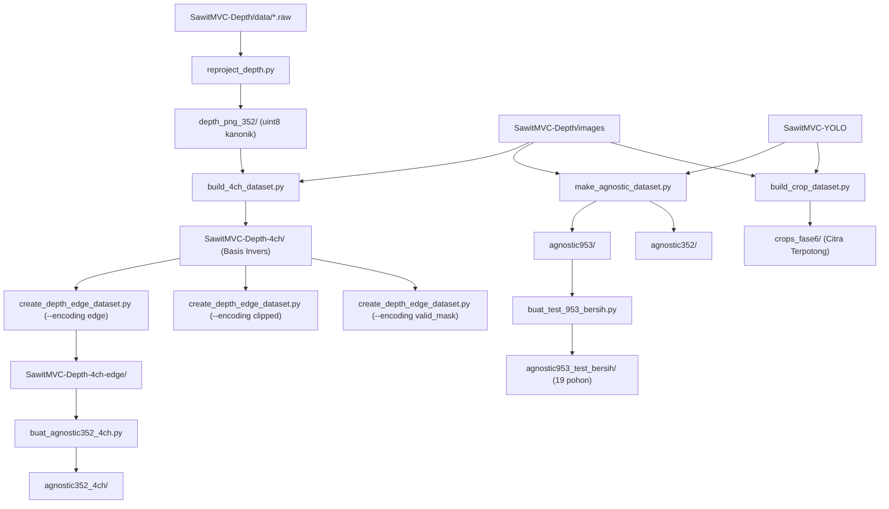

# Prosedur Regenerasi Data Turunan & Reprodusibilitas Komputasi

Dokumen ini menyajikan prosedur operasional standar untuk meregenerasi seluruh data turunan (*derived datasets*), citra terpotong (*crops*), dan representasi multi-kanal secara deterministik dari dataset sumber.

Seluruh bobot model terlatih (`*.pt`), log pelatihan, dan berkas keluaran evaluasi tersimpan permanen di repositori. Data turunan perantara dapat dibentuk ulang kapan pun melalui skrip yang tersedia.

---

## 1. Prasyarat Lingkungan Eksekusi

Lingkungan komputasi berbasis Python 3.12.3 diinisialisasi melalui:

```bash
cd /workspace/project-expertise
python3.12 -m venv .venv
.venv/bin/pip install -r requirements-freeze.txt \
  --extra-index-url https://download.pytorch.org/whl/cu128
```

Dataset sumber yang wajib tersedia di direktori lokal:
* `/workspace/SawitMVC-YOLO` (953 pohon)
* `/workspace/SawitMVC-Depth` (352 pohon)
* `/workspace/depth_png_352` (citra kedalaman tereproyeksi kanonik uint8)

---

## 2. Diagram Silsilah dan Urutan Ketergantungan Data



---

## 3. Perintah Regenerasi Langkah-demi-Langkah

### 3.1 Pembangunan Dataset 4-Kanal Basis Invers (`SawitMVC-Depth-4ch/`)
*Durasi: $\approx 5\text{ menit}$, Ukuran: $3,9\text{ GB}$*

```bash
.venv/bin/python scripts/build_4ch_dataset.py \
  --rgb-dir   /workspace/SawitMVC-Depth/images \
  --depth-dir /workspace/depth_png_352 \
  --out-dir   /workspace/SawitMVC-Depth-4ch/images \
  --workers 8
```
*Verifikasi*: Tepat 1.408 berkas TIFF 4-kanal `[B, G, R, D]`.

### 3.2 Pembangunan Varian Encoding Kedalaman (`edge`, `clipped`, `valid_mask`)
*Durasi: $\approx 10\text{ menit per varian}$*

```bash
for enc in edge clipped valid_mask; do
  .venv/bin/python scripts/create_depth_edge_dataset.py \
    --encoding "$enc" \
    --src /workspace/SawitMVC-Depth-4ch/images \
    --dst /workspace/SawitMVC-Depth-4ch-$enc/images \
    --workers 8
done
```

### 3.3 Ekstraksi Citra Terpotong (*Crops*) Tandan Kematangan (`crops_fase6/`)
*Durasi: $\approx 15\text{ menit}$, Ukuran: $3,3\text{ GB}$*

```bash
.venv/bin/python scripts/build_crop_dataset.py --src 352 --workers 8
.venv/bin/python scripts/build_crop_dataset.py --src 953 --workers 8
```
*Verifikasi*: Menghasilkan 2.299 crop dari 352 pohon (1.517 latih / 372 validasi / 410 uji) dan 16.542 crop dari 953 pohon.

### 3.4 Pembangunan Dataset Lokalisasi Murni (*Class-Agnostic*)
```bash
.venv/bin/python scripts/make_agnostic_dataset.py     # Membangun agnostic953 & agnostic352
.venv/bin/python scripts/buat_agnostic352_4ch.py      # Membangun agnostic352_4ch (berbasis 4ch-edge)
.venv/bin/python scripts/buat_test_953_bersih.py      # Membangun split test bersih 19 pohon
```

---

## 4. Skrip Eksekusi Terpadu (Rekonstruksi Penuh $\sim 45$ Menit)

```bash
#!/usr/bin/env bash
set -euo pipefail

cd /workspace/project-expertise
echo "Memulai regenerasi penuh data turunan..."

.venv/bin/python scripts/build_4ch_dataset.py \
  --rgb-dir /workspace/SawitMVC-Depth/images \
  --depth-dir /workspace/depth_png_352 \
  --out-dir /workspace/SawitMVC-Depth-4ch/images \
  --workers 8

for enc in edge clipped valid_mask; do
  .venv/bin/python scripts/create_depth_edge_dataset.py \
    --encoding "$enc" \
    --src /workspace/SawitMVC-Depth-4ch/images \
    --dst /workspace/SawitMVC-Depth-4ch-"$enc"/images \
    --workers 8
done

.venv/bin/python scripts/materialize_split_dirs.py \
  --src-images /workspace/SawitMVC-Depth-4ch/images \
  --src-labels /workspace/SawitMVC-Depth/labels \
  --splits-dir /workspace/SawitMVC-Depth/splits/canonical_70_15_15_tiff \
  --out-root /workspace/SawitMVC-Depth-4ch-YOLO

.venv/bin/python scripts/build_crop_dataset.py --src 352 --workers 8
.venv/bin/python scripts/build_crop_dataset.py --src 953 --workers 8
.venv/bin/python scripts/make_agnostic_dataset.py
.venv/bin/python scripts/buat_agnostic352_4ch.py
.venv/bin/python scripts/buat_test_953_bersih.py

echo "Regenerasi data turunan tuntas dan terverifikasi penuh."
```
