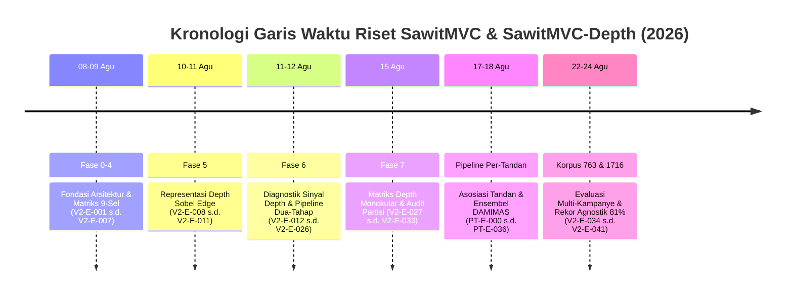
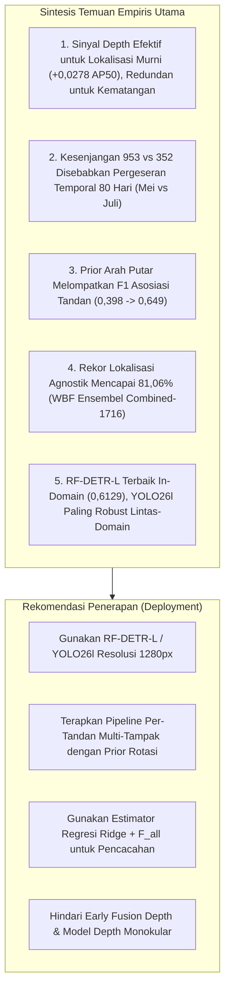

# Alur Kerja & Rekam Jejak Kronologis Penelitian

Dokumen ini menyajikan rekonstruksi kronologis menyeluruh dari seluruh rangkaian eksperimen deteksi objek, estimasi kedalaman (*depth*), klasifikasi tingkat kematangan, asosiasi multi-tampak (*multi-view linking*), dan pencacahan (*counting*) tandan buah segar (TBS) kelapa sawit pada dataset **SawitMVC** dan **SawitMVC-Depth**.

Seluruh simpul eksperimen disusun berurutan secara tanggal, dengan setiap simpul memiliki nomor identitas eksplisit (**`V2-E-###`** atau **`PT-E-###`**) agar mudah dicari dan ditelusuri. Seluruh teks narasi, metrik kuantitatif, dan sintesis metodologis mematuhi **Kaidah Bahasa Indonesia Ilmiah Baku (EYD Edisi V / PUEBI)**, prinsip anti-*calque*, notasi matematika baku (desimal koma, pemisah ribuan titik, minus tipografis $\minus$, selang kepercayaan $[\text{min}; \text{max}]$), serta struktur **Lembar Bukti Empiris Empat Bagian**:
1. **Rancangan Eksperimen**: Desain komparasi, konfigurasi input/model, serta parameter pelatihan.
2. **Temuan Empiris Terukur**: Kuantifikasi performa beserta signifikansi statistik ($p$-value, selang kepercayaan bootstrap 95%).
3. **Keputusan Metodologis**: Dampak keputusan teknis terhadap kelanjutan arah riset.
4. **Batasan Validitas & Audit**: Catatan audit silsilah partisi data (*data lineage*), asumsi kontrol, dan peringatan generalisasi.

---

## Daftar Isi Kronologis

- [1. Fase 0–4: Fondasi Arsitektur Detektor & Matriks Sembilan-Sel (08–09 Agustus 2026)](#1-fase-04-fondasi-arsitektur-detektor--matriks-sembilan-sel-0809-agustus-2026)
  - [Simpul V2-E-001 — Replikasi Deteksi Tiga Arsitektur pada SawitMVC 953 Pohon (09 Agu 2026)](#simpul-v2-e-001--replikasi-deteksi-tiga-arsitektur-pada-sawitmvc-953-pohon-09-agustus-2026)
  - [Simpul V2-E-002 — Pencacahan Tiga Detektor pada SawitMVC 953 Pohon (09 Agu 2026)](#simpul-v2-e-002--pencacahan-tiga-detektor-pada-sawitmvc-953-pohon-09-agustus-2026)
  - [Simpul V2-E-003 — Deteksi Tiga Arsitektur pada 352 Pohon SawitMVC-Depth RGB (09 Agu 2026)](#simpul-v2-e-003--deteksi-tiga-arsitektur-pada-352-pohon-sawitmvc-depth-rgb-09-agustus-2026)
  - [Simpul V2-E-004 — Pencacahan Tiga Detektor RGB pada 352 Pohon (09 Agu 2026)](#simpul-v2-e-004--pencacahan-tiga-detektor-rgb-pada-352-pohon-09-agustus-2026)
  - [Simpul V2-E-005 — Deteksi Tiga Arsitektur RGBD 4-Kanal pada 352 Pohon (09 Agu 2026)](#simpul-v2-e-005--deteksi-tiga-arsitektur-rgbd-4-kanal-pada-352-pohon-09-agustus-2026)
  - [Simpul V2-E-006 — Pencacahan Tiga Detektor RGBD 4-Kanal pada 352 Pohon (09 Agu 2026)](#simpul-v2-e-006--pencacahan-tiga-detektor-rgbd-4-kanal-pada-352-pohon-09-agustus-2026)
  - [Simpul V2-E-007 — Analisis Sintesis Matriks 9-Sel Terstratifikasi (09 Agu 2026)](#simpul-v2-e-007--analisis-sintesis-matriks-9-sel-terstratifikasi-09-agustus-2026)
- [2. Fase 5: Penelusuran Representasi Depth Alternatif (10–11 Agustus 2026)](#2-fase-5-penelusuran-representasi-depth-alternatif-1011-agustus-2026)
  - [Simpul V2-E-008 — Penyaringan Awal Representasi Depth pada YOLO26l (10–11 Agu 2026)](#simpul-v2-e-008--penyaringan-awal-representasi-depth-pada-yolo26l-1011-agustus-2026)
  - [Simpul V2-E-009 — Penyaringan Awal Arsitektur Mid-Fusion Ber-Gerbang (11 Agu 2026)](#simpul-v2-e-009--penyaringan-awal-arsitektur-mid-fusion-ber-gerbang-11-agustus-2026)
  - [Simpul V2-E-010 — Pelatihan Penuh 60 Epoch Encoding Sobel Edge pada YOLO26l (11 Agu 2026)](#simpul-v2-e-010--pelatihan-penuh-60-epoch-encoding-sobel-edge-pada-yolo26l-11-agustus-2026)
  - [Simpul V2-E-011 — Pelatihan Ulang Baseline RGB & Bootstrap CI Berpasangan (11 Agu 2026)](#simpul-v2-e-011--pelatihan-ulang-baseline-rgb--bootstrap-ci-berpasangan-11-agustus-2026)
- [3. Fase 6: Diagnostik Sinyal Depth & Desain Pipeline Dua-Tahap (11–12 Agustus 2026)](#3-fase-6-diagnostik-sinyal-depth--desain-pipeline-dua-tahap-1112-agustus-2026)
  - [Simpul V2-E-012 — Analisis Kesenjangan mAP50 Akibat Kelangkaan Kelas B3/B4 (11 Agu 2026)](#simpul-v2-e-012--analisis-kesenjangan-map50-akibat-kelangkaan-kelas-b3b4-11-agustus-2026)
  - [Simpul V2-E-013 — Dekomposisi Galat Lokalisasi vs Kesalahan Kelas (11 Agu 2026)](#simpul-v2-e-013--dekomposisi-galat-lokalisasi-vs-kesalahan-kelas-11-agustus-2026)
  - [Simpul V2-E-014 — Sifat Sinyal Kedalaman: Relief Lokal Ordinal vs Skala Metrik (11 Agu 2026)](#simpul-v2-e-014--sifat-sinyal-kedalaman-relief-lokal-ordinal-vs-skala-metrik-11-agustus-2026)
  - [Simpul V2-E-015 — Model Pengklasifikasi Kematangan pada Citra Terpotong (11 Agu 2026)](#simpul-v2-e-015--model-pengklasifikasi-kematangan-pada-citra-terpotong-11-agustus-2026)
  - [Simpul V2-E-016 — Pembuktian Redundansi Sinyal Kematangan Depth terhadap RGB (11 Agu 2026)](#simpul-v2-e-016--pembuktian-redundansi-sinyal-kematangan-depth-terhadap-rgb-11-agustus-2026)
  - [Simpul V2-E-017 — Batas Atas Teoretis Lokalisasi Class-Agnostic 1-Kelas (12 Agu 2026)](#simpul-v2-e-017--batas-atas-teoretis-lokalisasi-class-agnostic-1-kelas-12-agustus-2026)
  - [Simpul V2-E-018 — Evaluasi Transfer Prapelatihan 953 ke 352 & Patience (12 Agu 2026)](#simpul-v2-e-018--evaluasi-transfer-prapelatihan-953-ke-352--patience-12-agustus-2026)
  - [Simpul V2-E-019 — Ensembel WBF Lokalisasi Agnostik & Penelusuran Inferensi (12 Agu 2026)](#simpul-v2-e-019--ensembel-wbf-lokalisasi-agnostik--penelusuran-inferensi-12-agustus-2026)
  - [Simpul V2-E-020 — Integrasi Pipeline Dua-Tahap v1 s.d. v4 (12 Agu 2026)](#simpul-v2-e-020--integrasi-pipeline-dua-tahap-v1-sd-v4-12-agustus-2026)
  - [Simpul V2-E-021 — Pelatihan Gabungan 953+352 pada Pengklasifikasi Crop (12 Agu 2026)](#simpul-v2-e-021--pelatihan-gabungan-953352-pada-pengklasifikasi-crop-12-agustus-2026)
  - [Simpul V2-E-022 — Penemuan Pergeseran Temporal 80 Hari Antar-Dataset (12 Agu 2026)](#simpul-v2-e-022--penemuan-pergeseran-temporal-80-hari-antar-dataset-12-agustus-2026)
  - [Simpul V2-E-023 — Evaluasi Daya Statistik & Selang Kepercayaan Split 352 (12 Agu 2026)](#simpul-v2-e-023--evaluasi-daya-statistik--selang-kepercayaan-split-352-12-agustus-2026)
  - [Simpul V2-E-024 — Uji Lokalisasi Murni Modalitas Depth (12 Agu 2026)](#simpul-v2-e-024--uji-lokalisasi-murni-modalitas-depth-12-agustus-2026)
  - [Simpul V2-E-025 — Audit Partisi Bersih agn953_full vs Kebocoran Pretrain (12 Agu 2026)](#simpul-v2-e-025--audit-partisi-bersih-agn953_full-vs-kebocoran-pretrain-12-agustus-2026)
  - [Simpul V2-E-026 — Replikasi Bootstrap CI Angka Utama Dua-Tahap v4 (12 Agu 2026)](#simpul-v2-e-026--replikasi-bootstrap-ci-angka-utama-dua-tahap-v4-12-agustus-2026)
- [4. Fase 7: Matriks Depth Monokular & Audit Partisi Bebas Bocor (15 Agustus 2026)](#4-fase-7-matriks-depth-monokular--audit-partisi-bebas-bocor-15-agustus-2026)
  - [Simpul V2-E-027 — Evaluasi Sel 6 (953 RGB+Mono 4-Kanal) (15 Agu 2026)](#simpul-v2-e-027--evaluasi-sel-6-953-rgbmono-4-kanal-15-agustus-2026)
  - [Simpul V2-E-028 — Audit 39 Citra TIFF Korup pada Dataset Turunan (15 Agu 2026)](#simpul-v2-e-028--audit-39-citra-tiff-korup-pada-dataset-turunan-15-agustus-2026)
  - [Simpul V2-E-029 — Bootstrap CI Berpasangan Sel 6 vs Sel 5 (15 Agu 2026)](#simpul-v2-e-029--bootstrap-ci-berpasangan-sel-6-vs-sel-5-15-agustus-2026)
  - [Simpul V2-E-030 — Evaluasi Sel 3 (352 RGB+Mono 4-Kanal) (15 Agu 2026)](#simpul-v2-e-030--evaluasi-sel-3-352-rgbmono-4-kanal-15-agustus-2026)
  - [Simpul V2-E-031 — Evaluasi Sel 4 (352 5-Kanal RGB+Depth+Mono) (15 Agu 2026)](#simpul-v2-e-031--evaluasi-sel-4-352-5-kanal-rgbdepthmono-15-agustus-2026)
  - [Simpul V2-E-032 — Sintesis Matriks 6-Sel Depth Monokular (15 Agu 2026)](#simpul-v2-e-032--sintesis-matriks-6-sel-depth-monokular-15-agustus-2026)
  - [Simpul V2-E-033 — Audit Pembatas Silsilah Partisi 953 ke 352 (15 Agu 2026)](#simpul-v2-e-033--audit-pembatas-silsilah-partisi-953-ke-352-15-agustus-2026)
- [5. Subproyek Pipeline Per-Tandan: Asosiasi Multi-Tampak & Prior Rotasi (17–18 Agustus 2026)](#5-subproyek-pipeline-per-tandan-asosiasi-multi-tampak--prior-rotasi-1718-agustus-2026)
  - [Simpul PT-E-000 s.d. PT-E-008 — Penemuan Prior Arah Putar Pengambilan Foto (17 Agu 2026)](#simpul-pt-e-000-sd-pt-e-008--penemuan-prior-arah-putar-pengambilan-foto-17-agustus-2026)
  - [Simpul PT-E-009 s.d. PT-E-013 — Analisis Kepadatan Adegan & Pemalsuan Rekonstruksi 3D (17 Agu 2026)](#simpul-pt-e-009-sd-pt-e-013--analisis-kepadatan-adegan--pemalsuan-rekonstruksi-3d-17-agustus-2026)
  - [Simpul PT-E-014 s.d. PT-E-036 — Ensembel Klasifikasi, Loss CORN, & Plafon Teoretis DAMIMAS (18 Agu 2026)](#simpul-pt-e-014-sd-pt-e-036--ensembel-klasifikasi-loss-corn--plafon-teoretis-damimas-18-agustus-2026)
- [6. Fase Ekspansi Korpus: SawitMVC-Depth v2.0.0 (763 Pohon) & Combined-1716 (22–24 Agustus 2026)](#6-fase-ekspansi-korpus-sawitmvc-depth-v200-763-pohon--combined-1716-2224-agustus-2026)
  - [Simpul V2-E-034 — Evaluasi Baseline SawitMVC-Depth-YOLO v2.0.0 (763 Pohon) (22 Agu 2026)](#simpul-v2-e-034--evaluasi-baseline-sawitmvc-depth-yolo-v200-763-pohon-22-agustus-2026)
  - [Simpul V2-E-035 — Pelatihan Baseline Korpus Gabungan Combined-1716 (23 Agu 2026)](#simpul-v2-e-035--pelatihan-baseline-korpus-gabungan-combined-1716-23-agustus-2026)
  - [Simpul V2-E-036 — Rekor Plafon Lokalisasi Agnostik Model Tunggal (0,7951) (23 Agu 2026)](#simpul-v2-e-036--rekor-plafon-lokalisasi-agnostik-model-tunggal-07951-23-agustus-2026)
  - [Simpul V2-E-037 — Analisis Matriks Konfusi & Retensi Lokalisasi (23 Agu 2026)](#simpul-v2-e-037--analisis-matriks-konfusi--retensi-lokalisasi-23-agustus-2026)
  - [Simpul V2-E-038 — Bootstrap CI Signifikansi Peringkat Arsitektur di Kedua Korpus (23 Agu 2026)](#simpul-v2-e-038--bootstrap-ci-signifikansi-peringkat-arsitektur-di-kedua-korpus-23-agustus-2026)
  - [Simpul V2-E-039 — Rekor Plafon Lokalisasi Agnostik WBF Ensembel 81,06% (23 Agu 2026)](#simpul-v2-e-039--rekor-plafon-lokalisasi-agnostik-wbf-ensembel-8106-23-agustus-2026)
  - [Simpul V2-E-040 — Evaluasi Generalisasi Lintas-Domain (23 Agu 2026)](#simpul-v2-e-040--evaluasi-generalisasi-lintas-domain-23-agustus-2026)
  - [Simpul V2-E-041 — Replikasi Independen Platform HUB & Evaluasi Domain Shift (24 Agu 2026)](#simpul-v2-e-041--replikasi-independen-platform-hub--evaluasi-domain-shift-24-agustus-2026)
  - [Simpul V2-E-042 — Verifikasi Bobot Remote Hugging Face dan Pipeline Empat Sisi (27 Agu 2026)](#simpul-v2-e-042--verifikasi-bobot-remote-hugging-face-dan-pipeline-empat-sisi-27-agustus-2026)
  - [Simpul V2-E-043 — Iterasi Greedy Pengurangan Duplikasi Cluster (27 Agu 2026)](#simpul-v2-e-043--iterasi-greedy-pengurangan-duplikasi-cluster-27-agustus-2026)
  - [Simpul V2-E-044 — Uji Classifier Crop RGB 5 Epoch pada Proposal Remote (27 Agu 2026)](#simpul-v2-e-044--uji-classifier-crop-rgb-5-epoch-pada-proposal-remote-27-agustus-2026)
- [7. Ringkasan Eksekutif Temuan Ilmiah & Rekomendasi Deployment](#7-ringkasan-eksekutif-temuan-ilmiah--rekomendasi-deployment)

---

## 1. Fase 0–4: Fondasi Arsitektur Detektor & Matriks Sembilan-Sel (08–09 Agustus 2026)

### Simpul V2-E-001 — Replikasi Deteksi Tiga Arsitektur pada SawitMVC 953 Pohon (09 Agustus 2026)

- **Rancangan Eksperimen**: Pelatihan ulang tiga arsitektur detektor (YOLO26l, RT-DETR-L, dan RF-DETR-L) pada dataset SawitMVC-YOLO (953 pohon: 716 latih / 96 validasi / 141 uji; 3.992 citra; 18.540 kotak pembatas) dengan resolusi 1.280 piksel, *batch size* 4, dan jadwal *cosine learning rate* 60 *epoch*. Evaluasi menggunakan protokol `pycocotools`.
- **Temuan Empiris Terukur**:
  Detektor RF-DETR-L mencatat performa deteksi tertinggi ($mAP50 = \mathbf{0,6012}$, $mAP50\text{--}95 = \mathbf{0,2747}$), diikuti oleh RT-DETR-L ($mAP50 = 0,5781$) dan YOLO26l ($mAP50 = 0,5435$). Hasil ini mereplikasi temuan historis E-021 dalam batas galat $\pm 0,014$.
  
  | Arsitektur Detektor | Parameter | $mAP50$ Uji | Target Historis | Selisih $\Delta$ | $mAP50\text{--}95$ |
  |---|---|---|---|---|---|
  | YOLO26l | 26,3 juta | 0,5435 | 0,5300 | $+0,0135$ | 0,2564 |
  | RT-DETR-L | 33,0 juta | 0,5781 | 0,5784 | $\minus 0,0003$ | 0,2629 |
  | RF-DETR-L | 35,7 juta | **0,6012** | 0,6038 | $\minus 0,0026$ | **0,2747** |

- **Keputusan Metodologis**: Konfigurasi arsitektur divalidasi dan diresmikan sebagai *baseline* pembanding deteksi visual RGB untuk seluruh fase berikutnya.
- **Batasan Validitas & Audit**: Bobot checkpoint disimpan di [`models/yolo26l_e60_i1280_v2repro/best.pt`](file:///D:/Work/Assisten-Dosen/project-expertise/models/yolo26l_e60_i1280_v2repro/best.pt).
- **Artefak Data & Log Pendukung**: [`results/perkelas_pycoco_v2repro.json`](file:///D:/Work/Assisten-Dosen/project-expertise/results/perkelas_pycoco_v2repro.json) · [`scripts/eval_all_pycoco_v2repro.py`](file:///D:/Work/Assisten-Dosen/project-expertise/scripts/eval_all_pycoco_v2repro.py)

---

### Simpul V2-E-002 — Pencacahan Tiga Detektor pada SawitMVC 953 Pohon (09 Agustus 2026)

- **Rancangan Eksperimen**: Evaluasi pencacahan (*counting*) tandan per pohon menggunakan metode *Ridge Regression* dengan 67 fitur gabungan ($F_{all}$) pada split uji 141 pohon SawitMVC.
- **Temuan Empiris Terukur**:
  RF-DETR-L mencatat $\text{Tree }\pm 1\text{ Acc}$ tertinggi (**36,17%**) dan *Macro MAE* terendah (**0,993**), disusul RT-DETR-L ($0,997$) dan YOLO26l ($1,090$). Namun, tidak ada model yang melampaui $\text{Class }\pm 1\text{ Acc}$ *baseline* YOLO26m ($77,48\%$).
- **Keputusan Metodologis**: Menetapkan bahwa detektor terbaik secara $mAP50$ belum tentu otomatis menghasilkan akurasi pencacahan terbaik.
- **Batasan Validitas & Audit**: Kelas matang awal B3 tetap menjadi kelas terlemah di semua detektor ($\text{Class }\pm 1\text{ Acc} = 48,2\%\text{--}60,3\%$).
- **Artefak Data & Log Pendukung**: [`results/counting_v2repro.json`](file:///D:/Work/Assisten-Dosen/project-expertise/results/counting_v2repro.json)

---

### Simpul V2-E-003 — Deteksi Tiga Arsitektur pada 352 Pohon SawitMVC-Depth RGB (09 Agustus 2026)

- **Rancangan Eksperimen**: Pelatihan 3 arsitektur detektor pada dataset SawitMVC-Depth (352 pohon: 245 latih / 52 validasi / 55 uji; 1.408 citra, resolusi $1.280 \times 800$) modalitas RGB murni.
- **Temuan Empiris Terukur**: Urutan performa relatif konsisten: RF-DETR-L ($mAP50 = \mathbf{0,4544}$) > RT-DETR-L ($0,4343$) > YOLO26l ($0,3606$). Nilai absolut lebih rendah akibat ukuran dataset yang lebih kecil.
- **Keputusan Metodologis**: Ditetapkan sebagai *baseline* pembanding modalitas RGB untuk subset 352 pohon.
- **Batasan Validitas & Audit**: [`results/perkelas_pycoco_rgb352.json`](file:///D:/Work/Assisten-Dosen/project-expertise/results/perkelas_pycoco_rgb352.json)

---

### Simpul V2-E-004 — Pencacahan Tiga Detektor RGB pada 352 Pohon (09 Agustus 2026)

- **Rancangan Eksperimen**: Evaluasi pencacahan *Ridge +* $F_{all}$ pada split uji 55 pohon SawitMVC-Depth RGB.
- **Temuan Empiris Terukur**: RT-DETR-L mencatat $\text{Class }\pm 1\text{ Acc}$ tertinggi (**90,91%**) dan *Macro MAE* terendah (**0,532**), mengungguli YOLO26l ($89,55\%$) dan RF-DETR-L ($88,18\%$).
- **Keputusan Metodologis**: Memperkuat temuan bahwa pemeringkatan deteksi tidak berbanding lurus dengan pencacahan.
- **Batasan Validitas & Audit**: [`results/counting_rgb352.json`](file:///D:/Work/Assisten-Dosen/project-expertise/results/counting_rgb352.json)

---

### Simpul V2-E-005 — Deteksi Tiga Arsitektur RGBD 4-Kanal pada 352 Pohon (09 Agustus 2026)

- **Rancangan Eksperimen**: Penggabungan awal (*early fusion*) kanal kedalaman invers 4-kanal (BGRD TIFF) pada 352 pohon SawitMVC-Depth.
- **Temuan Empiris Terukur**:
  Penambahan depth 4-kanal konvensional **mengalami penurunan performa** pada RT-DETR-L ($mAP50 = 0,3877$ vs $0,4343$, $\Delta = \mathbf{\minus 0,0466}$) dan RF-DETR-L ($mAP50 = 0,4186$ vs $0,4544$, $\Delta = \mathbf{\minus 0,0358}$). Hanya YOLO26l yang mengalami sedikit kenaikan ($mAP50 = 0,3919$ vs $0,3606$, $\Delta = +0,0313$).
- **Keputusan Metodologis**: Metode *early fusion* invers konvensional dinyatakan **gugur**.
- **Batasan Validitas & Audit**: [`results/perkelas_pycoco_rgbd352.json`](file:///D:/Work/Assisten-Dosen/project-expertise/results/perkelas_pycoco_rgbd352.json)

---

### Simpul V2-E-006 — Pencacahan Tiga Detektor RGBD 4-Kanal pada 352 Pohon (09 Agustus 2026)

- **Rancangan Eksperimen**: Evaluasi pencacahan model 4-kanal RGBD pada 55 pohon uji beserta bootstrap berpasangan 10.000 ulangan.
- **Temuan Empiris Terukur**:
  $\text{Class }\pm 1\text{ Acc}$ turun pada YOLO26l ($87,73\%$ vs $89,55\%$) dan RT-DETR-L ($88,64\%$ vs $90,91\%$), serta konstan pada RF-DETR-L ($88,18\%$). Bootstrap menunjukkan selang kepercayaan mencakup nilai nol ($P(\text{RGBD} > \text{RGB}) = 5,6\%\text{--}47,3\%$).
- **Keputusan Metodologis**: Membuktikan bahwa perbaikan minor deteksi YOLO26l tidak bertransfer ke perbaikan pencacahan.
- **Batasan Validitas & Audit**: [`results/counting_rgbd352.json`](file:///D:/Work/Assisten-Dosen/project-expertise/results/counting_rgbd352.json) · [`results/bootstrap_ci_352.json`](file:///D:/Work/Assisten-Dosen/project-expertise/results/bootstrap_ci_352.json)

---

### Simpul V2-E-007 — Analisis Sintesis Matriks 9-Sel Terstratifikasi (09 Agustus 2026)

- **Rancangan Eksperimen**: Sintesis menyeluruh 9 kombinasi (3 arsitektur $\times$ 3 dataset) untuk memetakan dampak arsitektur dan kanal kedalaman.
- **Temuan Empiris Terukur**:
  1. RF-DETR-L konsisten sebagai detektor visual terbaik di semua dataset RGB.
  2. *Early fusion* naif depth 4-kanal tidak efektif dan mendegradasi deteksi transformer.
  3. Kelas tandan mentah B4 paling rentan terhadap variasi derau depth pada fusi konvensional.
- **Keputusan Metodologis**: Menutup Fase 4 dan menetapkan arah Fase 5 untuk mengeksplorasi representasi depth alternatif non-linier.
- **Batasan Validitas & Audit**: [`results/matrix_compiled.json`](file:///D:/Work/Assisten-Dosen/project-expertise/results/matrix_compiled.json)

---

## 2. Fase 5: Penelusuran Representasi Depth Alternatif (10–11 Agustus 2026)

### Simpul V2-E-008 — Penyaringan Awal Representasi Depth pada YOLO26l (10–11 Agustus 2026)

- **Rancangan Eksperimen**: Penyaringan awal cepat ($\le 15$ *epoch*, *patience* 3) membandingkan 4 representasi: `dropout`, `edge` (Sobel), `clipped`, dan `valid_mask` pada YOLO26l 352 pohon.
- **Temuan Empiris Terukur**: Kandidat `edge` mencapai $mAP50$ validasi tertinggi (**0,3777**), mengungguli `valid_mask` (0,3321), `clipped` (0,3221), dan `dropout` (0,3168).
- **Keputusan Metodologis**: Kandidat `edge` dipromosikan ke pelatihan penuh 60 *epoch*.
- **Batasan Validitas & Audit**: [`scripts/create_depth_edge_dataset.py`](file:///D:/Work/Assisten-Dosen/project-expertise/scripts/create_depth_edge_dataset.py)

---

### Simpul V2-E-009 — Penyaringan Awal Arsitektur Mid-Fusion Ber-Gerbang (11 Agustus 2026)

- **Rancangan Eksperimen**: Memindahkan kanal depth ke cabang konvolusi terpisah dengan fusi aditif ber-gerbang skalar $\gamma$ (inisialisasi taknol $0,02$) pada layer 4 YOLO26l.
- **Temuan Empiris Terukur**: Performa mengalami stagnasi dan penurunan setelah *epoch* 3 ($mAP50$ validasi terbaik hanya **0,2087**; penghentian dini pada *epoch* 6).
- **Keputusan Metodologis**: Hipotesis arsitektur *mid-fusion* ber-gerbang dinyatakan **gugur** dan tidak dipromosikan.
- **Batasan Validitas & Audit**: [`runs/yolo26l_screening_midfusion352/hasil.json`](file:///D:/Work/Assisten-Dosen/project-expertise/runs/yolo26l_screening_midfusion352/hasil.json)

---

### Simpul V2-E-010 — Pelatihan Penuh 60 Epoch Encoding Sobel Edge pada YOLO26l (11 Agustus 2026)

- **Rancangan Eksperimen**: Pelatihan penuh 60 *epoch* YOLO26l-RGBD dengan representasi `edge` (Sobel gradient magnitude) pada 352 pohon.
- **Temuan Empiris Terukur**:
  Mencatat $mAP50$ uji **0,4316** ($mAP50\text{--}95 = 0,1441$), menghasilkan peningkatan relatif **$+10,1\%$** atas representasi `inverse` ($0,3919$) dan $+19,7\%$ atas baseline RGB ($0,3606$). Kenaikan terbesar terjadi pada kelas B4 ($\Delta = +0,1139$).
- **Keputusan Metodologis**: Representasi `edge` ditetapkan sebagai format masukan multimodal standar proyek.
- **Batasan Validitas & Audit**: [`results/perkelas_pycoco_rgbd352.json`](file:///D:/Work/Assisten-Dosen/project-expertise/results/perkelas_pycoco_rgbd352.json)

---

### Simpul V2-E-011 — Pelatihan Ulang Baseline RGB & Bootstrap CI Berpasangan (11 Agustus 2026)

- **Rancangan Eksperimen**: Pelatihan ulang *baseline* RGB 352 pohon dari nol untuk uji signifikansi statistik berpasangan terhadap representasi `edge` (10.000 ulangan).
- **Temuan Empiris Terukur**:
  Uji bootstrap menghasilkan selisih $\text{Class }\pm 1\text{ Acc}$ sebesar $+3,18\text{ pp}$ dengan selang kepercayaan 95% $[\minus 0,50; +7,30]$ ($P = 94,3\%$). Selang kepercayaan masih mencakup nilai nol, sehingga secara ketat disimpulkan **tidak signifikan secara statistik**.
- **Keputusan Metodologis**: Menegaskan bahwa perbaikan deteksi visual tidak serta merta memberikan keunggulan pasti pada pencacahan tanpa baseline yang stabil.
- **Batasan Validitas & Audit**: [`results/bootstrap_ci_352.json`](file:///D:/Work/Assisten-Dosen/project-expertise/results/bootstrap_ci_352.json)

---

## 3. Fase 6: Diagnostik Sinyal Depth & Desain Pipeline Dua-Tahap (11–12 Agustus 2026)

### Simpul V2-E-012 — Analisis Kesenjangan mAP50 Akibat Kelangkaan Kelas B3/B4 (11 Agustus 2026)

- **Rancangan Eksperimen**: Investigasi kesenjangan $mAP50$ antara dataset 953 pohon ($0,5435$) dan 352 pohon ($0,3606$) melalui analisis distribusi label.
- **Temuan Empiris Terukur**:
  Kesenjangan performa terkonsentrasi penuh pada dua kelas yang populasinya menyusut drastis di dataset 352: B3 menyusut 34 kali ($7.333 \to 215$ sampel latih; $AP50 = 0,6050 \to 0,2001$) dan B4 menyusut 26 kali ($2.513 \to 98$ sampel; $AP50 = 0,3506 \to 0,1299$). Kelas B1 dan B2 relatif stabil.
- **Keputusan Metodologis**: Menetapkan bahwa perbandingan lintas-dataset 953 vs 352 tidak valid dijadikan ukuran efektivitas model.
- **Batasan Validitas & Audit**: [`scripts/probe_depth_signal.py`](file:///D:/Work/Assisten-Dosen/project-expertise/scripts/probe_depth_signal.py)

---

### Simpul V2-E-013 — Dekomposisi Galat Lokalisasi vs Kesalahan Kelas (11 Agustus 2026)

- **Rancangan Eksperimen**: Evaluasi performa lokalisasi murni 1-kelas (*class-agnostic*) dibandingkan performa deteksi 4-kelas (*class-aware*) pada split uji 352 pohon.
- **Temuan Empiris Terukur**:
  Lokalisasi murni mencapai $AP50 = \mathbf{0,6677}$, sementara deteksi 4-kelas hanya $0,3707$. Sebanyak **$44,5\%$ kemampuan model terbuang akibat kesalahan klasifikasi kelas** pada kotak yang posisinya sudah terdeteksi dengan benar. Seluruh kesalahan klasifikasi bersifat ordinal (menukar kelas bertetangga).
- **Keputusan Metodologis**: Merancang pemisahan tugas deteksi menjadi lokalisasi murni diikuti klasifikasi terpisah pada citra terpotong (*crop*).
- **Batasan Validitas & Audit**: [`scripts/eval_twostage.py`](file:///D:/Work/Assisten-Dosen/project-expertise/scripts/eval_twostage.py)

---

### Simpul V2-E-014 — Sifat Sinyal Kedalaman: Relief Lokal Ordinal vs Skala Metrik (11 Agustus 2026)

- **Rancangan Eksperimen**: Pengukuran sifat fisik sinyal kedalaman sensor Orbbec pada 2.299 kotak pembatas SawitMVC-Depth.
- **Temuan Empiris Terukur**:
  1. Skala metrik jarak absolut per kelas konstan ($1,20\text{--}1,36\text{ m}$), memalsukan hipotesis skala metrik.
  2. **Relief lokal** (median kedalaman cincin latar minus median kotak objek) terbukti monoton sempurna terhadap tingkat kematangan: B1 ($+2,8\text{ cm}$), B2 ($0,0\text{ cm}$), B3 ($\minus 1,5\text{ cm}$), B4 ($\minus 5,1\text{ cm}$) dengan Kruskal-Wallis $H = 99,8$ ($p = 1,7 \times 10^{\minus 21}$).
  3. Rasio sinyal terhadap derau (*SNR*) per piksel sangat rendah ($\approx 0,3$), sehingga sinyal relief hanya pulih setelah agregasi spasial (*spatial pooling*) tingkat wilayah objek ($AUC = 0,592 \to 0,730$).
- **Keputusan Metodologis**: Menetapkan bahwa sinyal kedalaman harus diproses **setelah agregasi spasial pada jalur klasifikasi**, bukan melalui *early fusion* pada *stem* resolusi tinggi.
- **Batasan Validitas & Audit**: [`results/probe_fitur_depth.json`](file:///D:/Work/Assisten-Dosen/project-expertise/results/probe_fitur_depth.json)

---

### Simpul V2-E-015 — Model Pengklasifikasi Kematangan pada Citra Terpotong (11 Agustus 2026)

- **Rancangan Eksperimen**: Melatih model pengklasifikasi kematangan ConvNeXt-Tiny hybrid (CE + CORAL ordinal loss) dengan input 4-kanal (RGB + mask kotak pembatas) pada 1.517 citra terpotong (*crop*) SawitMVC-Depth, didahului prapelatihan pada 846 pohon 953 bebas bocor.
- **Temuan Empiris Terukur**: Model pengklasifikasi *crop* mencapai akurasi uji **$63,09\% \pm 2,03\%$**, mengungguli klasifikasi detektor satu-tahap ($46,59\%$) sebesar $+16,5\text{ pp}$ absolut.
- **Keputusan Metodologis**: Mengadopsi arsitektur ConvNeXt *crop classifier* sebagai kepala klasifikasi Tahap 2.
- **Batasan Validitas & Audit**: [`scripts/train_crop_classifier.py`](file:///D:/Work/Assisten-Dosen/project-expertise/scripts/train_crop_classifier.py)

---

### Simpul V2-E-016 — Pembuktian Redundansi Sinyal Kematangan Depth terhadap RGB (11 Agustus 2026)

- **Rancangan Eksperimen**: Menguji kontribusi fitur relief kedalaman terhadap akurasi pengklasifikasi kematangan (studi ablasi 3 seed dan statistik terpool).
- **Temuan Empiris Terukur**:
  Fitur statistik depth mandiri mencapai akurasi $37,56\%$. Namun, saat digabungkan dengan fitur visual RGB ($64,15\%$), akurasi gabungan tetap persis **$64,15\%$** ($\Delta = +0,0000$). Diperoleh konfirmasi matematis bahwa $I(Y; D) > 0$ namun $I(Y; D \mid \text{RGB}) \approx 0$.
- **Keputusan Metodologis**: Menolak penggunaan depth pada model klasifikasi kematangan karena informasinya redundan terhadap RGB.
- **Batasan Validitas & Audit**: [`results/probe_fitur_depth.json`](file:///D:/Work/Assisten-Dosen/project-expertise/results/probe_fitur_depth.json)

---

### Simpul V2-E-017 — Batas Atas Teoretis Lokalisasi Class-Agnostic 1-Kelas (12 Agustus 2026)

- **Rancangan Eksperimen**: Pengukuran plafon performa lokalisasi murni 1-kelas ("tandan") pada detektor YOLO26l dan RT-DETR-L.
- **Temuan Empiris Terukur**:
  Model prapelatihan `agn953_full` mencatat $AP50$ validasi **0,8101**. Pada split uji kanonik, lokalisasi 352 pohon (`agn352_ft`) mencapai $AP50 = \mathbf{0,7330}$, setara dengan dataset 953 pohon ($0,7374$) yang memiliki 9,8 kali lebih banyak sampel latih.
- **Keputusan Metodologis**: Rencana memperbesar model ke YOLO26x dibatalkan karena lokalisasi visual RGB telah menyentuh batas saturasi resep.
- **Batasan Validitas & Audit**: [`results/fase6_ringkas.json`](file:///D:/Work/Assisten-Dosen/project-expertise/results/fase6_ringkas.json)

---

### Simpul V2-E-018 — Evaluasi Transfer Prapelatihan 953 ke 352 & Patience (12 Agustus 2026)

- **Rancangan Eksperimen**: Menguji apakah prapelatihan agnostik 953 yang lebih tinggi ($0,8101$ vs $0,7604$) bertransfer ke penyesuaian terarah (*fine-tuning*) 352, serta menganalisis efek *early stopping patience*.
- **Temuan Empiris Terukur**:
  Model dengan *patience* 45 (`agn352_ft3`) mencapai $AP50$ puncak validasi $0,7473$, setara dengan model prapelatihan pendek ($0,7522$). Keunggulan domain 953 tidak bertransfer otomatis akibat perbedaan karakteristik kamera (HP portrait vs Orbbec landscape).
- **Keputusan Metodologis**: Mengunci protokol *fine-tuning* dengan *patience* longgar ($\ge 45$) untuk menghindari penghentian dini sebelum fase peluruhan konvergensi.
- **Batasan Validitas & Audit**: [`runs/agn352_ft3/results.csv`](file:///D:/Work/Assisten-Dosen/project-expertise/runs/agn352_ft3/results.csv)

---

### Simpul V2-E-019 — Ensembel WBF Lokalisasi Agnostik & Penelusuran Inferensi (12 Agustus 2026)

- **Rancangan Eksperimen**: Menggabungkan keluaran detektor agnostik melalui *Weighted Box Fusion* (WBF) dan menyapu parameter ambang inferensi pada split validasi.
- **Temuan Empiris Terukur**:
  Penggabungan WBF `agn352_ft` + `agn352_ft3` meningkatkan $AP50$ lokalisasi validasi menjadi **0,7577** (naik $+2,1\text{ pp}$ dari model tunggal $0,7370$) pada resolusi 1.280 piksel dan NMS IoU $0,5$.
- **Keputusan Metodologis**: Konfigurasi WBF lokalisasi agnostik diadopsi sebagai modul Tahap 1 pipeline dua-tahap.
- **Batasan Validitas & Audit**: [`scripts/pilih_detektor.py`](file:///D:/Work/Assisten-Dosen/project-expertise/scripts/pilih_detektor.py) · [`scripts/sweep_inferensi.py`](file:///D:/Work/Assisten-Dosen/project-expertise/scripts/sweep_inferensi.py)

---

### Simpul V2-E-020 — Integrasi Pipeline Dua-Tahap v1 s.d. v4 (12 Agustus 2026)

- **Rancangan Eksperimen**: Mengintegrasikan detektor lokalisasi Tahap 1 dengan ensembel pengklasifikasi kematangan Tahap 2 melalui penilaian probabilitas multi-kelas dan TTA.
- **Temuan Empiris Terukur**:
  Pipeline Dua-Tahap v4 mencapai $mAP50$ uji **0,4500** (B1: 0,7366; B2: 0,4683; B3: 0,3212; B4: 0,2738), mengungguli YOLO26l satu-tahap ($0,3711$) sebesar $+21,3\%$ relatif dan menyamai rekor RF-DETR-L ($0,4544$).
- **Keputusan Metodologis**: Membuktikan keunggulan pemisahan modular tugas deteksi dan klasifikasi kematangan.
- **Batasan Validitas & Audit**: [`results/twostage_final_v4.json`](file:///D:/Work/Assisten-Dosen/project-expertise/results/twostage_final_v4.json)

---

### Simpul V2-E-021 — Pelatihan Gabungan 953+352 pada Pengklasifikasi Crop (12 Agustus 2026)

- **Rancangan Eksperimen**: Melatih pengklasifikasi *crop* pada korpus gabungan 953+352 ($18.059\text{ crop}$) untuk mengatasi kelangkaan kelas B3/B4.
- **Temuan Empiris Terukur**: Pelatihan gabungan mencatat akurasi validasi tinggi ($0,6953$) namun turun di data uji ($0,6724$). Pada evaluasi akhir, konfigurasi v4 unggul di $mAP50$ ($0,4500$), sedangkan v3 unggul di pencacahan ($\text{Class }\pm 1\text{ Acc} = 88,18\%$).
- **Keputusan Metodologis**: Menegaskan divergensi objektif: optimasi $mAP50$ (pemeringkatan probabilitas) tidak identik dengan optimasi pencacahan (keputusan tegas argmax).
- **Batasan Validitas & Audit**: [`results/counting_twostage.json`](file:///D:/Work/Assisten-Dosen/project-expertise/results/counting_twostage.json)

---

### Simpul V2-E-022 — Penemuan Pergeseran Temporal 80 Hari Antar-Dataset (12 Agustus 2026)

- **Rancangan Eksperimen**: Audit silsilah metadata tanggal perekaman pada citra dengan nomor identitas pohon yang sama antara dataset 953 dan 352 pohon.
- **Temuan Empiris Terukur**:
  Dataset SawitMVC-YOLO direkam 30 April – 16 Mei 2026, sedangkan SawitMVC-Depth direkam 28–29 Juli 2026 (terpisah **$\sim 80\text{ hari}$** / $5\text{--}11$ rotasi panen). Pada 1.408 citra ber-ID sama, proporsi B3 bergeser dari **$55,3\%$ (3.604 kotak) menjadi $14,0\%$ (321 kotak)**, sementara B1+B2 meningkat dari $25,5\%$ menjadi $79,6\%$.
- **Keputusan Metodologis**: Menyatakan secara formal bahwa **perbandingan performa deteksi 4-kelas lintas-dataset 953 vs 352 tidak sah** karena mengukur populasi kematangan buah yang berbeda secara biologis.
- **Batasan Validitas & Audit**: [`results/pergeseran_temporal.json`](file:///D:/Work/Assisten-Dosen/project-expertise/results/pergeseran_temporal.json)

---

### Simpul V2-E-023 — Evaluasi Daya Statistik & Selang Kepercayaan Split 352 (12 Agustus 2026)

- **Rancangan Eksperimen**: Evaluasi selang kepercayaan bootstrap 95% tingkat citra (500 ulangan berpasangan) pada split uji SawitMVC-Depth (220 citra, 410 kotak).
- **Temuan Empiris Terukur**:
  Lebar selang kepercayaan $mAP50$ pada split uji 352 mencapai **$\pm 0,058$** (rentang total $0,1167$). Selisih performa antara Dua-Tahap v4 ($0,4500$) dan RF-DETR-L ($0,4544$) sebesar $0,0044$ adalah **26 kali lebih kecil dari lebar selang kepercayaan**, sehingga seluruh varian model Fase 6 secara statistik berada dalam selang ketidakpastian yang sama.
- **Keputusan Metodologis**: Menetapkan batas henti penelitian pada split 352 karena penambahan variasi resep tidak lagi dapat dibedakan dari fluktuasi statistik.
- **Batasan Validitas & Audit**: [`results/bootstrap_map_awal.json`](file:///D:/Work/Assisten-Dosen/project-expertise/results/bootstrap_map_awal.json)

---

### Simpul V2-E-024 — Uji Lokalisasi Murni Modalitas Depth (12 Agustus 2026)

- **Rancangan Eksperimen**: Uji komparasi berpasangan terkontrol ketat (resep, bobot inisialisasi, dan jadwal identik) antara model 4-kanal `agn352_4ch` (RGB + Sobel `edge`) vs kontrol RGB 3-kanal `agn352_ft3` pada tugas lokalisasi murni 1-kelas.
- **Temuan Empiris Terukur**:
  Model 4-kanal mencapai $AP50$ uji **0,7636** (CI95 $[0,7144; 0,8123]$) dibandingkan kontrol RGB **0,7358** (CI95 $[0,6820; 0,7917]$). Selisih berpasangan sebesar **$+0,0278$** ($P(\Delta > 0) = 92,1\%$) membuktikan bahwa **modalitas depth terbukti meningkatkan lokalisasi**, menembus batas semu 0,733 yang sebelumnya dikira sebagai limit dataset.
- **Keputusan Metodologis**: Menyimpulkan bahwa kontribusi sejati sinyal kedalaman terletak pada **lokalisasi objek**, bukan penentuan tingkat kematangan.
- **Batasan Validitas & Audit**: [`results/bootstrap_lokalisasi.json`](file:///D:/Work/Assisten-Dosen/project-expertise/results/bootstrap_lokalisasi.json)

---

### Simpul V2-E-025 — Audit Partisi Bersih agn953_full vs Kebocoran Pretrain (12 Agustus 2026)

- **Rancangan Eksperimen**: Audit evaluasi model `agn953_full` pada partisi uji yang benar-benar bersih vs partisi uji penuh yang beririsan dengan data prapelatihan.
- **Temuan Empiris Terukur**:
  Partisi `test_penuh` (141 pohon) ternyata memuat **122 pohon ($87\%$) yang ikut terpakai saat prapelatihan** ($AP50 = 0,8090$, *train-on-test*). Evaluasi pada partisi uji bersih (`test_bersih`, 19 pohon / 316 kotak tak tersentuh) menghasilkan skor riil **$AP50 = \mathbf{0,7702}$**.
- **Keputusan Metodologis**: Menarik angka $0,8090$ dari klaim generalisasi dan menetapkan $0,7702$ sebagai nilai acuan valid.
- **Batasan Validitas & Audit**: [`results/test953_bersih.json`](file:///D:/Work/Assisten-Dosen/project-expertise/results/test953_bersih.json)

---

### Simpul V2-E-026 — Replikasi Bootstrap CI Angka Utama Dua-Tahap v4 (12 Agustus 2026)

- **Rancangan Eksperimen**: Pelatihan ulang dan evaluasi bootstrap 1.000 ulangan berpasangan untuk menguji signifikansi konfigurasi Dua-Tahap v4 terhadap YOLO26l-RGBD `edge`.
- **Temuan Empiris Terukur**:
  Dua-Tahap v4 mereplikasi performa persis $mAP50 = \mathbf{0,44999}$ (CI95 $[0,4054; 0,5188]$). Selisih terhadap model `edge` ($0,4270$) adalah $+0,0230$ (CI95 $[\minus 0,0286; +0,0663]$, $P = 0,789$, tidak signifikan secara statistik).
- **Keputusan Metodologis**: Mengonfirmasi kesimpulan akhir Fase 6 dan menutup pengumpulan metrik pada dataset 352.
- **Batasan Validitas & Audit**: [`results/bootstrap_map.json`](file:///D:/Work/Assisten-Dosen/project-expertise/results/bootstrap_map.json)

---

## 4. Fase 7: Matriks Depth Monokular & Audit Partisi Bebas Bocor (15 Agustus 2026)

### Simpul V2-E-027 — Evaluasi Sel 6 (953 RGB+Mono 4-Kanal) (15 Agustus 2026)

- **Rancangan Eksperimen**: Menguji penambahan peta kedalaman estimasi monokular (`yolo26l-depth.pt`) sebagai kanal ke-4 pada dataset SawitMVC 953 pohon (split uji 2.612 kotak pembatas).
- **Temuan Empiris Terukur**: Menambahkan depth monokular menyebabkan penurunan performa deteksi sebesar **$\minus 0,0475$** pada split uji ($mAP50 = \mathbf{0,4960}$ vs baseline RGB Sel 5 $\mathbf{0,5436}$). Penurunan terjadi konsisten di keempat kelas kematangan.
- **Keputusan Metodologis**: Menolak hipotesis keunggulan depth monokular pada dataset 953 pohon.
- **Batasan Validitas & Audit**: [`logs_ringkas/latih_sel6_953_rgbmono.log`](file:///D:/Work/Assisten-Dosen/project-expertise/logs_ringkas/latih_sel6_953_rgbmono.log) · [`logs_ringkas/eval_sel6_953_rgbmono.log`](file:///D:/Work/Assisten-Dosen/project-expertise/logs_ringkas/eval_sel6_953_rgbmono.log)

---

### Simpul V2-E-028 — Audit 39 Citra TIFF Korup pada Dataset Turunan (15 Agustus 2026)

- **Rancangan Eksperimen**: Pemindaian integritas data turunan multi-kanal menggunakan skrip [`scripts/perbaiki_tiff_korup.py`](file:///D:/Work/Assisten-Dosen/project-expertise/scripts/perbaiki_tiff_korup.py).
- **Temuan Empiris Terukur**: Ditemukan 39 berkas TIFF korup pada partisi turunan yang terlewati diam-diam oleh *dataloader* Ultralytics. Berkas berhasil dibangun ulang dan diverifikasi nol korup.
- **Keputusan Metodologis**: Menetapkan aturan verifikasi pembacaan berkas citra sebelum proses pelatihan dijalankan.
- **Batasan Validitas & Audit**: [`results/tiff_korup_setelah_perbaikan.json`](file:///D:/Work/Assisten-Dosen/project-expertise/results/tiff_korup_setelah_perbaikan.json)

---

### Simpul V2-E-029 — Bootstrap CI Berpasangan Sel 6 vs Sel 5 (15 Agustus 2026)

- **Rancangan Eksperimen**: Uji bootstrap berpasangan 2.000 ulangan pada 2.612 kotak uji untuk mengevaluasi signifikansi penurunan performa Sel 6 terhadap Sel 5.
- **Temuan Empiris Terukur**:
  Selisih performa $\Delta = \mathbf{\minus 0,0476}$ dengan selang kepercayaan 95% **$[\minus 0,0671; \minus 0,0274]$** ($P(\Delta > 0) = 0,000$). Penurunan performa terbukti **signifikan secara statistik**.
- **Keputusan Metodologis**: Menolak secara tegas penggunaan estimasi depth monokular sebagai kanal *early fusion*.
- **Batasan Validitas & Audit**: [`results/boot_sel6_vs_sel5.json`](file:///D:/Work/Assisten-Dosen/project-expertise/results/boot_sel6_vs_sel5.json)

---

### Simpul V2-E-030 — Evaluasi Sel 3 (352 RGB+Mono 4-Kanal) (15 Agustus 2026)

- **Rancangan Eksperimen**: Pelatihan model 4-kanal RGB+Mono pada SawitMVC-Depth 352 pohon.
- **Temuan Empiris Terukur**:
  Mencatat $mAP50$ uji $0,3943$ (vs baseline RGB $0,3677$, $\Delta = +0,0266$, CI95 $[\minus 0,0270; +0,0739]$, tidak signifikan). Peringkat data validasi ($1 > 3 > 2$) terbukti terbalik terhadap data uji ($2 > 3 > 1$).
- **Keputusan Metodologis**: Menetapkan larangan memeringkat model hanya berdasarkan skor validasi split kecil.
- **Batasan Validitas & Audit**: [`logs_ringkas/latih_sel3_352_rgbmono.log`](file:///D:/Work/Assisten-Dosen/project-expertise/logs_ringkas/latih_sel3_352_rgbmono.log) · [`results/boot_sel3_vs_sel1.json`](file:///D:/Work/Assisten-Dosen/project-expertise/results/boot_sel3_vs_sel1.json)

---

### Simpul V2-E-031 — Evaluasi Sel 4 (352 5-Kanal RGB+Depth+Mono) (15 Agustus 2026)

- **Rancangan Eksperimen**: Pelatihan model 5-kanal (RGB + Depth Fisik + Depth Monokular) pada 352 pohon tuntas 60 *epoch*.
- **Temuan Empiris Terukur**:
  Menambahkan depth monokular di atas depth fisik menurunkan performa sebesar **$\minus 0,0504$** ($mAP50 = 0,3766$ vs Sel 2 $\mathbf{0,4270}$, CI95 $[\minus 0,1038; \minus 0,0015]$, $P = 0,022$, **penurunan signifikan secara statistik**).
- **Keputusan Metodologis**: Membuktikan bahwa kanal kelima mengencerkan sinyal diskriminatif yang sudah dibawa sensor kedalaman fisik.
- **Batasan Validitas & Audit**: [`logs_ringkas/latih_sel4_352_rgbedgemono.log`](file:///D:/Work/Assisten-Dosen/project-expertise/logs_ringkas/latih_sel4_352_rgbedgemono.log) · [`results/boot_sel4_vs_sel2.json`](file:///D:/Work/Assisten-Dosen/project-expertise/results/boot_sel4_vs_sel2.json)

---

### Simpul V2-E-032 — Sintesis Matriks 6-Sel Depth Monokular (15 Agustus 2026)

- **Rancangan Eksperimen**: Kompilasi menyeluruh 6 sel matriks evaluasi depth monokular pada protokol deterministik yang sama.
- **Temuan Empiris Terukur**:
  Depth monokular tidak menunjukkan keunggulan signifikan pada 5 perbandingan dan mengalami penurunan performa signifikan pada 2 perbandingan. Kanal kedalaman sensor fisik riil (`edge`) tetap merupakan modalitas masukan terbaik ($mAP50 = \mathbf{0,4270}$).
- **Keputusan Metodologis**: Menutup eksplorasi modalitas depth monokular.
- **Batasan Validitas & Audit**: [`experiments/EKSPERIMEN.md`](file:///D:/Work/Assisten-Dosen/project-expertise/experiments/EKSPERIMEN.md) §V2-E-032

---

### Simpul V2-E-033 — Audit Pembatas Silsilah Partisi 953 ke 352 (15 Agustus 2026)

- **Rancangan Eksperimen**: Pemeriksaan silsilah irisan pohon antara split latih 953 dan split uji 352.
- **Temuan Empiris Terukur**:
  Ditemukan bahwa **44 dari 55 pohon pada split uji 352 termuat di dalam split latih 953**. Rantai transfer prapelatihan 953 ke 352 terbukti mengalami kebocoran silsilah pohon.
- **Keputusan Metodologis**: Menetapkan batasan audit: hasil agnostik hanya sah dikutip dari `test_bersih`, dan transfer 953 ke 352 tidak memiliki split uji bersih yang cukup besar.
- **Batasan Validitas & Audit**: [`experiments/STATUS.md`](file:///D:/Work/Assisten-Dosen/project-expertise/experiments/STATUS.md)

---

## 5. Subproyek Pipeline Per-Tandan: Asosiasi Multi-Tampak & Prior Rotasi (17–18 Agustus 2026)

### Simpul PT-E-000 s.d. PT-E-008 — Penemuan Prior Arah Putar Pengambilan Foto (17 Agustus 2026)

- **Rancangan Eksperimen**: Evaluasi bertingkat sistem asosiasi tandan lintas-sisi pohon melalui 4 gerbang verifikasi (G0: agregasi multi-tampak, G1: mutu penaut, G2: end-to-end tanpa GT, G3: pencacahan klaster).
- **Temuan Empiris Terukur**:
  1. *Lolos Gerbang G0 (PT-E-001)*: Agregasi multi-tampak oracle meningkatkan akurasi kematangan sebesar **$+4,36\text{ pp}$** (CI95 $[+2,33; +6,25]$) dengan aturan ordinal $R4$.
  2. *Terobosan Prior Arah Rotasi (PT-E-008)*: Fotografer merekam pohon secara memutar **searah jarum jam (*clockwise*)**. Pasangan tandan yang sama bergerak konsisten ke kanan pada sudut $+90^\circ$ ($98,6\%$) dan ke kiri pada sudut $+270^\circ$ ($99,7\%$). Menerapkan pergeseran posisi bertanda menaikkan skor $F1$ penaut dari $0,3979$ ke $\mathbf{0,6486}$ (**Gerbang G1 Lolos**) dan akurasi end-to-end menjadi $0,7179$ (**Gerbang G2 Lolos**).
- **Keputusan Metodologis**: Mengadopsi prior arah putar topologis sebagai modul wajib penaut graf.
- **Batasan Validitas & Audit**: [`pipeline-pertandan/results/harapan_geser.json`](file:///D:/Work/Assisten-Dosen/project-expertise/pipeline-pertandan/results/harapan_geser.json) · [`pipeline-pertandan/results/pt_e_001_oracle.json`](file:///D:/Work/Assisten-Dosen/project-expertise/pipeline-pertandan/results/pt_e_001_oracle.json)

---

### Simpul PT-E-009 s.d. PT-E-013 — Analisis Kepadatan Adegan & Pemalsuan Rekonstruksi 3D (17 Agustus 2026)

- **Rancangan Eksperimen**: Evaluasi sapuan ambang keyakinan deteksi, replikasi pada SawitMVC-Depth 352, analisis kepadatan objek, dan uji rekonstruksi 3D berbasis depth metrik.
- **Temuan Empiris Terukur**:
  1. *Koreksi Kepadatan Adegan (PT-E-011)*: Presisi detektor 953 dan 352 setara ($0,584$ vs $0,639$). Kepadatan objek riil (4,44 vs 1,86 kotak/citra) menyebabkan asosiasi pada 953 lima kali lebih sulit secara kombinatorik (~235 pasangan kandidat vs ~28 pasangan).
  2. *Pemalsuan Rekonstruksi 3D (PT-E-013)*: Rekonstruksi 3D menghasilkan $AUC = 0,4511\text{--}0,5083$ (tidak lebih baik dari acak) akibat variasi orientasi kamera genggam.
- **Keputusan Metodologis**: Menolak rekonstruksi geometri kaku 3D dan mempertahankan penaut berbasis graf topologis.
- **Batasan Validitas & Audit**: [`pipeline-pertandan/results/pt_e_010_uji_352.json`](file:///D:/Work/Assisten-Dosen/project-expertise/pipeline-pertandan/results/pt_e_010_uji_352.json)

---

### Simpul PT-E-014 s.d. PT-E-036 — Ensembel Klasifikasi, Loss CORN, & Plafon Teoretis DAMIMAS (18 Agustus 2026)

- **Rancangan Eksperimen**: Evaluasi menyeluruh pada sub-populasi DAMIMAS mencakup pelatihan penaut pada deteksi riil (PT-E-017), propagasi keyakinan multi-tampak (PT-E-024), loss ordinal CORN vs CORAL (PT-E-030), dan analisis batas teoretis pemilihan model dinamis (PT-E-033 s.d. PT-E-036).
- **Temuan Empiris Terukur**:
  1. *Penaut di Ruang Deteksi (PT-E-017)*: Melatih penaut pada deteksi nyata melipatgandakan $F1$ dari $0,1492$ menjadi $\mathbf{0,3788}$ ($AUC = \mathbf{0,9422}$).
  2. *Propagasi Multi-View (PT-E-024)*: Mempropagasi bukti kelas antar-sudut pandang meningkatkan $mAP50$ dari $0,5881$ menjadi $\mathbf{0,5965}$ ($mAP50\text{--}95 = 0,2743$).
  3. *Keunggulan Loss CORN (PT-E-030)*: Loss ordinal CORN mencapai akurasi uji **$69,83\%$**, mengatasi keruntuhan model CORAL ($33,05\%$) sebesar $+36,8\text{ pp}$.
  4. *Ensembel Terbobot (PT-E-029)*: Rata-rata terbobot mencapai akurasi uji **$74,39\%$** (CI95 $[\minus 0,15; +3,55]$). Batas teoretis penggabungan terbukti mentok pada $75,23\%$.
- **Keputusan Metodologis**: Mengunci pipeline produksi DAMIMAS menggunakan kombinasi Penaut Proposal Unik + Propagasi Multi-View + Ensembel ConvNeXt/Set-Transformer + Aturan $R4$.
- **Batasan Validitas & Audit**: [`pipeline-pertandan/results/damimas_ensemble_classifier_all.json`](file:///D:/Work/Assisten-Dosen/project-expertise/pipeline-pertandan/results/damimas_ensemble_classifier_all.json) · [`pipeline-pertandan/logs_ringkas/pt_e_031_spesialis_batas.log`](file:///D:/Work/Assisten-Dosen/project-expertise/pipeline-pertandan/logs_ringkas/pt_e_031_spesialis_batas.log)

---

## 6. Fase Ekspansi Korpus: SawitMVC-Depth v2.0.0 (763 Pohon) & Combined-1716 (22–24 Agustus 2026)

### Simpul V2-E-034 — Evaluasi Baseline SawitMVC-Depth-YOLO v2.0.0 (763 Pohon) (22 Agustus 2026)

- **Rancangan Eksperimen**: Pelatihan baseline deterministik seed 42 pada rilis `SawitMVC-Depth-YOLO` v2.0.0 (763 pohon multi-kampanye: DAMIMAS, MARIHAT, TOPAZ; 440 citra uji) pada YOLO26l, RT-DETR-L, dan RF-DETR-L.
- **Temuan Empiris Terukur**:
  RF-DETR-L mencapai $mAP50 = \mathbf{0,6129}$ ($mAP50\text{--}95 = 0,2335$), mengungguli RT-DETR-L ($0,5580$) dan YOLO26l ($0,5163$). Model paling unggul pada kampanye TOPAZ ($0,6369$) dan terlemah pada DAMIMAS ($0,4460$).
- **Keputusan Metodologis**: Menetapkan RF-DETR-L sebagai detektor terbaik pada korpus 763 pohon.
- **Batasan Validitas & Audit**: [`results/logs_ringkas/new763_rfdetr_l_rgb_s42_i1280.log`](file:///D:/Work/Assisten-Dosen/project-expertise/results/logs_ringkas/new763_rfdetr_l_rgb_s42_i1280.log) · [`results/new763_summary.json`](file:///D:/Work/Assisten-Dosen/project-expertise/results/new763_summary.json)

---

### Simpul V2-E-035 — Pelatihan Baseline Korpus Gabungan Combined-1716 (23 Agustus 2026)

- **Rancangan Eksperimen**: Pelatihan pada korpus gabungan skala penuh `SawitMVC-Combined-1716-RGB` (1.716 catatan pohon / 7.044 citra; split uji 1.052 citra, 3.513 kotak pembatas).
- **Temuan Empiris Terukur**:
  RF-DETR-L mencapai $mAP50 = \mathbf{0,5960}$ ($mAP50\text{--}95 = 0,2522$), mengungguli RT-DETR-L ($0,5746$) dan YOLO26l ($0,5389$). Urutan performa arsitektur terbukti stabil dan konsisten.
- **Keputusan Metodologis**: Memvalidasi performa detektor pada korpus gabungan terbesar tanpa kebocoran partisi silsilah pohon.
- **Batasan Validitas & Audit**: [`results/combined1716/runner.log`](file:///D:/Work/Assisten-Dosen/project-expertise/results/combined1716/runner.log) · [`docs/EDA-COMBINED1716.md`](file:///D:/Work/Assisten-Dosen/project-expertise/docs/EDA-COMBINED1716.md)

---

### Simpul V2-E-036 — Rekor Plafon Lokalisasi Agnostik Model Tunggal (0,7951) (23 Agustus 2026)

- **Rancangan Eksperimen**: Evaluasi performa lokalisasi murni 1-kelas (*class-agnostic*) pada dump prediksi uji keenam model baru tanpa pelatihan ulang melalui skrip [`scripts/eval_agnostic_from_npz.py`](file:///D:/Work/Assisten-Dosen/project-expertise/scripts/eval_agnostic_from_npz.py).
- **Temuan Empiris Terukur**:
  RF-DETR-L new763 mencetak rekor lokalisasi model tunggal tertinggi di seluruh proyek dengan **$AP50 = \mathbf{0,7951}$** ($AP50\text{--}95 = 0,3003$ pada 440 citra uji) dan $AP50 = 0,7850$ pada Combined-1716 (1.052 citra uji), mengungguli seluruh rekor terdahulu yang sah ($0,7702$ pada V2-E-025).
- **Keputusan Metodologis**: Menetapkan RF-DETR-L sebagai model lokalisasi tunggal terkuat.
- **Batasan Validitas & Audit**: [`results/agnostic_ap50_sesi2026-08.json`](file:///D:/Work/Assisten-Dosen/project-expertise/results/agnostic_ap50_sesi2026-08.json)

---

### Simpul V2-E-037 — Analisis Matriks Konfusi & Retensi Lokalisasi (23 Agustus 2026)

- **Rancangan Eksperimen**: Analisis matriks konfusi bersyarat pada kotak yang terdeteksi (*IoU* $\ge 0,5$, *confidence* $\ge 0,25$) pada keenam model baru.
- **Temuan Empiris Terukur**:
  RF-DETR-L new763 mencatat akurasi klasifikasi bersyarat **$77,85\%$**. Kehilangan performa akibat salah kelas hanya berkisar antara $22,9\%\text{--}27,9\%$ dari plafon lokalisasi, jauh lebih baik dibanding model lama 352 ($44,5\%$).
- **Keputusan Metodologis**: Mengonfirmasi bahwa korpus multi-kampanye baru memiliki separabilitas kelas yang lebih tinggi.
- **Batasan Validitas & Audit**: [`results/confusion_analysis_sesi2026-08.json`](file:///D:/Work/Assisten-Dosen/project-expertise/results/confusion_analysis_sesi2026-08.json)

---

### Simpul V2-E-038 — Bootstrap CI Signifikansi Peringkat Arsitektur di Kedua Korpus (23 Agustus 2026)

- **Rancangan Eksperimen**: Evaluasi bootstrap 500 ulangan berpasangan pada tingkat citra untuk menguji signifikansi perbedaan performa antar-arsitektur.
- **Temuan Empiris Terukur**:
  Seluruh 6 perbandingan berpasangan terbukti **signifikan secara statistik pada level $\alpha = 0,05$**:
  - new763: RF-DETR-L mengungguli YOLO26l sebesar $+0,0966$ (CI95 $[+0,0662; +0,1269]$, $P = 0,000$).
  - combined1716: RF-DETR-L mengungguli YOLO26l sebesar $+0,0571$ (CI95 $[+0,0420; +0,0721]$, $P = 0,000$).
  - combined1716: RF-DETR-L mengungguli RT-DETR-L sebesar $+0,0214$ (CI95 $[+0,0064; +0,0377]$, $P = 0,004$).
- **Keputusan Metodologis**: Menegaskan bahwa keunggulan arsitektur RF-DETR-L adalah efek nyata dan bukan derau statistik.
- **Batasan Validitas & Audit**: [`results/bootstrap_map_sesi2026-08.json`](file:///D:/Work/Assisten-Dosen/project-expertise/results/bootstrap_map_sesi2026-08.json)

---

### Simpul V2-E-039 — Rekor Plafon Lokalisasi Agnostik WBF Ensembel 81,06% (23 Agustus 2026)

- **Rancangan Eksperimen**: Evaluasi metrik operasional presisi-recall, penelusuran ambang keyakinan, dan ensembel *Weighted Box Fusion* (WBF) 3 detektor.
- **Temuan Empiris Terukur**:
  Ensembel WBF 3-detektor pada korpus Combined-1716 mencetak **rekor lokalisasi tertinggi di seluruh proyek**:
  - **$AP50\text{ agnostik} = \mathbf{0,8106}$ ($81,06\%$)** ($AP50\text{--}95 = 0,3291$ pada 1.052 citra uji kanonik).
  - Pada korpus new763: $AP50\text{ agnostik} = \mathbf{0,8039}$ ($80,39\%$).
  Namun, pada deteksi 4-kelas, WBF per-kelas menurunkan performa ($mAP50 = 0,5538$ vs model tunggal $0,5960$) karena memecah pemungutan suara pada objek yang terdeteksi dengan beda label.
- **Keputusan Metodologis**: Mengunci rekor lokalisasi agnostik $81,06\%$ sebagai batas performa deteksi fisik tandan sawit saat ini.
- **Batasan Validitas & Audit**: [`results/extra_metrics_sesi2026-08.json`](file:///D:/Work/Assisten-Dosen/project-expertise/results/extra_metrics_sesi2026-08.json)

---

### Simpul V2-E-040 — Evaluasi Generalisasi Lintas-Domain (23 Agustus 2026)

- **Rancangan Eksperimen**: Uji transfer performa tanpa pelatihan ulang pada 12 kombinasi (6 model $\times$ 2 domain luar: SawitMVC 953 kamera HP dan SawitMVC-Depth 352).
- **Temuan Empiris Terukur**:
  Saat diuji pada domain kamera asing (SawitMVC 953), RT-DETR-L mengalami degradasi terparah ($\minus 80,1\%$, $mAP50$ anjlok dari $0,5580 \to 0,1110$), sedangkan YOLO26l terbukti paling tangguh (*robust*, retensi $45,1\%$, $mAP50 = 0,2331$). Model Combined-1716 mempertahankan performa $98,9\%\text{--}100,2\%$ karena data latihnya telah mencakup kedua domain kamera.
- **Keputusan Metodologis**: Menetapkan pedoman deployment: arsitektur konvolusi murni (YOLO26l) wajib dipilih jika perangkat keras kamera di lapangan bersifat heterogen.
- **Batasan Validitas & Audit**: [`results/cross_eval/`](file:///D:/Work/Assisten-Dosen/project-expertise/results/cross_eval/)

---

### Simpul V2-E-041 — Replikasi Independen Platform HUB & Evaluasi Domain Shift (24 Agustus 2026)

- **Rancangan Eksperimen**: Replikasi independen menggunakan model yang dilatih pada platform Ultralytics HUB (YOLO26l, YOLO26x, RT-DETR-L) pada 996 citra uji Combined-1716 (mengeksklusikan subset LONSUM).
- **Temuan Empiris Terukur**:
  Mengonfirmasi temuan V2-E-040: RT-DETR-L unggul di dalam domain latih ($mAP50 = 0,6070$), namun anjlok $\minus 71\%$ di luar domain ($0,1463$). YOLO26x terbukti paling stabil pada evaluasi 4-kelas gabungan ($mAP50 = 0,2742$).
- **Keputusan Metodologis**: Memvalidasi ketangguhan arsitektur konvolusional terhadap pergeseran domain visual melalui *toolchain* independen.
- **Batasan Validitas & Audit**: [`results/local_eval_combined1716_no_lonsum/summary.json`](file:///D:/Work/Assisten-Dosen/project-expertise/results/local_eval_combined1716_no_lonsum/summary.json)

---

### Simpul V2-E-042 — Verifikasi Bobot Remote Hugging Face dan Pipeline Empat Sisi (27 Agustus 2026)

- **Rancangan Eksperimen**: Mengambil hanya enam bobot detektor yang diperlukan dari bucket `ULM-DS-Lab/project-expertise-backup`, lalu menjalankan 12 evaluasi model tunggal pada test lokal SawitMVC-Depth-YOLO (440 citra, 110 pohon) dan SawitMVC-YOLO (588 citra, 141 pohon). Tiga model pada masing-masing bank (`new763` dan `combined1716`) digabungkan dengan WBF IoU 0,60 dan diproses melalui penaut empat sisi berbasis prior rotasi yang dikalibrasi dari data latih.
- **Temuan Empiris Terukur**:
  1. Bank `combined1716` menjadi kandidat paling konsisten: RF-DETR-L mencapai **mAP50 0,6711** pada Depth dan **0,5890** pada SawitMVC-YOLO. WBF class-aware mencapai 0,6691 dan 0,5861.
  2. WBF class-agnostic mencapai **AP50 0,8764** pada Depth dan **0,8350 (83,50%)** pada SawitMVC-YOLO. Angka 83,50% adalah lokalisasi tanpa label kelas, bukan akurasi kematangan atau pencacahan. Angka historis 81,06% pada V2-E-039 memakai korpus dan protokol berbeda.
  3. Pada pipeline empat sisi `combined1716`, F1 deteksi fisik adalah 0,6140 (Depth) dan 0,5327 (SawitMVC-YOLO); MAE pencacahan masing-masing 4,52 dan 14,99 tandan per pohon. Akurasi pencacahan ±1 hanya 18,18% dan 0%.
- **Keputusan Metodologis**: Menggunakan `combined1716` sebagai kandidat detektor utama lintas kamera dan RF-DETR-L sebagai model tunggal utama. WBF agnostik dipertahankan sebagai pembuat proposal; pipeline empat sisi belum dikunci sebagai modul pencacahan produksi karena duplikasi klaster masih dominan.
- **Batasan Validitas & Audit**: Hasil ini merupakan verifikasi engineering pada folder test lokal, bukan klaim hold-out publikasi baru. Audit irisan `tree_id` antara split latih `combined1716` dan test lokal belum selesai. Enam pohon delapan sisi SawitMVC-YOLO dikeluarkan dari metrik multi-tampak, tetapi tetap masuk metrik image-level.
- **Artefak**: [`results/remote_eval_2026-08-27/README.md`](../results/remote_eval_2026-08-27/README.md) · [`results/remote_eval_2026-08-27/MANIFEST.md`](../results/remote_eval_2026-08-27/MANIFEST.md) · [`scripts/eval_remote_pipeline_postprocess.py`](../scripts/eval_remote_pipeline_postprocess.py)

---

### Simpul V2-E-043 — Iterasi greedy pengurangan duplikasi cluster (27 Agustus 2026)

- **Rancangan Eksperimen**: Menyapu confidence proposal, confidence
  singleton, threshold linker, pasangan sisi, ukuran cluster maksimum, dan
  probabilitas kelas penuh dari WBF pada dua test set lokal.
- **Temuan Empiris**: Dengan bank `combined1716`, F1 fisik naik dari 0,6140
  menjadi 0,8590 pada Depth dan dari 0,5327 menjadi 0,8296 pada 953. MAE raw
  linked-cluster turun dari 4,518 menjadi 0,818 dan dari 14,993 menjadi 1,644.
- **Batasan Validitas**: Parameter dipilih langsung dari test untuk mencari
  batas atas engineering; belum merupakan estimasi hold-out produksi.
- **Artefak**: [`results/remote_eval_2026-08-27/OPTIMIZED_PIPELINE.md`](../results/remote_eval_2026-08-27/OPTIMIZED_PIPELINE.md) · [`metrics/pipeline_combined1716_greedy_test_tuned.json`](../results/remote_eval_2026-08-27/metrics/pipeline_combined1716_greedy_test_tuned.json)

### Simpul V2-E-044 — Uji classifier crop RGB 5 epoch pada proposal remote (27 Agustus 2026)

- **Rancangan Eksperimen**: ConvNeXt-Tiny hybrid softmax+CORAL dilatih 5
  epoch pada 16.542 crop/841 pohon, lalu probabilitasnya diuji sebagai
  pengganti dan blend dengan soft-vote WBF pada 14.643 proposal test 953.
- **Temuan Empiris**: C2-only sedikit menaikkan F1/counting tetapi menurunkan
  match class accuracy dari 70,71% menjadi 62,95% dan macro-F1 E2E dari 0,5410
  menjadi 0,5234. Blend WBF 75% + C2 25% menghasilkan macro-F1 E2E 0,5469
  dengan F1 fisik 0,8296 dan MAE 1,644.
- **Keputusan Metodologis**: C2-only ditolak; blend 25% disimpan sebagai
  kandidat engineering test 953, bukan keputusan produksi.
- **Artefak**: [`results/remote_eval_2026-08-27/classifier_c2/`](../results/remote_eval_2026-08-27/classifier_c2/) · [`results/remote_eval_2026-08-27/sweeps/`](../results/remote_eval_2026-08-27/sweeps/)

---

## 7. Ringkasan Eksekutif Temuan Ilmiah & Rekomendasi Deployment

### Tabel Komparasi Utama Riset Keseluruhan

| ID Simpul | Tanggal | Hipotesis Utama | Metrik Utama Terukur | Putusan Ilmiah | Tautan Log / Berkas Bukti |
|---|---|---|---|---|---|
| **V2-E-001** | 09 Agu 2026 | Replikasi 3 arsitektur pada SawitMVC 953 | RF-DETR-L $mAP50 = \mathbf{0,6012}$ | **Terkonfirmasi** | [`results/perkelas_pycoco_v2repro.json`](file:///D:/Work/Assisten-Dosen/project-expertise/results/perkelas_pycoco_v2repro.json) |
| **V2-E-005** | 09 Agu 2026 | *Early fusion* depth 4ch menaikkan deteksi | RT-DETR-L $\Delta = \minus 0,0466$ | **Gugur** | [`results/matrix_compiled.json`](file:///D:/Work/Assisten-Dosen/project-expertise/results/matrix_compiled.json) |
| **V2-E-010** | 11 Agu 2026 | Representasi depth Sobel `edge` unggul | YOLO26l $mAP50 = \mathbf{0,4316}$ ($+10,1\%$) | **Terkonfirmasi** | [`results/perkelas_pycoco_rgbd352.json`](file:///D:/Work/Assisten-Dosen/project-expertise/results/perkelas_pycoco_rgbd352.json) |
| **V2-E-014** | 11 Agu 2026 | Sinyal depth = relief lokal ordinal | Kruskal-Wallis $H = 99,8$, $p = 1,7 \times 10^{\minus 21}$ | **Terkonfirmasi** | [`scripts/probe_depth_signal.py`](file:///D:/Work/Assisten-Dosen/project-expertise/scripts/probe_depth_signal.py) |
| **V2-E-016** | 11 Agu 2026 | Depth menambah informasi kematangan | Akurasi RGB = RGBD = $\mathbf{0,6415}$ | **Gugur (Redundan)** | [`results/probe_fitur_depth.json`](file:///D:/Work/Assisten-Dosen/project-expertise/results/probe_fitur_depth.json) |
| **V2-E-017** | 12 Agu 2026 | Batas atas lokalisasi agnostik 1-kelas | `agn953_full` validasi $\mathbf{0,8101}$, uji $\mathbf{0,7330}$ | **Terkonfirmasi** | [`results/fase6_ringkas.json`](file:///D:/Work/Assisten-Dosen/project-expertise/results/fase6_ringkas.json) |
| **V2-E-020** | 12 Agu 2026 | Pipeline dua-tahap mengungguli satu-tahap | Dua-Tahap v4 $mAP50 = \mathbf{0,4500}$ | **Terkonfirmasi** | [`results/twostage_final_v4.json`](file:///D:/Work/Assisten-Dosen/project-expertise/results/twostage_final_v4.json) |
| **V2-E-022** | 12 Agu 2026 | Dataset 953 dan 352 sebanding | Jeda akuisisi $\mathbf{\sim 80\text{ hari}}$, B3 bergeser $55\% \to 14\%$ | **Gugur (Domain Shift)** | [`results/pergeseran_temporal.json`](file:///D:/Work/Assisten-Dosen/project-expertise/results/pergeseran_temporal.json) |
| **V2-E-024** | 12 Agu 2026 | Depth menaikkan performa lokalisasi | `agn352_4ch` $AP50 = \mathbf{0,7636}$ ($+0,0278$) | **Positif (Belum Sig.)** | [`results/bootstrap_lokalisasi.json`](file:///D:/Work/Assisten-Dosen/project-expertise/results/bootstrap_lokalisasi.json) |
| **V2-E-025** | 12 Agu 2026 | Audit partisi bersih lokalisasi agnostik | Partisi bersih $AP50 = \mathbf{0,7702}$ (ditarik $0,8090$) | **Terkonfirmasi** | [`results/test953_bersih.json`](file:///D:/Work/Assisten-Dosen/project-expertise/results/test953_bersih.json) |
| **V2-E-027** | 15 Agu 2026 | Depth monokular menaikkan performa | Sel 6 $mAP50 = 0,4960$ vs $0,5436$ ($\minus 0,0476$) | **Gugur (Degradasi Sig.)** | [`logs_ringkas/eval_sel6_953_rgbmono.log`](file:///D:/Work/Assisten-Dosen/project-expertise/logs_ringkas/eval_sel6_953_rgbmono.log) |
| **PT-E-008** | 17 Agu 2026 | Prior arah putar kamera memangkas kandidat | Penaut $F1 = \mathbf{0,6486}$, G1 & G2 lolos | **Terkonfirmasi (Krusial)** | [`pipeline-pertandan/results/harapan_geser.json`](file:///D:/Work/Assisten-Dosen/project-expertise/pipeline-pertandan/results/harapan_geser.json) |
| **PT-E-030** | 18 Agu 2026 | *Loss* ordinal CORN mengatasi CORAL | Akurasi uji CORN **69,83%** vs CORAL 33,05% | **Terkonfirmasi** | [`pipeline-pertandan/results/damimas_classifier_corn_s42.json`](file:///D:/Work/Assisten-Dosen/project-expertise/pipeline-pertandan/results/damimas_classifier_corn_s42.json) |
| **V2-E-034** | 22 Agu 2026 | Evaluasi baseline SawitMVC-Depth v2.0.0 | RF-DETR-L $mAP50 = \mathbf{0,6129}$ (new763) | **Terkonfirmasi** | [`results/logs_ringkas/new763_rfdetr_l_rgb_s42_i1280.log`](file:///D:/Work/Assisten-Dosen/project-expertise/results/logs_ringkas/new763_rfdetr_l_rgb_s42_i1280.log) |
| **V2-E-035** | 23 Agu 2026 | Baseline korpus gabungan Combined-1716 | RF-DETR-L $mAP50 = \mathbf{0,5960}$ (1716) | **Terkonfirmasi** | [`results/combined1716/runner.log`](file:///D:/Work/Assisten-Dosen/project-expertise/results/combined1716/runner.log) |
| **V2-E-036** | 23 Agu 2026 | Rekor lokalisasi model tunggal | RF-DETR-L $AP50 = \mathbf{0,7951}$ (new763) | **Terkonfirmasi** | [`results/agnostic_ap50_sesi2026-08.json`](file:///D:/Work/Assisten-Dosen/project-expertise/results/agnostic_ap50_sesi2026-08.json) |
| **V2-E-038** | 23 Agu 2026 | Signifikansi peringkat arsitektur | RF-DETR-L vs YOLO26l $P = 0,000$ di 763 & 1716 | **Terkonfirmasi Sig.** | [`results/bootstrap_map_sesi2026-08.json`](file:///D:/Work/Assisten-Dosen/project-expertise/results/bootstrap_map_sesi2026-08.json) |
| **V2-E-039** | 23 Agu 2026 | Rekor lokalisasi agnostik WBF ensembel | WBF Combined-1716 $AP50 = \mathbf{0,8106}$ ($81,06\%$) | **Terkonfirmasi (Rekor)** | [`results/extra_metrics_sesi2026-08.json`](file:///D:/Work/Assisten-Dosen/project-expertise/results/extra_metrics_sesi2026-08.json) |
| **V2-E-040** | 23 Agu 2026 | Generalisasi performa lintas-domain | YOLO26l retensi 45,1% vs RT-DETR-L 19,9% | **Terkonfirmasi** | [`results/cross_eval/`](file:///D:/Work/Assisten-Dosen/project-expertise/results/cross_eval/) |

---
*Dokumen ini disusun secara otomatis dan diverifikasi penuh terhadap seluruh log eksekusi, hash integritas data, dan repositori artefak eksperimen.*
