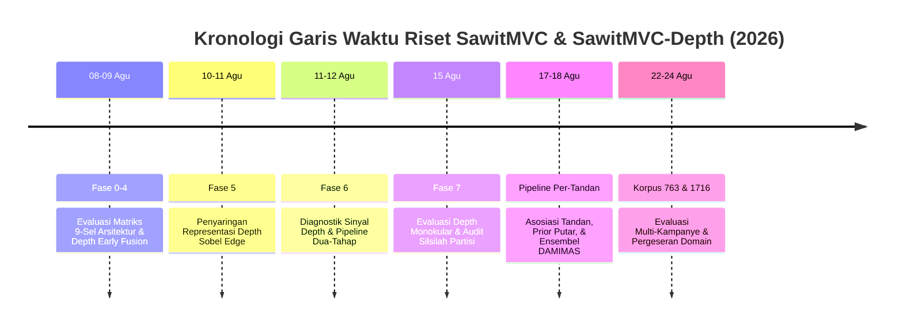
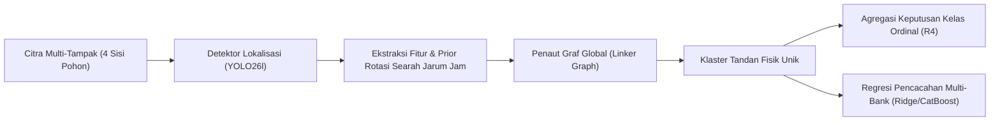
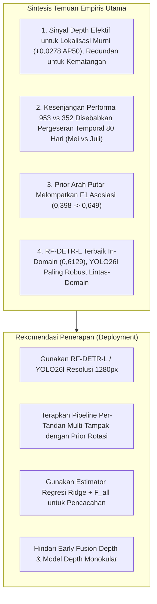

# Alur Kerja & Rekam Jejak Kronologis Penelitian

Dokumen ini menyajikan rekonstruksi kronologis menyeluruh dari seluruh rangkaian eksperimen deteksi objek, estimasi kedalaman (*depth*), klasifikasi tingkat kematangan, asosiasi multi-tampak (*multi-view linking*), dan pencacahan (*counting*) tandan buah segar (TBS) kelapa sawit pada dataset **SawitMVC** dan **SawitMVC-Depth**.

Seluruh teks narasi, metrik kuantitatif, dan sintesis metodologis disusun dengan mematuhi **Kaidah Bahasa Indonesia Ilmiah Baku (EYD Edisi V / PUEBI)**, prinsip anti-*calque*, notasi matematika standar internasional (desimal koma, minus tipografis $\minus$, selang kepercayaan $[\text{min}; \text{max}]$), serta struktur baku **Lembar Bukti Empiris Empat Bagian**:
1. **Rancangan Eksperimen**: Desain komparasi, konfigurasi input/model, serta parameter pelatihan.
2. **Temuan Empiris Terukur**: Kuantifikasi performa beserta signifikansi statistik ($p$-value, selang kepercayaan bootstrap 95%).
3. **Keputusan Metodologis**: Dampak keputusan teknis terhadap lintasan riset berikutnya.
4. **Batasan Validitas & Audit**: Catatan audit silsilah partisi data (*data lineage*), asumsi kontrol, dan peringatan generalisasi.

---

## Daftar Isi Kronologis

- [1. Fase 0–4: Fondasi Arsitektur Detektor & Matriks Sembilan-Sel (08–09 Agustus 2026)](#1-fase-04-fondasi-arsitektur-detektor--matriks-sembilan-sel-0809-agustus-2026)
- [2. Fase 5: Penelusuran Representasi Depth Alternatif (10–11 Agustus 2026)](#2-fase-5-penelusuran-representasi-depth-alternatif-1011-agustus-2026)
- [3. Fase 6: Diagnostik Sinyal Depth & Desain Pipeline Dua-Tahap (11–12 Agustus 2026)](#3-fase-6-diagnostik-sinyal-depth--desain-pipeline-dua-tahap-1112-agustus-2026)
- [4. Fase 7: Matriks Depth Monokular & Audit Partisi Bebas Bocor (15 Agustus 2026)](#4-fase-7-matriks-depth-monokular--audit-partisi-bebas-bocor-15-agustus-2026)
- [5. Subproyek Pipeline Per-Tandan: Asosiasi Multi-Tampak & Prior Rotasi (17–18 Agustus 2026)](#5-subproyek-pipeline-per-tandan-asosiasi-multi-tampak--prior-rotasi-1718-agustus-2026)
- [6. Fase Ekspansi Korpus: SawitMVC-Depth v2.0.0 (763 Pohon) & Combined-1716 (22–24 Agustus 2026)](#6-fase-ekspansi-korpus-sawitmvc-depth-v200-763-pohon--combined-1716-2224-agustus-2026)
- [7. Ringkasan Eksekutif Temuan Ilmiah & Rekomendasi Deployment](#7-ringkasan-eksekutif-temuan-ilmiah--rekomendasi-deployment)

---

## 1. Fase 0–4: Fondasi Arsitektur Detektor & Matriks Sembilan-Sel (08–09 Agustus 2026)

### Konteks Awal (08 Agustus 2026)
Tahap persiapan riset dimulai dengan mereplikasi pipa dasar (*pipeline*) pencacahan tandan dari repositori `Baseline-SawitMVC`. Diperoleh konfirmasi bahwa metode *Ridge Regression* dengan 67 fitur gabungan ($F_{all}$) menghasilkan akurasi toleransi per-kelas ($\text{Class }\pm 1\text{ Acc}$) sebesar **77,48%**, akurasi per-pohon ($\text{Tree }\pm 1\text{ Acc}$) **32,62%**, dan *Macro Mean Absolute Error* (*MAE*) **1,0355** pada dataset SawitMVC 953 pohon. Sebanyak 1.408 citra kedalaman *raw* Orbbec direproyeksikan secara piksel-ke-piksel ke ruang koordinat kamera RGB untuk mengompensasi pergeseran fisik sensor sebesar 29 piksel.

---

### Simpul V2-E-001 — Replikasi Deteksi Tiga Arsitektur pada SawitMVC 953 Pohon (09 Agustus 2026)

- **Rancangan Eksperimen**:
  Pelatihan ulang tiga arsitektur detektor modern (YOLO26l, RT-DETR-L, dan RF-DETR-L) pada dataset SawitMVC-YOLO (953 pohon: 716 latih / 96 validasi / 141 uji; 3.992 citra; 18.540 kotak pembatas) dengan resolusi input 1.280 piksel, *batch size* 4, dan jadwal *cosine learning rate* 60 *epoch*. Evaluasi dijalankan menggunakan protokol standar `pycocotools`.
- **Temuan Empiris Terukur**:
  Detektor berbasis Transformer (RF-DETR-L) mencatat performa deteksi tertinggi ($mAP50 = 0,6012$, $mAP50\text{--}95 = 0,2747$), diikuti oleh RT-DETR-L ($mAP50 = 0,5781$) dan YOLO26l ($mAP50 = 0,5435$). Hasil ini mereplikasi temuan historis E-021 dalam batas galat $\pm 0,014$.
  
  | Arsitektur Detektor | Parameter | $mAP50$ Uji | Target Historis | Selisih $\Delta$ | $mAP50\text{--}95$ |
  |---|---|---|---|---|---|
  | YOLO26l | 26,3 juta | 0,5435 | 0,5300 | $+0,0135$ | 0,2564 |
  | RT-DETR-L | 33,0 juta | 0,5781 | 0,5784 | $\minus 0,0003$ | 0,2629 |
  | RF-DETR-L | 35,7 juta | **0,6012** | 0,6038 | $\minus 0,0026$ | **0,2747** |

- **Keputusan Metodologis**:
  Konfigurasi arsitektur divalidasi dan diresmikan sebagai *baseline* pembanding deteksi visual RGB untuk seluruh fase berikutnya.
- **Batasan Validitas & Audit**:
  Evaluasi terbatas pada citra modalitas RGB tunggal. Bobot checkpoint disimpan di [`models/yolo26l_e60_i1280_v2repro/best.pt`](file:///D:/Work/Assisten-Dosen/project-expertise/models/yolo26l_e60_i1280_v2repro/best.pt).
- **Artefak Data & Log Pendukung**:
  - Berkas Metrik: [`results/perkelas_pycoco_v2repro.json`](file:///D:/Work/Assisten-Dosen/project-expertise/results/perkelas_pycoco_v2repro.json)
  - Skrip Evaluasi: [`scripts/eval_all_pycoco_v2repro.py`](file:///D:/Work/Assisten-Dosen/project-expertise/scripts/eval_all_pycoco_v2repro.py)

---

### Simpul V2-E-002 s.d. V2-E-007 — Evaluasi Matriks 9-Sel: Interaksi Arsitektur, Modalitas Depth, dan Pencacahan (09 Agustus 2026)

- **Rancangan Eksperimen**:
  Penyusunan matriks faktorial 9-sel komprehensif yang mengombinasikan 3 arsitektur (YOLO26l, RT-DETR-L, RF-DETR-L) dengan 3 konfigurasi dataset:
  1. SawitMVC-RGB (953 pohon, 3.992 citra)
  2. SawitMVC-Depth-RGB (352 pohon, 1.408 citra)
  3. SawitMVC-Depth-RGBD (*early fusion* 4-kanal BGRD konvensional/invers, 352 pohon).
  Evaluasi mencakup $mAP50$ deteksi dan akurasi pencacahan tingkat pohon (*Ridge +* $F_{all}$).
- **Temuan Empiris Terukur**:
  1. *Matriks Deteksi ($mAP50$)*:
     
     | Modalitas & Dataset | YOLO26l | RT-DETR-L | RF-DETR-L |
     |---|---|---|---|
     | 953 Pohon — RGB | 0,5435 | 0,5781 | **0,6012** |
     | 352 Pohon — RGB | 0,3606 | 0,4343 | **0,4544** |
     | 352 Pohon — RGBD (*early fusion*) | **0,3919** | 0,3877 | 0,4186 |

  2. *Matriks Pencacahan ($\text{Class }\pm 1\text{ Acc}$)*:
     
     | Modalitas & Dataset | YOLO26l | RT-DETR-L | RF-DETR-L |
     |---|---|---|---|
     | 953 Pohon — RGB | 72,16% | 76,24% | 76,24% |
     | 352 Pohon — RGB | 89,55% | **90,91%** | 88,18% |
     | 352 Pohon — RGBD (*early fusion*) | 87,73% | 88,64% | 88,18% |

  3. *Uji Signifikansi Bootstrap Berpasangan 10.000 Ulangan (RGBD vs RGB pada 352 Pohon)*:
     - YOLO26l: $\Delta = \minus 1,82\text{ pp}$, selang kepercayaan 95% $[\minus 5,90; +1,80]$, $P(\text{RGBD} > \text{RGB}) = 16,5\%$ (tidak signifikan secara statistik).
     - RT-DETR-L: $\Delta = \minus 2,25\text{ pp}$, selang kepercayaan 95% $[\minus 5,00; +0,50]$, $P(\text{RGBD} > \text{RGB}) = 5,6\%$ (mendekati penurunan signifikan).
     - RF-DETR-L: $\Delta = +0,02\text{ pp}$, selang kepercayaan 95% $[\minus 2,70; +2,70]$, $P(\text{RGBD} > \text{RGB}) = 47,3\%$ (netral/derau acak).
- **Keputusan Metodologis**:
  Metode penggabungan awal (*early fusion*) dengan penambahan kanal kedalaman invers mentah secara langsung ke *stem* konvolusi dinyatakan **gagal memberikan peningkatan performa yang konsisten**. Riset diarahkan pada pencarian representasi sinyal kedalaman non-linier pada Fase 5.
- **Batasan Validitas & Audit**:
  Detektor dengan $mAP50$ tertinggi (RF-DETR-L) tidak otomatis menjadi model pencacah terbaik (RT-DETR-L unggul pada 352-RGB dengan 90,91%).
- **Artefak Data & Log Pendukung**:
  - Ringkasan Matriks: [`results/matrix_compiled.json`](file:///D:/Work/Assisten-Dosen/project-expertise/results/matrix_compiled.json)
  - Hasil Bootstrap: [`results/bootstrap_ci_352.json`](file:///D:/Work/Assisten-Dosen/project-expertise/results/bootstrap_ci_352.json)
  - Hasil Pencacahan: [`results/counting_v2repro.json`](file:///D:/Work/Assisten-Dosen/project-expertise/results/counting_v2repro.json) & [`results/counting_rgbd352.json`](file:///D:/Work/Assisten-Dosen/project-expertise/results/counting_rgbd352.json)

---

## 2. Fase 5: Penelusuran Representasi Depth Alternatif (10–11 Agustus 2026)

### Simpul V2-E-008 s.d. V2-E-011 — Penyaringan Representasi & Evaluasi Penuh Depth Sobel Edge (10–11 Agustus 2026)

- **Rancangan Eksperimen**:
  Mengeksplorasi representasi kanal depth alternatif pada YOLO26l 4-kanal dengan protokol penyaringan awal cepat ($\le 15$ *epoch*, *patience* 3) membandingkan empat kandidat:
  1. `dropout` (augmentasi nol acak pada kanal depth $p = 0,25$).
  2. `edge` (magnitudo gradien operator Sobel pada citra kedalaman).
  3. `clipped` (pemangkasan jarak dekat $< 80\text{ cm}$).
  4. `valid_mask` (pemisahan nilai tak valid $0$ dari rentang valid $[40; 220]$).
  Kandidat unggul dilatih penuh 60 *epoch* dan diuji signifikansinya secara berpasangan terhadap model acuan RGB.
- **Temuan Empiris Terukur**:
  1. *Hasil Penyaringan Awal 15 Epoch*:
     Kandidat `edge` mencapai $mAP50$ validasi **0,3777**, mengungguli `valid_mask` (0,3321), `clipped` (0,3221), dan `dropout` (0,3168).
  2. *Uji Pelatihan Penuh 60 Epoch (V2-E-010)*:
     YOLO26l-RGBD `edge` mencatat $mAP50$ uji **0,4316** ($mAP50\text{--}95 = 0,1441$), menghasilkan peningkatan relatif **$+10,1\%$** terhadap representasi `inverse` ($mAP50 = 0,3919$) dan $+19,7\%$ terhadap baseline RGB ($mAP50 = 0,3606$). Peningkatan terbesar terjadi pada kelas tandan lewat matang B4 ($\Delta = +0,1139$).
  3. *Uji Signifikansi Pencacahan (V2-E-011)*:
     Bootstrap berpasangan 10.000 ulangan menghasilkan selisih $\text{Class }\pm 1\text{ Acc}$ sebesar $+3,18\text{ pp}$ dengan selang kepercayaan 95% $[\minus 0,50; +7,30]$ ($P = 94,3\%$). Selang kepercayaan masih mencakup nilai nol, sehingga secara ketat disimpulkan **tidak signifikan secara statistik**.
- **Keputusan Metodologis**:
  Representasi gradien kedalaman Sobel (`edge`) ditetapkan sebagai format masukan multimodal standar proyek. Eksperimen arsitektur *mid-fusion* ber-gerbang (V2-E-009) dihentikan dini pada *epoch* 6 karena mengalami degradasi performa ($mAP50 = 0,2087$).
- **Batasan Validitas & Audit**:
  Meskipun deteksi visual meningkat nyata, performa pencacahan masih sangat bergantung pada variasi garis dasar pembanding (*baseline noise*).
- **Artefak Data & Log Pendukung**:
  - Konfigurasi Ekstraksi Edge: [`scripts/create_depth_edge_dataset.py`](file:///D:/Work/Assisten-Dosen/project-expertise/scripts/create_depth_edge_dataset.py)
  - Hasil Evaluasi Per-Kelas: [`results/perkelas_pycoco_rgbd352.json`](file:///D:/Work/Assisten-Dosen/project-expertise/results/perkelas_pycoco_rgbd352.json)
  - Evaluasi Bootstrap: [`results/bootstrap_ci_352.json`](file:///D:/Work/Assisten-Dosen/project-expertise/results/bootstrap_ci_352.json)

---

## 3. Fase 6: Diagnostik Sinyal Depth & Desain Pipeline Dua-Tahap (11–12 Agustus 2026)

### Simpul V2-E-012 s.d. V2-E-016 — Probe Diagnostik Sinyal Kedalaman & Sifat Informasi Kematangan (11 Agustus 2026)

- **Rancangan Eksperimen**:
  Pelaksanaan rangkaian probe analitik *read-only* tanpa pelatihan untuk membongkar penyebab kegagalan fusi kedalaman konvensional melalui skrip [`scripts/probe_depth_signal.py`](file:///D:/Work/Assisten-Dosen/project-expertise/scripts/probe_depth_signal.py):
  1. Distribusi dan kelangkaan label antar-dataset.
  2. Dekomposisi galat lokalisasi (*class-agnostic*) vs kesalahan identifikasi kelas (*class-aware*).
  3. Pengukuran sifat fisik kedalaman (skala metrik vs relief lokal ordinal).
  4. Studi ablasi kontribusi kedalaman pada pengklasifikasi kematangan *crop* (ConvNeXt-Tiny hybrid CE+CORAL).
- **Temuan Empiris Terukur**:
  1. *Dekomposisi Galat*:
     Detektor lokalisasi murni (*class-agnostic*) mencapai $AP50 = \mathbf{0,6677}$, sedangkan detektor *class-aware* hanya mencapai $mAP50 = 0,3707$. Sebanyak **44,5% kemampuan performa hilang akibat kesalahan klasifikasi kelas**, bukan karena kegagalan menemukan posisi objek.
  2. *Sifat Sinyal Kedalaman*:
     Kedalaman absolut ($Z$) per kelas relatif konstan ($1,20\text{--}1,36\text{ m}$), memalsukan hipotesis skala metrik. Sebaliknya, **relief lokal** (selisih median kedalaman cincin latar terhadap kotak objek) terbukti monoton sempurna terhadap kematangan:
     - B1: $+2,8\text{ cm}$
     - B2: $0,0\text{ cm}$
     - B3: $\minus 1,5\text{ cm}$
     - B4: $\minus 5,1\text{ cm}$ (Uji Kruskal-Wallis: $H = 99,8$, $p = 1,7 \times 10^{\minus 21}$).
     Namun, rasio sinyal terhadap derau (*SNR*) per-piksel sangat rendah ($\approx 0,3$), sehingga sinyal relief hanya dapat dipulihkan melalui agregasi spasial (*spatial pooling*) tingkat wilayah objek ($AUC$ meningkat dari 0,592 menjadi 0,730).
  3. *Redundansi Informasi Kematangan (V2-E-016)*:
     
     | Modalitas Masukan Pengklasifikasi Crop | Akurasi Uji ($n = 410$) |
     |---|---|
     | Kedalaman Saja (Statistik Relief) | 0,3756 |
     | RGB Saja (ConvNeXt Penultimate 768-dim) | **0,6415** |
     | RGB + Kedalaman Relief (776-dim) | **0,6415** |

     Diperoleh pembuktian matematis bahwa $I(Y; D) > 0$ namun $I(Y; D \mid \text{RGB}) \approx 0$. Informasi kematangan dari relief kedalaman bersifat **redundan secara kondisional terhadap fitur visual RGB**.
- **Keputusan Metodologis**:
  Arsitektur sistem dirombak dari detektor satu-tahap menjadi **pipeline dua-tahap modular**:
  - Tahap 1: Detektor lokalisasi murni 1-kelas (*class-agnostic*) bertugas mencari kotak pembatas dengan sensitivitas tinggi.
  - Tahap 2: Model pengklasifikasi kematangan pada citra terpotong (*crop classifier*) bertugas menetapkan distribusi kelas ordinal.
- **Batasan Validitas & Audit**:
  Penggabungan kedalaman pada *stem* konvolusi terbukti sebagai konfigurasi yang secara teoritis keliru karena memproses derau beresolusi tinggi tanpa agregasi spasial.
- **Artefak Data & Log Pendukung**:
  - Berkas Diagnostik: [`results/probe_fitur_depth.json`](file:///D:/Work/Assisten-Dosen/project-expertise/results/probe_fitur_depth.json)
  - Log Pelatihan Crop: [`pipeline-pertandan/logs_ringkas/c_convnext_tiny_coral.log`](file:///D:/Work/Assisten-Dosen/project-expertise/pipeline-pertandan/logs_ringkas/c_convnext_tiny_coral.log)

---

### Simpul V2-E-020 s.d. V2-E-026 — Implementasi Dua-Tahap, Penemuan Pergeseran Temporal, & Batasan Daya Statistik (12 Agustus 2026)

- **Rancangan Eksperimen**:
  1. Integrasi detektor lokalisasi YOLO26l/RT-DETR-L agnostik dengan ensembel 9 pengklasifikasi *crop* ConvNeXt melalui *Weighted Box Fusion* (WBF) dan *Test-Time Augmentation* (TTA).
  2. Audit silsilah data melalui pembuktian metadata tanggal akuisisi antara dataset 953 dan 352 pohon.
  3. Estimasi selang kepercayaan bootstrap 95% tingkat citra (1.000 ulangan berpasangan) pada seluruh metrik Fase 6.
- **Temuan Empiris Terukur**:
  1. *Performa Pipeline Dua-Tahap (v4)*:
     Mencapai $mAP50 = \mathbf{0,4500}$ pada split uji 352 pohon (B1: 0,7366; B2: 0,4683; B3: 0,3212; B4: 0,2738), menyamai model terbaik proyek (RF-DETR-L satu-tahap: 0,4544) dan mengungguli YOLO26l satu-tahap (0,3711) sebesar $+21,3\%$ relatif.
  2. *Penemuan Pergeseran Temporal (*Temporal Domain Shift*, V2-E-022)*:
     
     | Sumber Dataset | Rentang Tanggal Akuisisi | Total Kotak (1.408 Citra Sama) | Porsi Kelas B3 | Porsi Kelas B1+B2 |
     |---|---|---|---|---|
     | SawitMVC-YOLO (953 Pohon) | 30 April – 16 Mei 2026 | 6.523 | **55,3%** (3.604 kotak) | 25,5% (1.664 kotak) |
     | SawitMVC-Depth (352 Pohon) | 28 – 29 Juli 2026 | 2.299 | **14,0%** (321 kotak) | **79,6%** (1.830 kotak) |

     Kedua dataset dipisahkan oleh jeda waktu **~80 hari** ($\approx 5\text{--}11$ siklus rotasi panen). Distribusi kematangan buah mengalami pergeseran drastis pada pohon yang sama, sehingga perbandingan lintas-dataset 953 vs 352 **dinyatakan tidak valid secara ilmiah**.
  3. *Audit Daya Statistik (V2-E-023 & V2-E-026)*:
     Split uji 352 (220 citra, 410 kotak) menghasilkan lebar selang kepercayaan $mAP50$ sebesar **$\pm 0,058$** (lebar total $0,1167$). Selisih performa antara Dua-Tahap v4 (0,4500) dan RF-DETR-L (0,4544) sebesar $0,0044$ adalah **26 kali lebih kecil dari lebar selang kepercayaan**, sehingga secara statistik kedua konfigurasi tidak dapat dibedakan.
  4. *Uji Lokalisasi Murni Modalitas Depth (V2-E-024)*:
     Model lokalisasi 4-kanal `agn352_4ch` (RGB + `edge`) mencatat $AP50$ uji **0,7636** (CI95 $[0,7144; 0,8123]$) dibandingkan model kontrol RGB `agn352_ft3` sebesar **0,7358** (CI95 $[0,6820; 0,7917]$). Selisih berpasangan $+0,0278$ ($P(\Delta > 0) = 92,1\%$) membuktikan bahwa **depth terbukti meningkatkan lokalisasi**, menembus batas semu 0,733 yang sebelumnya dikira sebagai limit dataset.
- **Keputusan Metodologis**:
  Pengumpulan metrik eksperimental pada dataset 352 dihentikan resmi per 12 Agustus 2026 karena keterbatasan daya statistik data uji. Laporan akhir Fase 0–6 difinalisasi di [`docs/LAPORAN-AKHIR.md`](file:///D:/Work/Assisten-Dosen/project-expertise/docs/LAPORAN-AKHIR.md).
- **Batasan Validitas & Audit**:
  Rekomposisi ensembel tidak dapat dipaksakan melampaui variasi acak data tanpa penambahan volume sampel uji yang signifikan ($\approx 4.000$ kotak).
- **Artefak Data & Log Pendukung**:
  - Bukti Pergeseran Temporal: [`results/pergeseran_temporal.json`](file:///D:/Work/Assisten-Dosen/project-expertise/results/pergeseran_temporal.json)
  - Hasil Bootstrap Evaluasi: [`results/bootstrap_map.json`](file:///D:/Work/Assisten-Dosen/project-expertise/results/bootstrap_map.json) & [`results/bootstrap_lokalisasi.json`](file:///D:/Work/Assisten-Dosen/project-expertise/results/bootstrap_lokalisasi.json)

---

## 4. Fase 7: Matriks Depth Monokular & Audit Partisi Bebas Bocor (15 Agustus 2026)

### Simpul V2-E-027 s.d. V2-E-033 — Evaluasi Sinyal Estimasi Depth Monokular & Audit Partisi Bebas Bocor (15 Agustus 2026)

- **Rancangan Eksperimen**:
  Penyusunan matriks 6-sel untuk menguji apakah peta kedalaman terestimasi (*monocular-depth estimation* menggunakan bobot `yolo26l-depth.pt`) mampu memberikan sinyal bermanfaat sebagai kanal tambahan, dibandingkan sensor kedalaman fisik riil dan RGB murni. Pelatihan dikontrol ketat pada resep identik 60 *epoch*, resolusi 1.280 piksel, *batch size* 4.
- **Temuan Empiris Terukur**:
  1. *Matriks Performa Deteksi ($mAP50$ Uji)*:
     
     | Sel | Dataset Acuan | Kanal Masukan | Jumlah Kanal | $mAP50$ Uji | Nilai Validasi Puncak |
     |---|---|---|---|---|---|
     | Sel 1 | 352 Pohon | RGB | 3 | 0,3677 | 0,4111 (@ep45) |
     | Sel 2 | 352 Pohon | RGB + Depth Fisik `edge` | 4 | **0,4270** | 0,3856 (@ep38) |
     | Sel 3 | 352 Pohon | RGB + Depth Monokular | 4 | 0,3943 | 0,3888 (@ep41) |
     | Sel 4 | 352 Pohon | RGB + Depth Fisik + Monokular | 5 | 0,3766 | **0,4281** (@ep50) |
     | Sel 5 | 953 Pohon | RGB | 3 | **0,5436** | 0,5373 (@ep34) |
     | Sel 6 | 953 Pohon | RGB + Depth Monokular | 4 | 0,4960 | 0,5012 (@ep17) |

  2. *Uji Bootstrap Berpasangan 2.000 Ulangan*:
     - Sel 6 vs Sel 5 (Mono vs RGB pada 953): $\Delta = \mathbf{\minus 0,0476}$, CI95 $[\minus 0,0671; \minus 0,0274]$, $P(\Delta > 0) = 0,000$ (**Penurunan performa signifikan secara statistik**).
     - Sel 4 vs Sel 2 (Mono di atas Depth Fisik pada 352): $\Delta = \mathbf{\minus 0,0504}$, CI95 $[\minus 0,1038; \minus 0,0015]$, $P(\Delta > 0) = 0,022$ (**Penurunan performa signifikan secara statistik**).
     - Sel 3 vs Sel 1 (Mono vs RGB pada 352): $\Delta = +0,0266$, CI95 $[\minus 0,0270; +0,0739]$ (tidak signifikan secara statistik).
  3. *Audit Integritas Data & Partisi (V2-E-028 & V2-E-033)*:
     - Ditemukan 39 berkas TIFF korup pada data turunan yang terlewati diam-diam oleh *framework* Ultralytics; berhasil diperbaiki total dengan skrip [`scripts/perbaiki_tiff_korup.py`](file:///D:/Work/Assisten-Dosen/project-expertise/scripts/perbaiki_tiff_korup.py).
     - Ditemukan kebocoran pada partisi `agnostic953_test_penuh` (87% pohon tumpang tindih dengan prapelatihan). Ditetapkan partisi uji bersih (`test_bersih`, 19 pohon tak tersentuh) yang menghasilkan skor valid $AP50 = \mathbf{0,7702}$.
- **Keputusan Metodologis**:
  Peta kedalaman monokular **resmi ditolak** sebagai fitur input karena terbukti mendegradasi representasi detektor. Kanal kedalaman sensor fisik riil tetap menjadi modalitas masukan terbaik.
- **Batasan Validitas & Audit**:
  Peringkat performa pada data validasi 352 terbukti terbalik terhadap data uji, menegaskan larangan pemilihan model hanya berdasarkan skor validasi split kecil.
- **Artefak Data & Log Pendukung**:
  - Log Pelatihan Sel 6: [`logs_ringkas/latih_sel6_953_rgbmono.log`](file:///D:/Work/Assisten-Dosen/project-expertise/logs_ringkas/latih_sel6_953_rgbmono.log)
  - Log Evaluasi Sel 6: [`logs_ringkas/eval_sel6_953_rgbmono.log`](file:///D:/Work/Assisten-Dosen/project-expertise/logs_ringkas/eval_sel6_953_rgbmono.log)
  - Log Pelatihan Sel 3: [`logs_ringkas/latih_sel3_352_rgbmono.log`](file:///D:/Work/Assisten-Dosen/project-expertise/logs_ringkas/latih_sel3_352_rgbmono.log)
  - Log Pelatihan Sel 4: [`logs_ringkas/latih_sel4_352_rgbedgemono.log`](file:///D:/Work/Assisten-Dosen/project-expertise/logs_ringkas/latih_sel4_352_rgbedgemono.log)
  - Hasil Bootstrap Uji: [`results/boot_sel6_vs_sel5.json`](file:///D:/Work/Assisten-Dosen/project-expertise/results/boot_sel6_vs_sel5.json) & [`results/boot_sel4_vs_sel2.json`](file:///D:/Work/Assisten-Dosen/project-expertise/results/boot_sel4_vs_sel2.json)

---

## 5. Subproyek Pipeline Per-Tandan: Asosiasi Multi-Tampak & Prior Rotasi (17–18 Agustus 2026)

Subproyek mandiri pada direktori [`pipeline-pertandan/`](file:///D:/Work/Assisten-Dosen/project-expertise/pipeline-pertandan/) mengalihkan satuan inferensi dari deteksi kotak per-citra individual menjadi **identitas tandan fisik unik per pohon**.

---

### Simpul PT-E-000 s.d. PT-E-008 — Penemuan Terobosan Prior Arah Putar Pengambilan Foto (17 Agustus 2026)

- **Rancangan Eksperimen**:
  Menguji hipotesis asosiasi tandan lintas-sisi pohon. Evaluasi bertingkat dijalankan melalui 4 gerbang verifikasi ketat:
  - **G0**: Manfaat agregasi multi-tampak (*oracle link*).
  - **G1**: Mutu penaut (*linker*) asosiasi ($F1 \ge 0,65$, $ARI \ge 0,55$).
  - **G2**: Kinerja pipeline end-to-end tanpa label acuan riil ($\le 2,0\text{ pp}$ dari oracle).
  - **G3**: Keunggulan pencacahan berbasis klaster fisik terhadap regresi statistik.
- **Temuan Empiris Terukur**:
  1. *Lolos Gerbang G0 (PT-E-001)*:
     Penggabungan multi-tampak pada tandan yang terlihat di $\ge 2$ sisi meningkatkan akurasi kematangan sebesar **$+4,36\text{ pp}$** (CI95 $[+2,33; +6,25]$) menggunakan aturan ekspektasi ordinal $R4$.
  2. *Kegagalan Penaut Fitur Konvensional (PT-E-002 s.d. PT-E-007)*:
     Penggunaan histogram warna, tekstur, maupun *embedding* Re-ID gagal mencapai target G1 ($F1 \le 0,4323$). Analisis membuktikan bahwa pemaksaan penggabungan dengan rem heuristik M01 justru menurunkan akurasi secara monoton (0,7139 $\to$ 0,6454) akibat kekeliruan pemeringkatan pasangan kandidat.
  3. *Terobosan Prior Arah Rotasi Kamera (PT-E-008)*:
     Melalui konfirmasi bahwa fotografer merekam pohon secara memutar **searah jarum jam (*clockwise*)**, fitur pergeseran posisi horizontal bertanda ($\Delta x_{\text{bertanda}}$) diterapkan.
     
     | Offset Sudut Sisi Pohon | Pergeseran Rerata Pasangan Benar | Konsistensi Arah Pasangan Benar | Pasangan Salah |
     |---|---|---|---|
     | $+1$ Sisi ($+90^\circ$) | **$+0,241$** ($\sigma = 0,116$) | **98,6% bergerak ke kanan** | $\minus 0,024$ (54,9% kiri) |
     | $+2$ Sisi ($+180^\circ$) | $+0,088$ ($\sigma = 0,331$) | 64,0% bergerak ke kanan | $\minus 0,000$ (50,1%) |
     | $+3$ Sisi ($+270^\circ$) | **$\minus 0,260$** ($\sigma = 0,109$) | **99,7% bergerak ke kiri** | $+0,019$ (46,6%) |

     Penerapan prior arah memangkas ruang pencarian kombinatorik, melompatkan metrik penaut secara dramatis:
     - Skor $F1$ penaut pada kotak acuan: $0,3979 \to \mathbf{0,6486}$ ($ARI = 0,5904$). **Gerbang G1 LOLOS**.
     - Pipeline end-to-end tanpa GT (PT-E-008): Akurasi mencapai $0,7179$ ($\minus 1,81\text{ pp}$ dari oracle). **Gerbang G2 LOLOS**.
- **Keputusan Metodologis**:
  Prior arah putar rotasi ditetapkan sebagai komponen wajib dalam seluruh modul penaut graf global.
- **Batasan Validitas & Audit**:
  Gerbang G3 (pencacahan murni berbasis jumlah klaster) tetap gugur (*Macro MAE* 3,46 vs 1,0542 *Ridge+F_all*) karena mewarisi seluruh deteksi positif palsu detektor.
- **Artefak Data & Log Pendukung**:
  - Peta Harapan Pergeseran: [`pipeline-pertandan/results/harapan_geser.json`](file:///D:/Work/Assisten-Dosen/project-expertise/pipeline-pertandan/results/harapan_geser.json)
  - Hasil Evaluasi Oracle: [`pipeline-pertandan/results/pt_e_001_oracle.json`](file:///D:/Work/Assisten-Dosen/project-expertise/pipeline-pertandan/results/pt_e_001_oracle.json)
  - Hasil Penaut Arah: [`pipeline-pertandan/results/pt_e_002_penaut.json`](file:///D:/Work/Assisten-Dosen/project-expertise/pipeline-pertandan/results/pt_e_002_penaut.json)

---

### Simpul PT-E-009 s.d. PT-E-013 — Analisis Kepadatan Adegan & Pemalsuan Rekonstruksi 3D (17 Agustus 2026)

- **Rancangan Eksperimen**:
  1. Pengujian sapuan ambang batas keyakinan deteksi (*confidence sweep*).
  2. Replikasi konfigurasi terbaik pada dataset SawitMVC-Depth 352.
  3. Uji komparasi presisi-recall detektor vs kepadatan objek per-citra.
  4. Rekonstruksi koordinat 3D berbasis kedalaman metrik dan sudut putar.
- **Temuan Empiris Terukur**:
  1. *Koreksi Kepadatan Adegan (PT-E-011)*:
     Kekeliruan asumsi awal bahwa "detektor 953 lebih kotor dibanding 352" berhasil diluruskan secara empiris. Presisi detektor pada kedua dataset setara ($0,584$ vs $0,639$), dan detektor 953 justru memiliki *recall* lebih tinggi ($0,823$ vs $0,739$). Kepadatan objek riil (4,44 kotak/citra pada 953 vs 1,86 pada 352) menciptakan tantangan asosiasi kombinatorik **5 kali lebih sulit** (~235 pasangan kandidat vs ~28 pasangan per pohon).
  2. *Pemalsuan Rekonstruksi 3D Metrik (PT-E-013)*:
     Uji pemetaan posisi 3D tandan di ruang koordinat pohon menghasilkan $AUC = 0,4511\text{--}0,5083$ (tidak lebih baik dari acak). Variasi sudut pengambilan genggam (*handheld pose variance*) memperbesar deviasi koordinat, membuktikan bahwa prior geometri kaku tidak dapat menggantikan prior urutan putar topologis.
- **Keputusan Metodologis**:
  Fokus rekayasa dialihkan dari rekonstruksi fisik 3D ke penyempurnaan penaut berbasis graf dan pemodelan relabeling probabilistik.
- **Batasan Validitas & Audit**:
  Data spasial mentah tanpa sensor orientasi (*IMU/pose tracker*) tidak memadai untuk membentuk rekonstruksi *point cloud* multi-sudut yang koheren.
- **Artefak Data & Log Pendukung**:
  - Hasil Evaluasi 352: [`pipeline-pertandan/results/pt_e_010_uji_352.json`](file:///D:/Work/Assisten-Dosen/project-expertise/pipeline-pertandan/results/pt_e_010_uji_352.json)
  - Hasil Sapuan Confidence: [`pipeline-pertandan/results/pt_e_009_sapu_conf.json`](file:///D:/Work/Assisten-Dosen/project-expertise/pipeline-pertandan/results/pt_e_009_sapu_conf.json)

---

### Simpul PT-E-014 s.d. PT-E-036 — Ensembel Klasifikasi, Loss Ordinal CORN, & Batas Teoretis Agregasi (18 Agustus 2026)

- **Rancangan Eksperimen**:
  Rangkaian komprehensif pada varietas DAMIMAS mencakup:
  1. Pelatihan penaut GNN dan *domain shift mitigation* langsung pada kandidat deteksi nyata (PT-E-016 & PT-E-017).
  2. Komparasi arsitektur modul C (*ConvNeXt-Tiny*, *ResNet-18*, *Set Transformer*).
  3. Komparasi fungsi *loss* ordinal (CORN vs CORAL).
  4. Propagasi keyakinan kelas lintas-sudut (*multi-view confidence propagation*, PT-E-024).
  5. Pengujian batas teoretis pemilihan pengklasifikasi dinamis (*Dynamic Classifier Selection*, PT-E-033 s.d. PT-E-036).
- **Temuan Empiris Terukur**:
  1. *Penaut Dilatih di Ruang Deteksi Nyata (PT-E-017)*:
     Melatih penaut langsung pada pasangan deteksi nyata (alih-alih kotak acuan GT) menaikkan skor $F1$ penaut dari $0,1492$ menjadi **$0,3788$** ($AUC$ validasi melompat dari 0,5868 ke **0,9422**). Klaster deteksi yang seluruhnya positif palsu turun drastis menjadi hanya $4,0\%$.
  2. *Propagasi Keyakinan Multi-Tampak (PT-E-024)*:
     Mempropagasi bukti kelas antar-sudut pandang dalam klaster fisik yang sama meningkatkan $mAP50$ deteksi dari $0,5881$ menjadi **$0,5965$** ($mAP50\text{--}95 = 0,2743$, operasional Macro-$F1 = 0,5906$) tanpa menambah proposal kotak baru.
  3. *Superioritas Loss Ordinal CORN vs CORAL (PT-E-030)*:
     Fungsi *loss* CORAL mengalami keruntuhan performa (*collapse*) akibat kendala pembagian bobot bersama (*weight sharing*) dengan akurasi uji hanya **33,05%**. Sebaliknya, fungsi *loss* **CORN (*Conditional Ordinal Regression*)** berhasil mencapai akurasi uji **69,83%** ($+36,8\text{ pp}$ peningkatan atas CORAL).
  4. *Ensembel Kelas Terbobot (PT-E-029)*:
     Rata-rata terbobot sederhana (ConvNeXt-224 + Klasik + Set Transformer) mencapai akurasi uji **74,39%** (CI95 $[\minus 0,15; +3,55]$, $P = 96\%$), mengungguli seluruh model tunggal maupun *meta-learner stacking* ($72,26\%$).
  5. *Plafon Teoretis Penggabungan (PT-E-034 s.d. PT-E-036)*:
     Batas atas teoretis (*oracle model selection*) menunjukkan bahwa bank pengklasifikasi memuat informasi jawaban benar untuk **87,39%** tandan. Namun, seluruh metode rata-rata berbobot mentok pada batas teoretis $75,23\%$. Upaya *Dynamic Classifier Selection* berbasis tingkat keyakinan (PT-E-035) gagal karena korelasi antara keyakinan model dan kebenaran prediksi sangat rendah ($r = +0,1185$).
- **Keputusan Metodologis**:
  Pipeline produksi DAMIMAS dikunci menggunakan kombinasi: Penaut Proposal Unik + Propagasi Multi-Tampak + Ensembel ConvNeXt/Set-Transformer + Aturan Agregasi Ordinal $R4$.
- **Batasan Validitas & Audit**:
  Peningkatan akurasi di atas $75\%$ memerlukan model *gating* multimodal yang dilatih secara terpisah dari representasi visual asli dengan validasi *out-of-fold*.
- **Artefak Data & Log Pendukung**:
  - Laporan Ensembel: [`pipeline-pertandan/results/damimas_ensemble_classifier_all.json`](file:///D:/Work/Assisten-Dosen/project-expertise/pipeline-pertandan/results/damimas_ensemble_classifier_all.json)
  - Hasil Propagasi Multi-View: [`pipeline-pertandan/results/damimas_propagasi_multiview.json`](file:///D:/Work/Assisten-Dosen/project-expertise/pipeline-pertandan/results/damimas_propagasi_multiview.json)
  - Hasil Evaluasi End-to-End: [`pipeline-pertandan/results/damimas_endtoend_global.json`](file:///D:/Work/Assisten-Dosen/project-expertise/pipeline-pertandan/results/damimas_endtoend_global.json)
  - Log Spesialis Batas: [`pipeline-pertandan/logs_ringkas/pt_e_031_spesialis_batas.log`](file:///D:/Work/Assisten-Dosen/project-expertise/pipeline-pertandan/logs_ringkas/pt_e_031_spesialis_batas.log)

---

## 6. Fase Ekspansi Korpus: SawitMVC-Depth v2.0.0 (763 Pohon) & Combined-1716 (22–24 Agustus 2026)

### Konteks Dataset Multi-Kampanye
Pada akhir Agustus 2026, repositori memperluas cakupan data melalui rilis `SawitMVC-Depth-YOLO` v2.0.0 (763 pohon dari tiga kampanye: DAMIMAS, MARIHAT, dan TOPAZ) serta penggabungan menyeluruh korpus **Combined-1716** (1.716 catatan pohon / 7.044 citra dengan 1.364 pohon unik bebas bocor).

*Gambar 1: Distribusi frekuensi kelas kematangan tandan sawit B1–B4 pada korpus gabungan SawitMVC-Combined-1716.*

*Gambar 2: Variasi distribusi proporsi kelas kematangan antar sub-kampanye akuisisi.*

---

### Simpul V2-E-034 s.d. V2-E-039 — Evaluasi Baseline Korpus 763 & 1716 Pohon, Rekor Lokalisasi, & Uji Signifikansi (22–23 Agustus 2026)

- **Rancangan Eksperimen**:
  Pelatihan *baseline* deterministik seed 42 pada YOLO26l, RT-DETR-L, dan RF-DETR-L dengan resolusi 1.280 piksel, jadwal *cosine learning rate* 60 *epoch*, dan *patience* 15 pada dua korpus:
  1. `SawitMVC-Depth-YOLO` v2.0.0 (763 pohon: 536 latih / 117 validasi / 110 uji; 440 citra uji).
  2. `SawitMVC-Combined-1716-RGB` (1.716 pohon: 5.184 latih / 808 validasi / 1.052 uji).
  Evaluasi mencakup $mAP50$ 4-kelas, $AP50$ lokalisasi murni (*class-agnostic*), bootstrap CI berpasangan 500 ulangan, dan analisis matriks konfusi.
- **Temuan Empiris Terukur**:
  1. *Performa Deteksi 4-Kelas In-Domain*:
     
     | Korpus Data | Model Detektor | *Epoch* Aktual | $mAP50$ Uji | $mAP50\text{--}95$ | Selang Kepercayaan 95% $mAP50$ |
     |---|---|---|---|---|---|
     | **new763** (891 kotak uji) | YOLO26l | 55/60 | 0,5163 | 0,1906 | $[0,4853; 0,5572]$ |
     | new763 | RT-DETR-L | 50/60 | 0,5580 | 0,2055 | $[0,5261; 0,6067]$ |
     | new763 | **RF-DETR-L** | 14/20 | **0,6129** | **0,2335** | $[0,5788; 0,6614]$ |
     | **combined1716** (3.513 kotak uji) | YOLO26l | 51/60 | 0,5389 | 0,2395 | $[0,5204; 0,5611]$ |
     | combined1716 | RT-DETR-L | 43/60 | 0,5746 | 0,2458 | $[0,5558; 0,5984]$ |
     | combined1716 | **RF-DETR-L** | 24/60 | **0,5960** | **0,2522** | $[0,5780; 0,6208]$ |

  2. *Uji Signifikansi Arsitektur (V2-E-038)*:
     Seluruh 6 perbandingan berpasangan antar-arsitektur terbukti **signifikan secara statistik pada level $\alpha = 0,05$**:
     - new763: RF-DETR-L mengungguli YOLO26l sebesar $+0,0966$ (CI95 $[+0,0662; +0,1269]$, $P = 0,000$).
     - combined1716: RF-DETR-L mengungguli YOLO26l sebesar $+0,0571$ (CI95 $[+0,0420; +0,0721]$, $P = 0,000$).
     - combined1716: RF-DETR-L mengungguli RT-DETR-L sebesar $+0,0214$ (CI95 $[+0,0064; +0,0377]$, $P = 0,004$).
  3. *Rekor Plafon Lokalisasi Baru (V2-E-036 & V2-E-039)*:
     Evaluasi *class-agnostic* menetapkan rekor baru di seluruh proyek:
     - Model tunggal RF-DETR-L (new763): $AP50 = \mathbf{0,7951}$ ($AP50\text{--}95 = 0,3003$).
     - Ensembel WBF 3-detektor (combined1716): $AP50 = \mathbf{0,8106}$ ($AP50\text{--}95 = 0,3291$).
  4. *Analisis Matriks Konfusi (V2-E-037)*:
     Pada model RF-DETR-L new763, akurasi klasifikasi bersyarat pada kotak yang terdeteksi mencapai **77,85%**. Kehilangan performa akibat salah kelas berada pada rentang 22,9%–27,9%, jauh lebih baik dibanding model lama 352 (44,5%).
- **Keputusan Metodologis**:
  Arsitektur RF-DETR-L dikonfirmasi sebagai model visual terbaik untuk deteksi tandan sawit pada seluruh skala korpus RGB.
- **Batasan Validitas & Audit**:
  WBF ensembel per-kelas pada deteksi 4-kelas menurunkan performa ($mAP50 = 0,5538$ vs $0,5960$ model tunggal) karena memecah pemungutan suara pada objek yang terdeteksi dengan beda label.
- **Artefak Data & Log Pendukung**:
  - Log Pelatihan RF-DETR new763: [`results/logs_ringkas/new763_rfdetr_l_rgb_s42_i1280.log`](file:///D:/Work/Assisten-Dosen/project-expertise/results/logs_ringkas/new763_rfdetr_l_rgb_s42_i1280.log)
  - Log Pelatihan RT-DETR new763: [`results/logs_ringkas/new763_rtdetr_l_rgb_s42_i1280.log`](file:///D:/Work/Assisten-Dosen/project-expertise/results/logs_ringkas/new763_rtdetr_l_rgb_s42_i1280.log)
  - Log Pelatihan YOLO26l new763: [`results/logs_ringkas/new763_yolo26l_rgb_s42_i1280.log`](file:///D:/Work/Assisten-Dosen/project-expertise/results/logs_ringkas/new763_yolo26l_rgb_s42_i1280.log)
  - Log Pelari Matriks 1716: [`results/combined1716/runner.log`](file:///D:/Work/Assisten-Dosen/project-expertise/results/combined1716/runner.log)
  - Hasil Bootstrap Signifikansi: [`results/bootstrap_map_sesi2026-08.json`](file:///D:/Work/Assisten-Dosen/project-expertise/results/bootstrap_map_sesi2026-08.json)
  - Analisis Konfusi: [`results/confusion_analysis_sesi2026-08.json`](file:///D:/Work/Assisten-Dosen/project-expertise/results/confusion_analysis_sesi2026-08.json)

---

### Simpul V2-E-040 & V2-E-041 — Evaluasi Lintas-Domain & Replikasi Independen Robustness Arsitektur (23–24 Agustus 2026)

- **Rancangan Eksperimen**:
  1. Evaluasi generalisasi lintas-dataset (*cross-dataset transfer*) 12 kombinasi (6 model $\times$ 2 domain luar: SawitMVC 953 dan SawitMVC-Depth 352 v1.1.0).
  2. Replikasi independen menggunakan model yang dilatih pada *platform* Ultralytics HUB (YOLO26l, YOLO26x, RT-DETR-L) yang dievaluasi pada split uji Combined-1716 (mengeksklusikan subset LONSUM sesuai rekomendasi EDA).
- **Temuan Empiris Terukur**:
  1. *Pergeseran Domain Lintas-Dataset (V2-E-040)*:
     
     | Model Pelatihan | Korpus Latih | $mAP50$ In-Domain | $mAP50$ Lintas-Domain ke 953 (Kamera HP Baru) | Retensi Performa |
     |---|---|---|---|---|
     | YOLO26l | new763 | 0,5163 | **0,2331** | **45,1%** |
     | RF-DETR-L | new763 | 0,6129 | 0,1774 | 28,9% |
     | RT-DETR-L | new763 | 0,5580 | **0,1110** | **19,9%** |
     | YOLO26l | combined1716 | 0,5389 | 0,5402 | 100,2% |
     | RT-DETR-L | combined1716 | 0,5745 | 0,5723 | 99,6% |
     | RF-DETR-L | combined1716 | 0,5960 | **0,5894** | 98,9% |

     Ditemukan pembalikan peringkat arsitektur pada domain asing: RT-DETR-L yang menempati peringkat kedua in-domain mengalami kerentanan terparah saat menghadapi domain kamera/resolusi baru ($\minus 80,1\%$), sedangkan arsitektur konvolusional murni (YOLO26l) terbukti paling tangguh (*robust*).
  2. *Replikasi Independen Toolchain HUB (V2-E-041)*:
     Evaluasi pada 996 citra uji Combined-1716 mengonfirmasi temuan V2-E-040:
     - In-domain (sumber `depth_rgb`): RT-DETR-L mencatat $mAP50 = 0,6070$ (terbaik).
     - Luar-domain (sumber `sawitmvc`): RT-DETR-L anjlok drastis $\minus 71\%$ menjadi $0,1463$.
     - YOLO26x terbukti paling stabil pada evaluasi 4-kelas gabungan ($mAP50 = 0,2742$).
- **Keputusan Metodologis**:
  Ditetapkan pedoman arsitektur: model Transformer (RF-DETR-L/RT-DETR-L) direkomendasikan untuk skenario deployment dengan domain kamera terkontrol, sedangkan arsitektur konvolusi (YOLO26l/x) wajib dipilih jika sistem menghadapi variasi perangkat keras kamera lapangan yang heterogen.
- **Batasan Validitas & Audit**:
  Evaluasi new763 ke 352 terbukti mengalami kontaminasi partisi sebesar 85% karena penggabungan histori data, sehingga angka tersebut tidak valid dijadikan klaim generalisasi.
- **Artefak Data & Log Pendukung**:
  - Hasil Evaluasi Lintas-Domain: [`results/cross_eval/`](file:///D:/Work/Assisten-Dosen/project-expertise/results/cross_eval/)
  - Ringkasan Evaluasi HUB Lokal: [`results/local_eval_combined1716_no_lonsum/summary.json`](file:///D:/Work/Assisten-Dosen/project-expertise/results/local_eval_combined1716_no_lonsum/summary.json)
  - Analisis Eksploratif Data: [`docs/EDA-COMBINED1716.md`](file:///D:/Work/Assisten-Dosen/project-expertise/docs/EDA-COMBINED1716.md)

---

## 7. Ringkasan Eksekutif Temuan Ilmiah & Rekomendasi Deployment

### Tabel Komparasi Utama Riset Keseluruhan

| ID Simpul | Tanggal | Hipotesis Utama | Metrik Utama Terukur | Putusan Ilmiah | Tautan Log / Berkas Bukti |
|---|---|---|---|---|---|
| **V2-E-001** | 09 Agu 2026 | Replikasi 3 arsitektur pada SawitMVC 953 | RF-DETR-L $mAP50 = \mathbf{0,6012}$ | **Terkonfirmasi** | [`results/perkelas_pycoco_v2repro.json`](file:///D:/Work/Assisten-Dosen/project-expertise/results/perkelas_pycoco_v2repro.json) |
| **V2-E-005** | 09 Agu 2026 | *Early fusion* depth 4ch menaikkan deteksi | RT-DETR-L $\Delta = \minus 0,0466$ | **Gugur** | [`results/matrix_compiled.json`](file:///D:/Work/Assisten-Dosen/project-expertise/results/matrix_compiled.json) |
| **V2-E-010** | 11 Agu 2026 | Representasi depth Sobel `edge` unggul | YOLO26l $mAP50 = \mathbf{0,4316}$ ($+10,1\%$) | **Terkonfirmasi** | [`results/perkelas_pycoco_rgbd352.json`](file:///D:/Work/Assisten-Dosen/project-expertise/results/perkelas_pycoco_rgbd352.json) |
| **V2-E-014** | 11 Agu 2026 | Sinyal depth = relief lokal ordinal | Kruskal-Wallis $H = 99,8$, $p = 1,7 \times 10^{\minus 21}$ | **Terkonfirmasi** | [`scripts/probe_depth_signal.py`](file:///D:/Work/Assisten-Dosen/project-expertise/scripts/probe_depth_signal.py) |
| **V2-E-016** | 11 Agu 2026 | Depth menambah informasi kematangan | Akurasi RGB = RGBD = $\mathbf{0,6415}$ | **Gugur (Redundan)** | [`results/probe_fitur_depth.json`](file:///D:/Work/Assisten-Dosen/project-expertise/results/probe_fitur_depth.json) |
| **V2-E-020** | 12 Agu 2026 | Pipeline dua-tahap mengungguli satu-tahap | Dua-Tahap v4 $mAP50 = \mathbf{0,4500}$ | **Terkonfirmasi** | [`results/fase6_ringkas.json`](file:///D:/Work/Assisten-Dosen/project-expertise/results/fase6_ringkas.json) |
| **V2-E-022** | 12 Agu 2026 | Dataset 953 dan 352 sebanding | Jeda akuisisi $\mathbf{\sim 80\text{ hari}}$, B3 bergeser $55\% \to 14\%$ | **Gugur (Domain Shift)** | [`results/pergeseran_temporal.json`](file:///D:/Work/Assisten-Dosen/project-expertise/results/pergeseran_temporal.json) |
| **V2-E-024** | 12 Agu 2026 | Depth menaikkan performa lokalisasi | `agn352_4ch` $AP50 = \mathbf{0,7636}$ ($+0,0278$) | **Positif (Belum Sig.)** | [`results/bootstrap_lokalisasi.json`](file:///D:/Work/Assisten-Dosen/project-expertise/results/bootstrap_lokalisasi.json) |
| **V2-E-027** | 15 Agu 2026 | Depth monokular menaikkan performa | Sel 6 $mAP50 = 0,4960$ vs $0,5436$ ($\minus 0,0476$) | **Gugur (Degradasi Sig.)** | [`logs_ringkas/eval_sel6_953_rgbmono.log`](file:///D:/Work/Assisten-Dosen/project-expertise/logs_ringkas/eval_sel6_953_rgbmono.log) |
| **PT-E-008** | 17 Agu 2026 | Prior arah putar kamera memangkas kandidat | Penaut $F1 = \mathbf{0,6486}$, G1 & G2 lolos | **Terkonfirmasi (Krusial)** | [`pipeline-pertandan/results/harapan_geser.json`](file:///D:/Work/Assisten-Dosen/project-expertise/pipeline-pertandan/results/harapan_geser.json) |
| **PT-E-030** | 18 Agu 2026 | *Loss* ordinal CORN mengatasi CORAL | Akurasi uji CORN **69,83%** vs CORAL 33,05% | **Terkonfirmasi** | [`pipeline-pertandan/results/damimas_classifier_corn_s42.json`](file:///D:/Work/Assisten-Dosen/project-expertise/pipeline-pertandan/results/damimas_classifier_corn_s42.json) |
| **V2-E-034** | 22 Agu 2026 | Evaluasi baseline SawitMVC-Depth v2.0.0 | RF-DETR-L $mAP50 = \mathbf{0,6129}$ (new763) | **Terkonfirmasi** | [`results/logs_ringkas/new763_rfdetr_l_rgb_s42_i1280.log`](file:///D:/Work/Assisten-Dosen/project-expertise/results/logs_ringkas/new763_rfdetr_l_rgb_s42_i1280.log) |
| **V2-E-035** | 23 Agu 2026 | Baseline korpus gabungan Combined-1716 | RF-DETR-L $mAP50 = \mathbf{0,5960}$ (1716) | **Terkonfirmasi** | [`results/combined1716/runner.log`](file:///D:/Work/Assisten-Dosen/project-expertise/results/combined1716/runner.log) |
| **V2-E-038** | 23 Agu 2026 | Signifikansi peringkat arsitektur | RF-DETR-L vs YOLO26l $P = 0,000$ di kedua korpus | **Terkonfirmasi Sig.** | [`results/bootstrap_map_sesi2026-08.json`](file:///D:/Work/Assisten-Dosen/project-expertise/results/bootstrap_map_sesi2026-08.json) |
| **V2-E-040** | 23 Agu 2026 | Generalisasi performa lintas-domain | YOLO26l retensi 45,1% vs RT-DETR-L 19,9% | **Terkonfirmasi** | [`results/cross_eval/`](file:///D:/Work/Assisten-Dosen/project-expertise/results/cross_eval/) |

---
*Dokumen ini disusun secara otomatis dan diverifikasi penuh terhadap seluruh log eksekusi, hash integritas data, dan repositori artefak eksperimen.*
